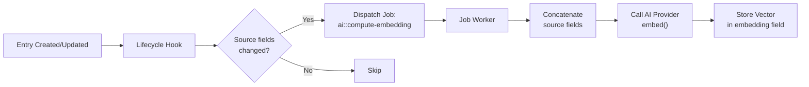
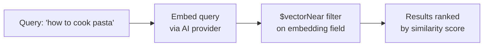
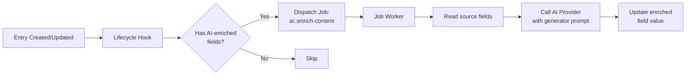
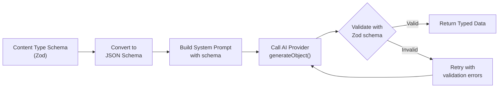
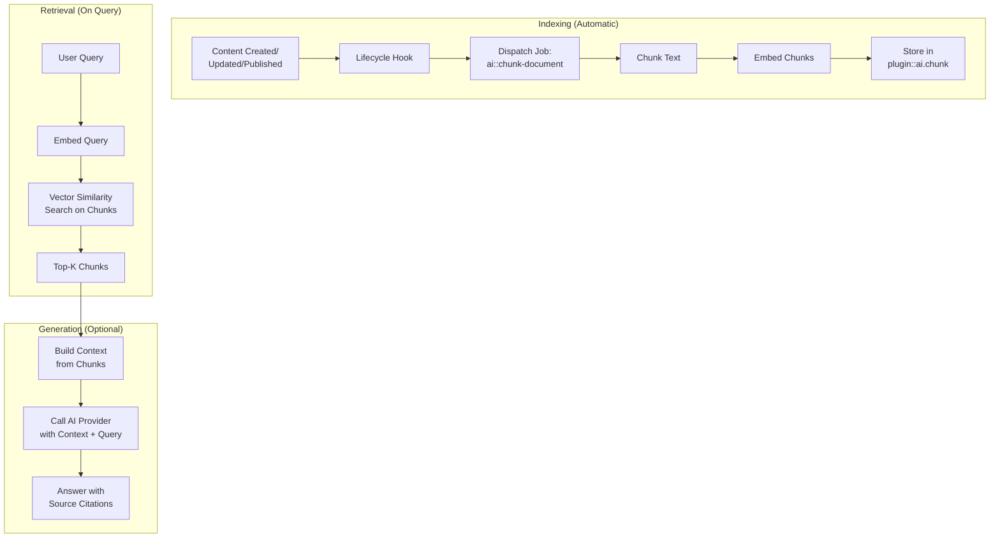
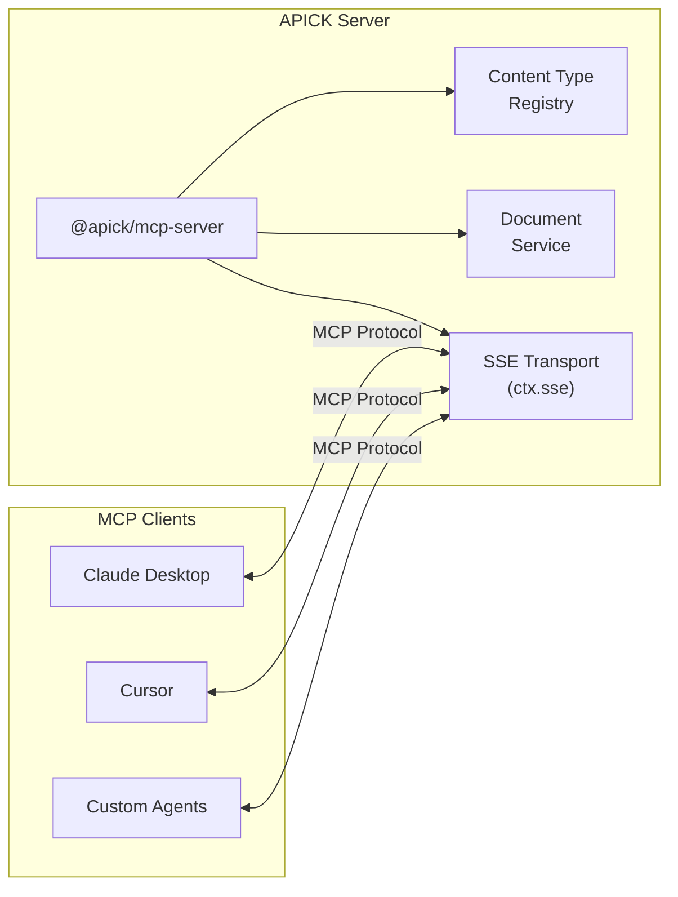
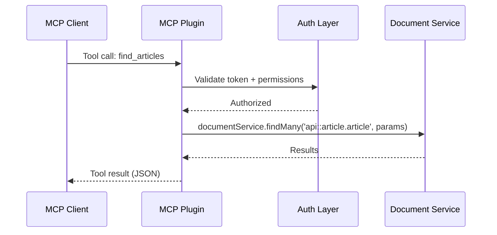
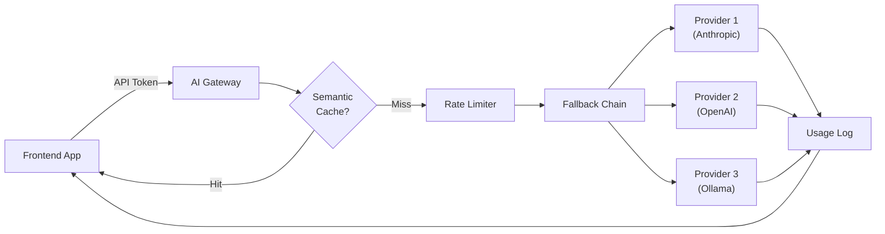
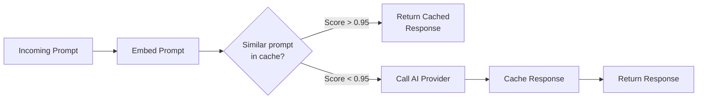

# AI Guide

This guide covers every AI capability in APICK: the provider abstraction layer, vector fields and semantic search, content enrichment, the prompt registry, structured output, the RAG pipeline, the MCP server, and the AI gateway. It is written for both developers building extensions and users consuming the REST API.

For foundational context, see [ARCHITECTURE.md](./ARCHITECTURE.md). For content type design, see [CONTENT_MODELING_GUIDE.md](./CONTENT_MODELING_GUIDE.md). For database-level details relevant to vector storage, see [DATABASE_GUIDE.md](./DATABASE_GUIDE.md). For plugin development patterns, see [PLUGINS_GUIDE.md](./PLUGINS_GUIDE.md). For production deployment considerations, see [DEPLOYMENT_GUIDE.md](./DEPLOYMENT_GUIDE.md).

---

## Table of Contents

1. [Architecture Overview](#1-architecture-overview)
2. [AI Provider System](#2-ai-provider-system)
   - [Provider Interface](#21-provider-interface)
   - [Configuration](#22-configuration)
   - [Built-in Providers](#23-built-in-providers)
   - [Service API](#24-service-api)
   - [Building a Custom Provider](#25-building-a-custom-provider)
3. [Vector Fields](#3-vector-fields)
   - [Adding a Vector Field](#31-adding-a-vector-field)
   - [Auto-Embedding Lifecycle](#32-auto-embedding-lifecycle)
   - [Database Storage by Dialect](#33-database-storage-by-dialect)
4. [Semantic Search](#4-semantic-search)
   - [Search Modes](#41-search-modes)
   - [Content API (curl)](#42-content-api-curl)
   - [Service API](#43-service-api)
   - [Direct Vector Queries](#44-direct-vector-queries)
   - [Reindexing](#45-reindexing)
5. [Content Enrichment](#5-content-enrichment)
   - [Enrichment Lifecycle](#51-enrichment-lifecycle)
   - [Schema Configuration](#52-schema-configuration)
   - [Built-in Generators](#53-built-in-generators)
   - [Custom Generators](#54-custom-generators)
   - [Manual and Bulk Enrichment](#55-manual-and-bulk-enrichment)
   - [Admin Routes (curl)](#56-admin-routes-curl)
6. [Prompt Registry](#6-prompt-registry)
   - [Prompt Content Type](#61-prompt-content-type)
   - [Template Syntax](#62-template-syntax)
   - [Service API](#63-service-api)
   - [Admin Routes (curl)](#64-admin-routes-curl)
   - [Content API (curl)](#65-content-api-curl)
7. [Structured Output](#7-structured-output)
   - [How It Works](#71-how-it-works)
   - [Service API](#72-service-api)
   - [Routes (curl)](#73-routes-curl)
   - [Retry Logic](#74-retry-logic)
8. [RAG Pipeline](#8-rag-pipeline)
   - [Pipeline Flow](#81-pipeline-flow)
   - [Configuration](#82-configuration)
   - [Chunking Strategies](#83-chunking-strategies)
   - [Service API](#84-service-api)
   - [Routes (curl)](#85-routes-curl)
   - [Lifecycle Behavior](#86-lifecycle-behavior)
9. [MCP Server](#9-mcp-server)
   - [What It Does](#91-what-it-does)
   - [Configuration](#92-configuration)
   - [Auto-Generated Tools and Resources](#93-auto-generated-tools-and-resources)
   - [Authentication](#94-authentication)
   - [Client Configuration](#95-client-configuration)
10. [AI Gateway](#10-ai-gateway)
    - [Architecture](#101-architecture)
    - [Configuration](#102-configuration)
    - [Routes (curl)](#103-routes-curl)
    - [Semantic Caching](#104-semantic-caching)
    - [Rate Limiting](#105-rate-limiting)
    - [Cost Tracking and Limits](#106-cost-tracking-and-limits)
    - [Fallback Chains](#107-fallback-chains)
    - [Admin Analytics (curl)](#108-admin-analytics-curl)
11. [Complete API Reference](#11-complete-api-reference)
12. [Design Principles](#12-design-principles)

---

## 1. Architecture Overview

APICK's AI capabilities are built as natural extensions of the framework. Every AI feature uses the same patterns as existing features: the provider pattern for AI providers, the plugin pattern for AI capabilities, custom fields for vector storage, lifecycle hooks for content enrichment, and configuration via `config/plugins.ts`.

```mermaid
graph TB
    subgraph Core["Core Infrastructure"]
        Queue["apick.queue<br/>Background Jobs"]
        SSE["ctx.sse()<br/>Streaming"]
        Registry["apick.provider.registerDomain()<br/>Provider Registry"]
        Operators["apick.query.registerOperator()<br/>Custom Operators"]
        ColumnTypes["apick.db.registerColumnType()<br/>Custom Column Types"]
        JsonSchema["zodToJsonSchema()<br/>Schema Conversion"]
    end

    subgraph AIPlugin["@apick/ai Plugin"]
        Provider["AI Provider System"]
        Vector["Vector Field + Auto-Embedding"]
        Search["Semantic Search"]
        Enrichment["Content Enrichment"]
        Prompts["Prompt Registry"]
        Structured["Structured Output"]
        RAG["RAG Pipeline"]
    end

    subgraph Separate["Separate Plugins"]
        MCP["@apick/mcp-server"]
        Gateway["@apick/ai-gateway"]
    end

    subgraph Providers["AI Providers"]
        OpenAI["@apick/provider-ai-openai"]
        Anthropic["@apick/provider-ai-anthropic"]
        Google["@apick/provider-ai-google"]
        Ollama["@apick/provider-ai-ollama"]
    end

    Provider --> Registry
    Vector --> ColumnTypes
    Vector --> Operators
    Vector --> Queue
    Search --> Vector
    Enrichment --> Queue
    Enrichment --> Provider
    Structured --> JsonSchema
    Structured --> Provider
    RAG --> Vector
    RAG --> Queue
    RAG --> Provider
    MCP --> SSE
    Gateway --> Provider
    Gateway --> SSE
    Provider --> OpenAI
    Provider --> Anthropic
    Provider --> Google
    Provider --> Ollama
```



### Core vs Plugin Boundary

| Layer | Component | Location | Purpose |
|-------|-----------|----------|---------|
| **Core** | Background job queue | `packages/core/` | Async processing for embeddings, enrichment, chunking |
| **Core** | SSE streaming helper | `packages/core/` | Streaming responses for MCP transport, chat, prompts |
| **Core** | Generic provider registry | `packages/core/` | Pluggable provider domains (AI, upload, email) |
| **Core** | Extensible query operators | `packages/core/` | `$vectorNear` and other custom operators |
| **Core** | Extensible column types | `packages/core/` | `vector` column type (pgvector / JSON fallback) |
| **Core utility** | JSON Schema generation | `packages/utils/` | `zodToJsonSchema()` for structured output and MCP |
| **Plugin** | AI Provider + Vector + Search + Enrichment + Prompts + Structured Output + RAG | `packages/ai/` | All AI features in one plugin |
| **Plugin** | MCP Server | `packages/mcp-server/` | Model Context Protocol endpoint |
| **Plugin** | AI Gateway | `packages/ai-gateway/` | Proxy, cache, rate limit AI calls |
| **Provider** | OpenAI, Anthropic, Google, Ollama | `packages/providers/ai-*/` | Interchangeable AI backends |

The core infrastructure additions are not AI-specific. The job queue benefits webhooks, data transfer, and email. SSE benefits any real-time feature. Custom operators and column types serve geospatial, full-text search, and any domain-specific storage.

---

## 2. AI Provider System

The AI plugin uses the generic provider registry to register the `ai` provider domain. Switch between OpenAI, Anthropic, Google, or local models by changing `config/plugins.ts` -- no code changes required.

### 2.1 Provider Interface

Every AI provider must implement `generateText` and `embed`. The optional methods `generateObject` and `streamText` enable structured output and streaming features.

```ts
interface AIProvider {
  // Required
  generateText(options: GenerateTextOptions): Promise<GenerateTextResult>;
  embed(options: EmbedOptions): Promise<EmbedResult>;

  // Optional
  generateObject?<T>(options: GenerateObjectOptions<T>): Promise<GenerateObjectResult<T>>;
  streamText?(options: StreamTextOptions): AsyncIterable<string>;
}
```

#### GenerateText

```ts
interface GenerateTextOptions {
  prompt: string;
  systemPrompt?: string;
  model?: string;             // Override default model
  temperature?: number;       // 0-2, default 1
  maxTokens?: number;         // Max output tokens
}

interface GenerateTextResult {
  text: string;
  usage: TokenUsage;
  model: string;
  finishReason: 'stop' | 'length' | 'content_filter';
}
```

#### Embed

```ts
interface EmbedOptions {
  input: string | string[];   // Single text or batch
  model?: string;             // Override default embedding model
  dimensions?: number;        // Output dimensions (if model supports)
}

interface EmbedResult {
  embeddings: number[][];     // One vector per input
  usage: { totalTokens: number };
  model: string;
  dimensions: number;
}
```

#### GenerateObject (Optional)

```ts
interface GenerateObjectOptions<T> {
  prompt: string;
  schema: ZodSchema<T>;       // APICK Zod schemas directly
  systemPrompt?: string;
  model?: string;
  temperature?: number;
  maxRetries?: number;         // Retry with validation errors, default 3
}

interface GenerateObjectResult<T> {
  data: T;                     // Validated, typed result
  usage: TokenUsage;
  model: string;
}
```

#### StreamText (Optional)

```ts
interface StreamTextOptions {
  prompt: string;
  systemPrompt?: string;
  model?: string;
  temperature?: number;
  maxTokens?: number;
}

// Returns AsyncIterable<string> -- each yielded value is a token/chunk
```

#### TokenUsage

```ts
interface TokenUsage {
  promptTokens: number;
  completionTokens: number;
  totalTokens: number;
  estimatedCost?: number;      // USD, if model pricing is known
}
```

**Provider interface summary:**

| Method | Required | Input | Output | Used By |
|--------|----------|-------|--------|---------|
| `generateText` | Yes | Prompt + options | Text + usage | Enrichment, prompts, RAG, gateway |
| `embed` | Yes | Text or text array | Vector array + usage | Vector fields, semantic search, RAG |
| `generateObject` | No | Prompt + Zod schema | Validated typed object | Structured output |
| `streamText` | No | Prompt + options | AsyncIterable of tokens | Prompt streaming, gateway streaming |

### 2.2 Configuration

```ts
// config/plugins.ts
export default ({ env }) => ({
  ai: {
    enabled: true,
    config: {
      provider: '@apick/provider-ai-openai',
      providerOptions: {
        apiKey: env('OPENAI_API_KEY'),
        defaultModel: 'gpt-4o',
        embeddingModel: 'text-embedding-3-small',
      },
      features: {
        vectorField: true,
        semanticSearch: true,
        enrichment: true,
        prompts: true,
        structuredOutput: true,
        rag: true,
      },
    },
  },
});
```

Each sub-feature is independently toggleable via the `features` object. Enable only what you use.

### 2.3 Built-in Providers

| Provider | Package | Models | Notes |
|----------|---------|--------|-------|
| OpenAI | `@apick/provider-ai-openai` | GPT-4o, GPT-4o-mini, text-embedding-3-small/large | Full feature support |
| Anthropic | `@apick/provider-ai-anthropic` | Claude Sonnet, Opus, Haiku | Streaming, structured output; no native embeddings |
| Google | `@apick/provider-ai-google` | Gemini Pro, Gemini Flash | Multimodal support |
| Ollama | `@apick/provider-ai-ollama` | Llama, Mistral, any local model | No API key needed, local inference |

#### Provider-Specific Configuration

```ts
// OpenAI
providerOptions: {
  apiKey: env('OPENAI_API_KEY'),
  defaultModel: 'gpt-4o',
  embeddingModel: 'text-embedding-3-small',
  organization: env('OPENAI_ORG'),       // Optional
  baseURL: env('OPENAI_BASE_URL'),       // Optional: custom endpoint
}

// Anthropic
providerOptions: {
  apiKey: env('ANTHROPIC_API_KEY'),
  defaultModel: 'claude-sonnet-4-6',
  // Anthropic does not provide embeddings -- use a separate embedding provider
  // or configure embeddingProvider in the ai plugin config
}

// Google
providerOptions: {
  apiKey: env('GOOGLE_AI_API_KEY'),
  defaultModel: 'gemini-2.0-flash',
  embeddingModel: 'text-embedding-004',
}

// Ollama (local)
providerOptions: {
  baseURL: env('OLLAMA_URL', 'http://localhost:11434'),
  defaultModel: 'llama3.2',
  embeddingModel: 'nomic-embed-text',
}
```

### 2.4 Service API

The AI plugin wraps the provider in a service for convenience, adding logging and error handling:

```ts
// Direct provider access
const provider = apick.provider('ai');
const result = await provider.generateText({ prompt: 'Hello' });

// Via plugin service (equivalent, adds logging and error handling)
const result = await apick.service('plugin::ai.provider').generateText({
  prompt: 'Hello',
});
```

| Method | Description |
|--------|-------------|
| `generateText(options)` | Generate text from a prompt |
| `embed(options)` | Compute embeddings for text(s) |
| `generateObject(options)` | Generate a validated object matching a Zod schema |
| `streamText(options)` | Stream text tokens as an AsyncIterable |
| `getModel()` | Get the current default model name |
| `getEmbeddingModel()` | Get the current default embedding model name |

### 2.5 Building a Custom Provider

Use the same `defineProvider` factory as upload and email providers. See [PLUGINS_GUIDE.md](./PLUGINS_GUIDE.md) for the general provider development pattern.

```ts
// packages/providers/ai-custom/server/src/index.ts
import { defineProvider } from '@apick/utils';

export default defineProvider({
  init(providerOptions) {
    const client = createMyClient(providerOptions);

    return {
      async generateText(options) {
        const response = await client.complete({
          model: options.model || providerOptions.defaultModel,
          prompt: options.prompt,
          system: options.systemPrompt,
          temperature: options.temperature,
          maxTokens: options.maxTokens,
        });
        return {
          text: response.text,
          usage: {
            promptTokens: response.inputTokens,
            completionTokens: response.outputTokens,
            totalTokens: response.inputTokens + response.outputTokens,
          },
          model: response.model,
          finishReason: response.stopReason,
        };
      },

      async embed(options) {
        const input = Array.isArray(options.input) ? options.input : [options.input];
        const response = await client.embed({ input, model: options.model });
        return {
          embeddings: response.vectors,
          usage: { totalTokens: response.tokenCount },
          model: response.model,
          dimensions: response.vectors[0].length,
        };
      },

      // Optional: structured output
      async generateObject(options) {
        const jsonSchema = zodToJsonSchema(options.schema);
        // ... call LLM with JSON mode, validate with options.schema
      },

      // Optional: streaming
      async *streamText(options) {
        const stream = client.streamComplete({ /* ... */ });
        for await (const chunk of stream) {
          yield chunk.text;
        }
      },
    };
  },
});
```

Register the custom provider in `config/plugins.ts`:

```ts
ai: {
  config: {
    provider: 'provider-ai-custom',
    resolve: './src/plugins/provider-ai-custom',
    providerOptions: { /* ... */ },
  },
}
```

---

## 3. Vector Fields

The AI plugin provides a `vector` custom field for storing embeddings. Embeddings are computed automatically via lifecycle hooks and the background job queue.

### 3.1 Adding a Vector Field

Add a vector field to any content type. For content modeling patterns, see [CONTENT_MODELING_GUIDE.md](./CONTENT_MODELING_GUIDE.md).

```ts
// src/api/article/content-types/article/schema.ts
export default defineContentType({
  attributes: {
    title: { type: 'string', required: true },
    content: { type: 'richtext' },
    embedding: {
      type: 'customField',
      customField: 'plugin::ai.vector',
      private: true,                        // Excluded from API responses
      pluginOptions: {
        ai: {
          sourceFields: ['title', 'content'],  // Auto-embed from these fields
          model: 'text-embedding-3-small',     // Optional: override embedding model
          dimensions: 1536,                    // Vector dimensions
        },
      },
    },
  },
});
```

#### Vector Field Options

| Option | Type | Default | Description |
|--------|------|---------|-------------|
| `sourceFields` | `string[]` | Required | Fields to concatenate and embed |
| `dimensions` | `number` | `1536` | Vector dimensions (must match model) |
| `model` | `string` | Plugin default | Embedding model override |
| `private` | `boolean` | `true` | Exclude from API responses |

### 3.2 Auto-Embedding Lifecycle

When `sourceFields` is configured, the AI plugin subscribes to lifecycle hooks:



Key behaviors:

- Runs asynchronously via the job queue. The API response is never blocked by inference.
- On `create`: always computes the embedding.
- On `update`: only recomputes if any source field changed (checked via `event.state`).
- The entry is saved immediately; the embedding field is populated asynchronously.

### 3.3 Database Storage by Dialect

For full database configuration details, see [DATABASE_GUIDE.md](./DATABASE_GUIDE.md).

| Database | Storage | Index | Performance |
|----------|---------|-------|-------------|
| PostgreSQL | `pgvector` column | IVFFlat or HNSW index | Native vector operations, fast similarity search |
| SQLite | TEXT (JSON string) | None | JSON-based cosine similarity in application, suitable for dev/small datasets |
| MySQL | JSON column | None | JSON-based cosine similarity, suitable for dev/small datasets |

PostgreSQL with pgvector is recommended for production. SQLite and MySQL work for development and small datasets but lack native vector indexing.

---

## 4. Semantic Search

### 4.1 Search Modes

| Mode | Description | Requires Vector Field |
|------|-------------|-----------------------|
| `keyword` | Traditional full-text search (default, unchanged) | No |
| `semantic` | Vector similarity search | Yes |
| `hybrid` | Combined keyword + semantic with Reciprocal Rank Fusion | Yes |

**Semantic mode** embeds the query text via the AI provider, uses the `$vectorNear` operator to filter the content type's vector field, and returns results ranked by cosine similarity.

**Hybrid mode** runs keyword search (full-text) and semantic search (vector) independently, then merges using Reciprocal Rank Fusion (RRF): `score = sum(1 / (k + rank))` across both lists.

**Fallback:** If `_searchMode=semantic` is used on a content type without a vector field, it falls back to keyword search and logs a warning.



### 4.2 Content API (curl)

**Semantic search:**

```bash
curl -X GET "https://api.example.com/api/articles?_search=how+to+deploy+nodejs&_searchMode=semantic&_limit=10" \
  -H "Authorization: Bearer <api-token>"
```

**Hybrid search:**

```bash
curl -X GET "https://api.example.com/api/articles?_search=deployment+best+practices&_searchMode=hybrid&_limit=20" \
  -H "Authorization: Bearer <api-token>"
```

**Semantic search combined with filters:**

```bash
curl -X GET "https://api.example.com/api/articles?_search=pasta+recipes&_searchMode=semantic&filters[category][slug][\$eq]=food&_limit=10" \
  -H "Authorization: Bearer <api-token>"
```

| Parameter | Type | Default | Description |
|-----------|------|---------|-------------|
| `_search` | `string` | -- | Search query text |
| `_searchMode` | `'keyword' \| 'semantic' \| 'hybrid'` | `'keyword'` | Search strategy |
| `_limit` | `number` | `25` | Max results |

### 4.3 Service API

```ts
const results = await apick.service('plugin::ai.search').search(
  'api::article.article',
  {
    query: 'how to cook pasta',
    mode: 'semantic',           // 'keyword' | 'semantic' | 'hybrid'
    limit: 10,
    filters: {                   // Combine with standard where-clause filters
      category: { slug: 'recipes' },
      publishedAt: { $notNull: true },
    },
  }
);
// Result:
// {
//   results: [
//     { documentId: 'abc', title: '...', score: 0.94, ... },
//     { documentId: 'def', title: '...', score: 0.87, ... },
//   ],
//   meta: { total: 2, mode: 'semantic', model: 'text-embedding-3-small' },
// }
```

### 4.4 Direct Vector Queries

For advanced use cases, use the `$vectorNear` operator directly in the Query Engine:

```ts
// First, embed the query
const { embeddings } = await apick.provider('ai').embed({
  input: 'how to cook pasta',
});

// Then query with vector similarity
const articles = await apick.db.query('api::article.article').findMany({
  where: {
    embedding: { $vectorNear: { vector: embeddings[0], distance: 0.3 } },
    publishedAt: { $notNull: true },
  },
  limit: 10,
});
```

### 4.5 Reindexing

If you change `sourceFields`, `dimensions`, or the embedding model, existing vectors become stale. Reindex to recompute all embeddings:

```ts
// Service
await apick.service('plugin::ai.search').reindex('api::article.article');
```

```bash
# Admin API
curl -X POST "https://api.example.com/admin/ai/search/reindex/api::article.article" \
  -H "Authorization: Bearer <admin-jwt>"
```

Reindexing dispatches one job per entry to the queue. Progress is visible via queue stats.

---

## 5. Content Enrichment

Auto-generate summaries, tags, SEO descriptions, alt text, sentiment scores, and classifications from your content. Enrichment uses lifecycle hooks, the background job queue, and the AI provider.

### 5.1 Enrichment Lifecycle



1. Content is saved and the entry is immediately available via API.
2. Lifecycle hook detects fields with `pluginOptions.ai.generate`.
3. An async job is dispatched. The API response is never blocked.
4. The job worker reads source fields, calls the AI provider, and updates the enriched field.

### 5.2 Schema Configuration

Configure enrichment per field using `pluginOptions.ai` in your content type schema:

```ts
// src/api/article/content-types/article/schema.ts
export default defineContentType({
  attributes: {
    title: { type: 'string', required: true },
    content: { type: 'richtext', required: true },

    // Auto-generated summary
    summary: {
      type: 'text',
      pluginOptions: {
        ai: {
          generate: 'summarize',
          sourceFields: ['content'],
          maxTokens: 200,
          regenerateOn: 'both',
        },
      },
    },

    // Auto-extracted tags
    tags: {
      type: 'json',
      pluginOptions: {
        ai: {
          generate: 'extract-tags',
          sourceFields: ['title', 'content'],
          maxTags: 10,
        },
      },
    },

    // Auto-generated SEO description
    seoDescription: {
      type: 'text',
      pluginOptions: {
        ai: {
          generate: 'seo-description',
          sourceFields: ['title', 'content'],
        },
      },
    },

    // Auto-generated alt text for images
    coverImage: { type: 'media', allowedTypes: ['images'] },
    coverAltText: {
      type: 'text',
      pluginOptions: {
        ai: {
          generate: 'image-alt-text',
          sourceFields: ['coverImage'],
        },
      },
    },

    // Sentiment analysis
    sentiment: {
      type: 'float',
      pluginOptions: {
        ai: {
          generate: 'sentiment-score',
          sourceFields: ['content'],
        },
      },
    },
  },
});
```

#### Field Options

| Option | Type | Default | Description |
|--------|------|---------|-------------|
| `generate` | `string` | Required | Generator name (built-in or custom) |
| `sourceFields` | `string[]` | Required | Fields to read as input |
| `regenerateOn` | `'create' \| 'update' \| 'both' \| 'manual'` | `'both'` | When to trigger regeneration |
| `maxTokens` | `number` | Generator default | Max output tokens |
| `model` | `string` | Plugin default | Model override for this field |
| `maxTags` | `number` | `10` | For `extract-tags` generator |

#### `regenerateOn` Behavior

| Value | Create | Update (source changed) | Update (source unchanged) | Manual |
|-------|--------|------------------------|---------------------------|--------|
| `'create'` | Yes | No | No | Yes |
| `'update'` | No | Yes | No | Yes |
| `'both'` | Yes | Yes | No | Yes |
| `'manual'` | No | No | No | Yes |

### 5.3 Built-in Generators

| Generator | Input | Output | Description |
|-----------|-------|--------|-------------|
| `summarize` | Text fields | `string` | Concise summary of the content |
| `extract-tags` | Text fields | `string[]` (JSON) | Relevant keywords/tags |
| `seo-description` | Text fields | `string` | SEO-optimized meta description (150-160 chars) |
| `image-alt-text` | Media field | `string` | Descriptive alt text for accessibility |
| `sentiment-score` | Text fields | `number` (-1 to 1) | Sentiment: -1 (negative) to 1 (positive) |
| `classify` | Text fields | `string` | Category classification |
| `translate` | Text fields | `string` | Translation (requires `targetLocale` option) |

### 5.4 Custom Generators

Register custom generators in your plugin or app `register()` phase. See [PLUGINS_GUIDE.md](./PLUGINS_GUIDE.md) for the register lifecycle.

```ts
// In register() -- app src/index.ts or plugin register()
apick.service('plugin::ai.enrichment').registerGenerator('reading-time', {
  prompt: (sourceData) =>
    `Estimate the reading time in minutes for this text. Return only a number.\n\n${sourceData.content}`,
  outputTransform: (response) => parseInt(response.text.trim(), 10),
});

apick.service('plugin::ai.enrichment').registerGenerator('key-takeaways', {
  prompt: (sourceData) =>
    `Extract 3-5 key takeaways from this article as a JSON array of strings:\n\n${sourceData.content}`,
  model: 'gpt-4o',
  outputTransform: (response) => JSON.parse(response.text),
});
```

#### Generator Definition Interface

```ts
interface GeneratorDefinition {
  prompt: (sourceData: Record<string, unknown>) => string;
  systemPrompt?: string;
  model?: string;               // Override default model
  temperature?: number;         // Default: 0.7
  maxTokens?: number;           // Default: 500
  outputTransform?: (response: GenerateTextResult) => unknown;
}
```

Use the custom generator in a content type:

```ts
readingTime: {
  type: 'integer',
  pluginOptions: {
    ai: {
      generate: 'reading-time',
      sourceFields: ['content'],
    },
  },
},
```

### 5.5 Manual and Bulk Enrichment

**Single entry (service):**

```ts
await apick.service('plugin::ai.enrichment').enrich(
  'api::article.article',
  'abc123',                      // documentId
  ['summary', 'tags'],           // Optional: specific fields (default: all enriched fields)
);
```

**Bulk enrichment (service):**

```ts
await apick.service('plugin::ai.enrichment').enrichAll(
  'api::article.article',
  { fields: ['summary'] },       // Optional: specific fields
);
```

Bulk enrichment dispatches one job per entry to the queue.

### 5.6 Admin Routes (curl)

**Enrich a single entry:**

```bash
curl -X POST "https://api.example.com/admin/ai/enrich/api::article.article/abc123" \
  -H "Content-Type: application/json" \
  -H "Authorization: Bearer <admin-jwt>" \
  -d '{
    "fields": ["summary", "tags"]
  }'
```

Response:

```json
{
  "data": {
    "jobIds": ["job_abc", "job_def"],
    "message": "Enrichment jobs dispatched for 2 fields"
  }
}
```

**Bulk enrich all entries:**

```bash
curl -X POST "https://api.example.com/admin/ai/enrich/api::article.article" \
  -H "Content-Type: application/json" \
  -H "Authorization: Bearer <admin-jwt>" \
  -d '{
    "fields": ["summary"]
  }'
```

**Check enrichment status:**

```bash
curl -X GET "https://api.example.com/admin/ai/enrich/api::article.article/status" \
  -H "Authorization: Bearer <admin-jwt>"
```

| Method | Path | Auth | Description |
|--------|------|------|-------------|
| `POST` | `/admin/ai/enrich/:contentTypeUid/:documentId` | Admin | Enrich a single entry |
| `POST` | `/admin/ai/enrich/:contentTypeUid` | Admin | Bulk enrich all entries |
| `GET` | `/admin/ai/enrich/:contentTypeUid/status` | Admin | Enrichment job status |

---

## 6. Prompt Registry

The prompt registry stores, versions, and executes prompt templates as content. Prompts are an internal content type (`plugin::ai.prompt`) with draft/publish support -- iterate in draft, publish when ready, with full content history.

### 6.1 Prompt Content Type

| Field | Type | Description |
|-------|------|-------------|
| `name` | `uid` | Unique slug: `summarize-article`, `classify-support-ticket` |
| `description` | `text` | What this prompt does |
| `template` | `text` | Prompt template with `{{variables}}` |
| `systemPrompt` | `text` | System/context prompt sent to the LLM |
| `model` | `string` | Model override (uses plugin default if empty) |
| `temperature` | `float` | Temperature override (0-2) |
| `maxTokens` | `integer` | Max output tokens |
| `variables` | `json` | Schema of accepted variables: `{ title: 'string', content: 'string' }` |
| `category` | `enumeration` | `content`, `seo`, `moderation`, `classification`, `custom` |

Prompts use APICK's standard draft/publish system:

- Create and iterate on prompts in **draft** mode.
- **Publish** when the prompt is tested and ready.
- Content API only serves **published** prompts.
- Admin API can access both draft and published versions.
- Previous published versions are tracked in content history.

### 6.2 Template Syntax

Templates use `{{variable}}` placeholders:

```
Summarize the following article in {{maxSentences}} sentences.

Title: {{title}}
Content: {{content}}

Focus on the main argument and key takeaways.
```

The `variables` field defines what variables the template expects. This is used for validation when rendering and for documentation:

```json
{
  "title": "string",
  "content": "string",
  "maxSentences": "number",
  "tone": "string"
}
```

### 6.3 Service API

```ts
const promptService = apick.service('plugin::ai.prompt');
```

**Render (no LLM call):** Resolve template variables without calling the LLM. Useful for previewing or piping to a custom LLM call.

```ts
const rendered = await promptService.render('summarize-article', {
  title: 'TypeScript Best Practices',
  content: 'TypeScript is a typed superset of JavaScript...',
});
// Returns the interpolated template string
```

**Execute (render + LLM call):** Render the template and send it to the AI provider.

```ts
const result = await promptService.execute('summarize-article', {
  title: 'TypeScript Best Practices',
  content: 'TypeScript is a typed superset of JavaScript...',
});
// {
//   text: 'This article covers key TypeScript practices including...',
//   usage: { promptTokens: 245, completionTokens: 68, totalTokens: 313 },
//   model: 'gpt-4o',
//   prompt: { name: 'summarize-article', version: 3 },
// }
```

**Stream (render + streaming LLM call):** Returns an AsyncIterable for streaming responses.

```ts
const stream = promptService.stream('summarize-article', {
  title: 'TypeScript Best Practices',
  content: 'TypeScript is a typed superset of JavaScript...',
});

for await (const chunk of stream) {
  process.stdout.write(chunk);
}
```

**Execute options:** All three methods accept an optional third argument for overrides.

```ts
await promptService.execute('summarize-article', variables, {
  model: 'gpt-4o-mini',       // Override prompt's model
  temperature: 0.3,           // Override prompt's temperature
  maxTokens: 100,             // Override prompt's maxTokens
});
```

### 6.4 Admin Routes (curl)

| Method | Path | Auth | Description |
|--------|------|------|-------------|
| `GET` | `/admin/ai/prompts` | Admin | List all prompts (draft + published) |
| `POST` | `/admin/ai/prompts` | Admin | Create a new prompt |
| `GET` | `/admin/ai/prompts/:id` | Admin | Get prompt by ID |
| `PUT` | `/admin/ai/prompts/:id` | Admin | Update prompt |
| `DELETE` | `/admin/ai/prompts/:id` | Admin | Delete prompt |
| `POST` | `/admin/ai/prompts/:id/test` | Admin | Test prompt with sample variables |

**Create a prompt:**

```bash
curl -X POST "https://api.example.com/admin/ai/prompts" \
  -H "Content-Type: application/json" \
  -H "Authorization: Bearer <admin-jwt>" \
  -d '{
    "data": {
      "name": "summarize-article",
      "description": "Summarize an article in 2-3 sentences",
      "template": "Summarize the following article in {{maxSentences}} sentences.\n\nTitle: {{title}}\nContent: {{content}}",
      "systemPrompt": "You are a concise technical writer.",
      "model": "gpt-4o",
      "temperature": 0.5,
      "maxTokens": 200,
      "variables": {
        "title": "string",
        "content": "string",
        "maxSentences": "number"
      },
      "category": "content"
    }
  }'
```

**Test a prompt:**

```bash
curl -X POST "https://api.example.com/admin/ai/prompts/42/test" \
  -H "Content-Type: application/json" \
  -H "Authorization: Bearer <admin-jwt>" \
  -d '{
    "variables": {
      "title": "Test Article",
      "content": "This is test content for the prompt.",
      "maxSentences": 2
    }
  }'
```

Response:

```json
{
  "data": {
    "rendered": "Summarize the following article in 2 sentences.\n\nTitle: Test Article\nContent: This is test content for the prompt.",
    "result": {
      "text": "This test article contains sample content for prompt testing.",
      "usage": { "promptTokens": 48, "completionTokens": 12, "totalTokens": 60 }
    }
  }
}
```

### 6.5 Content API (curl)

| Method | Path | Auth | Description |
|--------|------|------|-------------|
| `POST` | `/api/ai/prompts/:name/execute` | API token | Execute a published prompt |
| `POST` | `/api/ai/prompts/:name/stream` | API token | Execute with SSE streaming |

**Execute a prompt:**

```bash
curl -X POST "https://api.example.com/api/ai/prompts/summarize-article/execute" \
  -H "Content-Type: application/json" \
  -H "Authorization: Bearer <api-token>" \
  -d '{
    "variables": {
      "title": "TypeScript Best Practices",
      "content": "TypeScript is a typed superset of JavaScript..."
    }
  }'
```

Response:

```json
{
  "data": {
    "text": "This article covers key TypeScript practices including...",
    "usage": {
      "promptTokens": 245,
      "completionTokens": 68,
      "totalTokens": 313
    }
  }
}
```

**Stream a prompt (SSE):**

```bash
curl -N -X POST "https://api.example.com/api/ai/prompts/summarize-article/stream" \
  -H "Content-Type: application/json" \
  -H "Authorization: Bearer <api-token>" \
  -d '{
    "variables": {
      "title": "TypeScript Best Practices",
      "content": "TypeScript is a typed superset of JavaScript..."
    }
  }'
```

SSE response format:

```
event: token
data: This

event: token
data:  article

event: token
data:  covers

event: done
data: {"usage":{"promptTokens":245,"completionTokens":68,"totalTokens":313}}
```

---

## 7. Structured Output

APICK already has a Zod schema for every content type. The structured output feature converts these schemas to JSON Schema, sends them to the LLM, validates the response, and retries on failure. Generate typed, validated content that matches your content model with zero extra schema work.

### 7.1 How It Works



1. Read content type schema from the registry.
2. Convert Zod schema to JSON Schema (via `zodToJsonSchema()` in `@apick/utils`).
3. Build system prompt: "Generate a valid JSON object matching this schema."
4. Call `aiProvider.generateObject({ prompt, schema })` -- uses the LLM's JSON mode or function calling.
5. Validate response with the original Zod schema.
6. If invalid, retry with validation error details appended to the prompt (up to `maxRetries`).
7. Optionally save as draft or published entry.

### 7.2 Service API

```ts
const generation = apick.service('plugin::ai.generation');

const result = await generation.generateContent('api::article.article', {
  prompt: 'Write an article about TypeScript best practices',
  fields: ['title', 'content', 'tags', 'seoDescription'],  // Optional: subset
  locale: 'en',
  save: false,           // true -> auto-create draft entry
  publish: false,        // true -> auto-publish (requires permission)
});
// {
//   data: {
//     title: 'TypeScript Best Practices for 2025',
//     content: '<p>TypeScript has become the standard...</p>',
//     tags: ['typescript', 'best-practices', 'web-development'],
//     seoDescription: 'Learn essential TypeScript best practices...',
//   },
//   usage: {
//     promptTokens: 892,
//     completionTokens: 1247,
//     totalTokens: 2139,
//     estimatedCost: 0.0043,
//   },
//   validation: { valid: true, attempts: 1 },
// }
```

#### Options

```ts
interface GenerateContentOptions {
  prompt: string;               // What to generate
  fields?: string[];            // Subset of content type fields (default: all)
  locale?: string;              // Target locale
  model?: string;               // Override default model
  temperature?: number;         // Override default temperature
  maxRetries?: number;          // Validation retry attempts (default: 3)
  save?: boolean;               // Auto-save as draft entry (default: false)
  publish?: boolean;            // Auto-publish entry (default: false)
  systemPrompt?: string;        // Additional system context
  context?: string;             // Additional context appended to prompt
}
```

#### Result Shape

```ts
interface GenerateContentResult<T> {
  data: T;                      // Generated content, validated and typed
  usage: TokenUsage;
  validation: {
    valid: boolean;             // Whether first attempt was valid
    attempts: number;           // Total attempts including retries
    errors?: string[];          // Validation errors from failed attempts
  };
  savedEntry?: {                // Present if save: true
    documentId: string;
    status: 'draft' | 'published';
  };
}
```

#### Components and Dynamic Zones

Structured output generates nested structures matching the full schema depth:

```ts
// Content type with components
export default defineContentType({
  attributes: {
    title: { type: 'string', required: true },
    sections: {
      type: 'dynamiczone',
      components: ['blocks.hero', 'blocks.text-block', 'blocks.image-gallery'],
    },
    seo: {
      type: 'component',
      component: 'shared.seo',
    },
  },
});

// Generated output includes nested structures
const result = await generation.generateContent('api::page.page', {
  prompt: 'Create a landing page for a TypeScript course',
});
// {
//   data: {
//     title: 'Master TypeScript',
//     sections: [
//       { __component: 'blocks.hero', heading: '...', subheading: '...' },
//       { __component: 'blocks.text-block', body: '...' },
//     ],
//     seo: { metaTitle: '...', metaDescription: '...', keywords: [...] },
//   },
// }
```

### 7.3 Routes (curl)

| Method | Path | Auth | Description |
|--------|------|------|-------------|
| `POST` | `/admin/ai/generate/:contentTypeUid` | Admin | Generate content for any content type |
| `POST` | `/api/ai/generate/:contentTypeUid` | API token | Generate via Content API |

**Admin route:**

```bash
curl -X POST "https://api.example.com/admin/ai/generate/api::article.article" \
  -H "Content-Type: application/json" \
  -H "Authorization: Bearer <admin-jwt>" \
  -d '{
    "prompt": "Write an article about TypeScript generics",
    "fields": ["title", "content", "tags"],
    "save": true
  }'
```

Response:

```json
{
  "data": {
    "content": {
      "title": "Understanding TypeScript Generics",
      "content": "<p>Generics are one of TypeScript's most powerful features...</p>",
      "tags": ["typescript", "generics", "type-system"]
    },
    "usage": {
      "promptTokens": 756,
      "completionTokens": 1102,
      "totalTokens": 1858
    },
    "validation": { "valid": true, "attempts": 1 },
    "savedEntry": {
      "documentId": "abc123",
      "status": "draft"
    }
  }
}
```

**Content API route:**

```bash
curl -X POST "https://api.example.com/api/ai/generate/api::article.article" \
  -H "Content-Type: application/json" \
  -H "Authorization: Bearer <api-token>" \
  -d '{
    "prompt": "Write a short blog post about Node.js streams",
    "fields": ["title", "content", "seoDescription"]
  }'
```

### 7.4 Retry Logic

When the LLM returns invalid JSON or data that fails Zod validation:

1. Extract Zod validation errors (field paths, expected types, received values).
2. Append errors to the prompt: "The previous response was invalid. Fix these errors: ..."
3. Retry with the corrected prompt.
4. Repeat up to `maxRetries` (default: 3).

If all retries fail, the service throws a `ValidationError` with accumulated errors:

```ts
try {
  const result = await generation.generateContent('api::article.article', {
    prompt: 'Write an article',
    maxRetries: 5,
  });
} catch (error) {
  if (error.name === 'ValidationError') {
    console.log(error.details);
    // { attempts: 5, errors: ['title: Required', 'content: Expected string, received number'] }
  }
}
```

---

## 8. RAG Pipeline

The RAG (Retrieval-Augmented Generation) pipeline automatically chunks content, computes embeddings, and enables question-answering grounded in your content. It builds on vector fields, the job queue, and the AI provider.

### 8.1 Pipeline Flow



**Indexing:** Content is created, updated, or published. Lifecycle hooks fire, long text fields are chunked using the configured strategy, each chunk is embedded via the AI provider, and chunks are stored in the `plugin::ai.chunk` content type. When content is unpublished or deleted, associated chunks are removed.

**Retrieval:** User submits a query. The query is embedded, vector similarity search finds the top-K most relevant chunks, and chunks are returned with similarity scores and source references.

**Generation (full RAG):** Retrieved chunks are assembled into a context string. Context + query are sent to the AI provider with a grounding system prompt. The answer is generated based only on the provided context, and sources are returned alongside the answer.

### 8.2 Configuration

Enable RAG per content type using `pluginOptions.ai.rag`. For content type schema patterns, see [CONTENT_MODELING_GUIDE.md](./CONTENT_MODELING_GUIDE.md).

```ts
// src/api/article/content-types/article/schema.ts
export default defineContentType({
  attributes: {
    title: { type: 'string', required: true },
    content: { type: 'richtext' },
    description: { type: 'text' },
  },
  pluginOptions: {
    ai: {
      rag: {
        enabled: true,
        fields: ['content', 'description'],   // Which text fields to chunk
        chunkSize: 500,                        // Tokens per chunk
        chunkOverlap: 50,                      // Overlapping tokens between chunks
        strategy: 'paragraph',                 // Chunking strategy
        metadata: ['title', 'category'],       // Fields to include in chunk metadata
      },
    },
  },
});
```

#### RAG Options

| Option | Type | Default | Description |
|--------|------|---------|-------------|
| `enabled` | `boolean` | `false` | Enable RAG indexing for this content type |
| `fields` | `string[]` | Required | Text fields to chunk and embed |
| `chunkSize` | `number` | `500` | Target tokens per chunk |
| `chunkOverlap` | `number` | `50` | Overlapping tokens between adjacent chunks |
| `strategy` | `string` | `'paragraph'` | Chunking strategy |
| `metadata` | `string[]` | `[]` | Additional fields to store in chunk metadata |

#### Chunk Content Type: `plugin::ai.chunk`

| Field | Type | Description |
|-------|------|-------------|
| `sourceType` | `string` | Content type UID: `api::article.article` |
| `sourceId` | `string` | Document ID of the source entry |
| `sourceField` | `string` | Which field this chunk came from |
| `content` | `text` | The chunk text |
| `embedding` | `customField` (`plugin::ai.vector`) | Vector embedding |
| `chunkIndex` | `integer` | Position in the source document (0-based) |
| `metadata` | `json` | Source locale, title, category, custom metadata |

### 8.3 Chunking Strategies

| Strategy | Description | Best For |
|----------|-------------|----------|
| `fixed` | Split at fixed token boundaries | Uniform, predictable chunk sizes |
| `paragraph` | Split at paragraph breaks, respecting chunk size | Prose content (articles, docs) |
| `heading` | Split at heading boundaries (H1-H6 in rich text) | Structured documents with sections |
| `field-boundary` | One chunk per field (no splitting within a field) | Short fields, structured content |

### 8.4 Service API

**Retrieve chunks:**

```ts
const chunks = await apick.service('plugin::ai.rag').retrieve({
  query: 'how to deploy a Node.js app',
  topK: 5,
  filters: {
    sourceType: 'api::article.article',           // Optional: limit to content type
    metadata: { category: 'tutorials' },          // Optional: filter by metadata
  },
  scoreThreshold: 0.7,                            // Optional: minimum similarity score
});
// [
//   {
//     content: 'To deploy a Node.js application, first ensure...',
//     score: 0.94,
//     source: {
//       type: 'api::article.article',
//       id: 'abc123',
//       field: 'content',
//       chunkIndex: 3,
//     },
//     metadata: { title: 'Node.js Deployment Guide', category: 'tutorials' },
//   },
//   ...
// ]
```

**Ask (full RAG):** Retrieve relevant chunks and generate an answer in one call.

```ts
const answer = await apick.service('plugin::ai.rag').ask({
  query: 'how to deploy a Node.js app',
  topK: 5,
  filters: {
    sourceType: 'api::article.article',
  },
  systemPrompt: 'Answer based only on the provided context. If the context does not contain enough information, say so.',
  model: 'gpt-4o',
});
// {
//   answer: 'To deploy a Node.js application, you should...',
//   sources: [
//     { type: 'api::article.article', id: 'abc123', field: 'content', score: 0.94 },
//     { type: 'api::article.article', id: 'def456', field: 'content', score: 0.89 },
//   ],
//   usage: { promptTokens: 1240, completionTokens: 312, totalTokens: 1552 },
// }
```

#### Retrieve Options

| Option | Type | Default | Description |
|--------|------|---------|-------------|
| `query` | `string` | Required | Search query |
| `topK` | `number` | `5` | Number of chunks to retrieve |
| `filters.sourceType` | `string` | All types | Limit to a specific content type |
| `filters.metadata` | `object` | None | Filter by chunk metadata values |
| `scoreThreshold` | `number` | `0` | Minimum similarity score (0-1) |

#### Ask Options (inherits all retrieve options, plus)

| Option | Type | Default | Description |
|--------|------|---------|-------------|
| `systemPrompt` | `string` | Default grounding prompt | System prompt for answer generation |
| `model` | `string` | Plugin default | Model override for generation |
| `temperature` | `number` | `0.3` | Temperature for answer generation |
| `maxTokens` | `number` | `1000` | Max tokens for the answer |

### 8.5 Routes (curl)

| Method | Path | Auth | Description |
|--------|------|------|-------------|
| `POST` | `/api/ai/retrieve` | API token | Retrieve relevant chunks |
| `POST` | `/api/ai/ask` | API token | RAG: retrieve + generate answer |
| `POST` | `/admin/ai/rag/reindex/:contentTypeUid` | Admin | Force reindex all entries |

**Retrieve chunks:**

```bash
curl -X POST "https://api.example.com/api/ai/retrieve" \
  -H "Content-Type: application/json" \
  -H "Authorization: Bearer <api-token>" \
  -d '{
    "query": "how to deploy a Node.js app",
    "topK": 5,
    "filters": {
      "sourceType": "api::article.article"
    }
  }'
```

Response:

```json
{
  "data": [
    {
      "content": "To deploy a Node.js application, first ensure...",
      "score": 0.94,
      "source": {
        "type": "api::article.article",
        "id": "abc123",
        "field": "content",
        "chunkIndex": 3
      },
      "metadata": { "title": "Node.js Deployment Guide" }
    }
  ]
}
```

**Ask (full RAG):**

```bash
curl -X POST "https://api.example.com/api/ai/ask" \
  -H "Content-Type: application/json" \
  -H "Authorization: Bearer <api-token>" \
  -d '{
    "query": "how to deploy a Node.js app",
    "topK": 5,
    "filters": {
      "sourceType": "api::article.article"
    }
  }'
```

Response:

```json
{
  "data": {
    "answer": "To deploy a Node.js application, you should...",
    "sources": [
      { "type": "api::article.article", "id": "abc123", "field": "content", "score": 0.94 },
      { "type": "api::article.article", "id": "def456", "field": "content", "score": 0.89 }
    ],
    "usage": {
      "promptTokens": 1240,
      "completionTokens": 312,
      "totalTokens": 1552
    }
  }
}
```

**Reindex:**

```bash
curl -X POST "https://api.example.com/admin/ai/rag/reindex/api::article.article" \
  -H "Authorization: Bearer <admin-jwt>"
```

Dispatches one `ai::chunk-document` job per entry to the queue. Existing chunks for the content type are deleted before reindexing begins.

### 8.6 Lifecycle Behavior

| Event | Action |
|-------|--------|
| Entry created | Chunk and embed all RAG-enabled fields |
| Entry updated | Re-chunk and re-embed if any RAG-enabled field changed |
| Entry published | Chunk and embed (if not already done) |
| Entry unpublished | Remove all associated chunks |
| Entry deleted | Remove all associated chunks |

---

## 9. MCP Server

`@apick/mcp-server` is a separate plugin that auto-generates [Model Context Protocol](https://modelcontextprotocol.io) tools and resources from your content type schemas. Any MCP client -- Claude Desktop, Cursor, custom agents -- can discover and interact with your content.

### 9.1 What It Does



The plugin reads your content type registry at bootstrap, generates MCP tool and resource definitions from the schemas, and serves them over SSE transport. Tool calls go through the Document Service, meaning draft/publish, i18n, lifecycle events, and permission checks are all applied exactly as if the request came through the Content API.

### 9.2 Configuration

```ts
// config/plugins.ts
export default {
  'mcp-server': {
    enabled: true,
    config: {
      path: '/mcp',                          // SSE endpoint path
      contentTypes: '*',                     // Or specific UIDs
      operations: ['find', 'get', 'create', 'update', 'delete'],
    },
  },
};
```

| Option | Type | Default | Description |
|--------|------|---------|-------------|
| `path` | `string` | `'/mcp'` | SSE endpoint for MCP transport |
| `contentTypes` | `'*' \| string[]` | `'*'` | Content types to expose |
| `operations` | `string[]` | All five | Which CRUD operations to expose |

**Limiting exposure:**

```ts
config: {
  // Only expose articles and products
  contentTypes: ['api::article.article', 'api::product.product'],
  // Read-only: no create/update/delete
  operations: ['find', 'get'],
}
```

### 9.3 Auto-Generated Tools and Resources

For each exposed collection type, the plugin generates five MCP tools:

| Tool | Parameters | Description |
|------|-----------|-------------|
| `find_{collection}` | `filters?`, `sort?`, `pagination?`, `populate?` | Search/list entries with filtering and pagination |
| `get_{collection}` | `documentId`, `populate?` | Get a single entry by document ID |
| `create_{collection}` | `data` (matches content type schema) | Create a new entry |
| `update_{collection}` | `documentId`, `data` | Update an existing entry |
| `delete_{collection}` | `documentId` | Delete an entry |

Auto-generated MCP resources:

| URI Pattern | Description |
|-------------|-------------|
| `apick://schema/{contentTypeUid}` | Content type schema in JSON Schema format |
| `apick://content/{contentTypeUid}` | List of entries (paginated) |
| `apick://content/{contentTypeUid}/{documentId}` | Single entry |

**Example tool definitions** for an `api::article.article` content type with fields `title`, `content`, `slug`, `category`:

`find_articles` input schema:

```json
{
  "type": "object",
  "properties": {
    "filters": {
      "type": "object",
      "description": "Filter conditions using APICK operators ($eq, $contains, etc.)"
    },
    "sort": {
      "type": "string",
      "description": "Sort field and direction, e.g. 'createdAt:desc'"
    },
    "pagination": {
      "type": "object",
      "properties": {
        "page": { "type": "integer" },
        "pageSize": { "type": "integer", "default": 25 }
      }
    }
  }
}
```

`create_articles` input schema:

```json
{
  "type": "object",
  "properties": {
    "data": {
      "type": "object",
      "properties": {
        "title": { "type": "string" },
        "content": { "type": "string" },
        "slug": { "type": "string" },
        "category": { "type": "string", "description": "Document ID of related category" }
      },
      "required": ["title"]
    }
  },
  "required": ["data"]
}
```

#### Tool Call Processing



### 9.4 Authentication

The MCP server uses dedicated **MCP API tokens** -- a token type in APICK admin scoped to specific content types and operations.

**Creating an MCP token:**

```bash
curl -X POST "https://api.example.com/admin/api-tokens" \
  -H "Content-Type: application/json" \
  -H "Authorization: Bearer <admin-jwt>" \
  -d '{
    "name": "Claude Desktop - Articles",
    "type": "mcp",
    "permissions": {
      "api::article.article": ["find", "get"],
      "api::product.product": ["find", "get", "create", "update"]
    }
  }'
```

The MCP client includes this token in the SSE connection. The plugin validates it on every tool call and resource read, enforcing the scoped permissions.

### 9.5 Client Configuration

**Claude Desktop** (`claude_desktop_config.json`):

```json
{
  "mcpServers": {
    "my-cms": {
      "transport": {
        "type": "sse",
        "url": "https://api.example.com/mcp",
        "headers": {
          "Authorization": "Bearer <mcp-api-token>"
        }
      }
    }
  }
}
```

**Cursor** (`.cursor/mcp.json`):

```json
{
  "mcpServers": {
    "my-cms": {
      "transport": "sse",
      "url": "https://api.example.com/mcp",
      "headers": {
        "Authorization": "Bearer <mcp-api-token>"
      }
    }
  }
}
```

---

## 10. AI Gateway

`@apick/ai-gateway` is a separate plugin that proxies AI API calls through APICK with semantic caching, per-user rate limiting, cost tracking, and fallback chains. Frontend apps get AI access without holding API keys.

### 10.1 Architecture



### 10.2 Configuration

```ts
// config/plugins.ts
export default ({ env }) => ({
  'ai-gateway': {
    enabled: true,
    config: {
      cache: {
        enabled: true,
        ttl: 3600,                   // Cache TTL in seconds
        similarityThreshold: 0.95,   // Cosine similarity for cache hits
      },
      rateLimits: {
        perUser: {
          tokensPerMinute: 50_000,
          requestsPerMinute: 60,
        },
        perToken: {                   // Per API token
          tokensPerMinute: 100_000,
        },
        global: {
          tokensPerMinute: 1_000_000,
        },
      },
      costLimits: {
        perUser: {
          daily: 5.00,               // USD
          monthly: 100.00,
        },
      },
      fallback: ['anthropic', 'openai'],   // Try in order
      pricing: {
        'gpt-4o': { input: 2.50, output: 10.00 },           // Per 1M tokens
        'gpt-4o-mini': { input: 0.15, output: 0.60 },
        'claude-sonnet-4-6': { input: 3.00, output: 15.00 },
        'claude-haiku-4-5': { input: 0.80, output: 4.00 },
      },
    },
  },
});
```

### 10.3 Routes (curl)

| Method | Path | Auth | Description |
|--------|------|------|-------------|
| `POST` | `/api/ai/gateway/chat` | API token | Proxied text generation |
| `POST` | `/api/ai/gateway/chat/stream` | API token | Proxied streaming generation |
| `POST` | `/api/ai/gateway/embed` | API token | Proxied embedding |
| `GET` | `/admin/ai/gateway/usage` | Admin | Usage analytics |
| `GET` | `/admin/ai/gateway/costs` | Admin | Cost report |

**Chat:**

```bash
curl -X POST "https://api.example.com/api/ai/gateway/chat" \
  -H "Content-Type: application/json" \
  -H "Authorization: Bearer <api-token>" \
  -d '{
    "prompt": "Explain TypeScript generics in simple terms",
    "systemPrompt": "You are a helpful programming tutor.",
    "model": "gpt-4o",
    "temperature": 0.7,
    "maxTokens": 500
  }'
```

Response:

```json
{
  "data": {
    "text": "Think of generics like a box that can hold any type...",
    "model": "gpt-4o",
    "usage": {
      "promptTokens": 24,
      "completionTokens": 156,
      "totalTokens": 180,
      "estimatedCost": 0.0016
    },
    "cached": false,
    "provider": "openai",
    "latency": 1243
  }
}
```

**Streaming chat:**

```bash
curl -N -X POST "https://api.example.com/api/ai/gateway/chat/stream" \
  -H "Content-Type: application/json" \
  -H "Authorization: Bearer <api-token>" \
  -d '{
    "prompt": "Explain TypeScript generics",
    "model": "gpt-4o"
  }'
```

SSE response:

```
event: token
data: Think

event: token
data:  of

event: token
data:  generics

event: done
data: {"usage":{"promptTokens":12,"completionTokens":156,"totalTokens":168,"estimatedCost":0.0016}}
```

**Embed:**

```bash
curl -X POST "https://api.example.com/api/ai/gateway/embed" \
  -H "Content-Type: application/json" \
  -H "Authorization: Bearer <api-token>" \
  -d '{
    "input": ["TypeScript generics", "Zod validation"],
    "model": "text-embedding-3-small"
  }'
```

Response:

```json
{
  "data": {
    "embeddings": [[0.012, -0.034, "..."], [0.045, 0.023, "..."]],
    "model": "text-embedding-3-small",
    "usage": { "totalTokens": 8 },
    "dimensions": 1536,
    "cached": false
  }
}
```

### 10.4 Semantic Caching

When enabled, the gateway caches responses and checks incoming prompts for semantic similarity against cached prompts. If a cached prompt is above the similarity threshold, the cached response is returned without calling the AI provider.



| Config | Type | Default | Description |
|--------|------|---------|-------------|
| `cache.enabled` | `boolean` | `false` | Enable semantic caching |
| `cache.ttl` | `number` | `3600` | Cache entry TTL in seconds |
| `cache.similarityThreshold` | `number` | `0.95` | Cosine similarity threshold for cache hits |

Cached responses include `"cached": true` in the response body.

### 10.5 Rate Limiting

The gateway extends APICK's rate limiter with token-based limits -- not just request counts.

| Level | Scope | Description |
|-------|-------|-------------|
| `perUser` | Authenticated user | Limits per authenticated user |
| `perToken` | API token | Limits per API token (may serve multiple users) |
| `global` | All requests | Global rate limit across all users/tokens |

| Limit | Description |
|-------|-------------|
| `tokensPerMinute` | Total AI tokens (input + output) per minute |
| `requestsPerMinute` | Number of gateway requests per minute |

When a limit is exceeded, the gateway returns `429 Too Many Requests` with a `Retry-After` header.

### 10.6 Cost Tracking and Limits

Every AI call through the gateway is logged in `plugin::ai-gateway.usage-log`:

| Field | Type | Description |
|-------|------|-------------|
| `userId` | `relation` | Who made the call |
| `apiTokenId` | `relation` | Which API token |
| `provider` | `string` | Which provider handled it |
| `model` | `string` | Model used |
| `promptTokens` | `integer` | Input tokens |
| `completionTokens` | `integer` | Output tokens |
| `estimatedCost` | `decimal` | USD estimate (from `pricing` config) |
| `latency` | `integer` | Response time in ms |
| `cached` | `boolean` | Whether response was from cache |
| `endpoint` | `string` | `/chat`, `/embed`, etc. |
| `createdAt` | `datetime` | Timestamp |

**Cost limits:**

```ts
costLimits: {
  perUser: {
    daily: 5.00,     // $5/day per user
    monthly: 100.00, // $100/month per user
  },
}
```

Exceeding cost limits returns `429 Too Many Requests` with a message indicating the cost limit reached.

### 10.7 Fallback Chains

Configure multiple providers in priority order. The gateway tries the first provider; on failure, it falls back to the next:

```ts
fallback: ['anthropic', 'openai', 'ollama'],
```

| Scenario | Action |
|----------|--------|
| Provider returns error (5xx) | Try next provider |
| Provider times out (30s default) | Try next provider |
| Provider rate-limited (429) | Try next provider |
| All providers fail | Return 503 with error details |
| Provider returns content filter error | Do **not** fall back -- return error to client |

### 10.8 Admin Analytics (curl)

**Usage analytics:**

```bash
curl -X GET "https://api.example.com/admin/ai/gateway/usage?period=7d" \
  -H "Authorization: Bearer <admin-jwt>"
```

Response:

```json
{
  "data": {
    "period": "7d",
    "totalRequests": 4521,
    "totalTokens": 2340000,
    "cacheHitRate": 0.23,
    "averageLatency": 1450,
    "byModel": {
      "gpt-4o": { "requests": 2100, "tokens": 1200000 },
      "claude-sonnet-4-6": { "requests": 2421, "tokens": 1140000 }
    },
    "byUser": [
      { "userId": 1, "requests": 892, "tokens": 450000, "cost": 4.21 }
    ]
  }
}
```

**Cost report:**

```bash
curl -X GET "https://api.example.com/admin/ai/gateway/costs?period=30d" \
  -H "Authorization: Bearer <admin-jwt>"
```

Response:

```json
{
  "data": {
    "period": "30d",
    "totalCost": 127.45,
    "byModel": {
      "gpt-4o": 89.20,
      "claude-sonnet-4-6": 38.25
    },
    "byDay": [
      { "date": "2025-01-15", "cost": 4.32 },
      { "date": "2025-01-16", "cost": 5.10 }
    ]
  }
}
```

---

## 11. Complete API Reference

### Content API Endpoints (require API token)

| Method | Path | Description | Section |
|--------|------|-------------|---------|
| `GET` | `/api/{collection}?_search=...&_searchMode=semantic` | Semantic search | [4.2](#42-content-api-curl) |
| `GET` | `/api/{collection}?_search=...&_searchMode=hybrid` | Hybrid search | [4.2](#42-content-api-curl) |
| `POST` | `/api/ai/prompts/:name/execute` | Execute a published prompt | [6.5](#65-content-api-curl) |
| `POST` | `/api/ai/prompts/:name/stream` | Stream a published prompt (SSE) | [6.5](#65-content-api-curl) |
| `POST` | `/api/ai/generate/:contentTypeUid` | Generate structured content | [7.3](#73-routes-curl) |
| `POST` | `/api/ai/retrieve` | Retrieve relevant RAG chunks | [8.5](#85-routes-curl) |
| `POST` | `/api/ai/ask` | Full RAG: retrieve + generate answer | [8.5](#85-routes-curl) |
| `POST` | `/api/ai/gateway/chat` | Proxied text generation | [10.3](#103-routes-curl) |
| `POST` | `/api/ai/gateway/chat/stream` | Proxied streaming generation (SSE) | [10.3](#103-routes-curl) |
| `POST` | `/api/ai/gateway/embed` | Proxied embedding | [10.3](#103-routes-curl) |

### Admin API Endpoints (require admin JWT)

| Method | Path | Description | Section |
|--------|------|-------------|---------|
| `POST` | `/admin/ai/enrich/:contentTypeUid/:documentId` | Enrich a single entry | [5.6](#56-admin-routes-curl) |
| `POST` | `/admin/ai/enrich/:contentTypeUid` | Bulk enrich all entries | [5.6](#56-admin-routes-curl) |
| `GET` | `/admin/ai/enrich/:contentTypeUid/status` | Enrichment job status | [5.6](#56-admin-routes-curl) |
| `GET` | `/admin/ai/prompts` | List all prompts | [6.4](#64-admin-routes-curl) |
| `POST` | `/admin/ai/prompts` | Create a prompt | [6.4](#64-admin-routes-curl) |
| `GET` | `/admin/ai/prompts/:id` | Get a prompt | [6.4](#64-admin-routes-curl) |
| `PUT` | `/admin/ai/prompts/:id` | Update a prompt | [6.4](#64-admin-routes-curl) |
| `DELETE` | `/admin/ai/prompts/:id` | Delete a prompt | [6.4](#64-admin-routes-curl) |
| `POST` | `/admin/ai/prompts/:id/test` | Test a prompt | [6.4](#64-admin-routes-curl) |
| `POST` | `/admin/ai/generate/:contentTypeUid` | Generate structured content | [7.3](#73-routes-curl) |
| `POST` | `/admin/ai/search/reindex/:contentTypeUid` | Reindex vector embeddings | [4.5](#45-reindexing) |
| `POST` | `/admin/ai/rag/reindex/:contentTypeUid` | Reindex RAG chunks | [8.5](#85-routes-curl) |
| `GET` | `/admin/ai/gateway/usage` | Usage analytics | [10.8](#108-admin-analytics-curl) |
| `GET` | `/admin/ai/gateway/costs` | Cost report | [10.8](#108-admin-analytics-curl) |

### Service API Quick Reference

| Service | Method | Description |
|---------|--------|-------------|
| `plugin::ai.provider` | `generateText(options)` | Generate text |
| `plugin::ai.provider` | `embed(options)` | Compute embeddings |
| `plugin::ai.provider` | `generateObject(options)` | Generate validated object |
| `plugin::ai.provider` | `streamText(options)` | Stream text tokens |
| `plugin::ai.search` | `search(uid, options)` | Semantic/hybrid/keyword search |
| `plugin::ai.search` | `reindex(uid)` | Recompute embeddings |
| `plugin::ai.enrichment` | `enrich(uid, documentId, fields?)` | Enrich single entry |
| `plugin::ai.enrichment` | `enrichAll(uid, options?)` | Bulk enrich |
| `plugin::ai.enrichment` | `registerGenerator(name, definition)` | Register custom generator |
| `plugin::ai.prompt` | `render(name, variables)` | Render template (no LLM) |
| `plugin::ai.prompt` | `execute(name, variables, options?)` | Render + LLM call |
| `plugin::ai.prompt` | `stream(name, variables, options?)` | Render + streaming LLM |
| `plugin::ai.generation` | `generateContent(uid, options)` | Generate structured content |
| `plugin::ai.rag` | `retrieve(options)` | Retrieve relevant chunks |
| `plugin::ai.rag` | `ask(options)` | Full RAG: retrieve + answer |

---

## 12. Design Principles

1. **Same patterns** -- Provider pattern, plugin pattern, custom fields, lifecycle hooks, `config/plugins.ts`. No new abstractions to learn. See [ARCHITECTURE.md](./ARCHITECTURE.md).

2. **Feature flags** -- Each sub-feature is independently toggleable. Enable only what you use.

3. **Async by default** -- AI operations run via the job queue. API responses are never blocked by inference.

4. **Provider-agnostic** -- Switch between OpenAI, Anthropic, Google, or local models by changing config. See [PLUGINS_GUIDE.md](./PLUGINS_GUIDE.md) for the provider development pattern.

5. **Schema-driven** -- Zod schemas power structured output, JSON Schema generation, and content validation. Zero extra work. See [CONTENT_MODELING_GUIDE.md](./CONTENT_MODELING_GUIDE.md).

6. **Dialect-aware** -- Vector storage uses pgvector on PostgreSQL, JSON fallback on SQLite/MySQL. Same API, different performance. See [DATABASE_GUIDE.md](./DATABASE_GUIDE.md).

7. **Production-ready** -- The AI gateway provides caching, rate limiting, cost controls, and fallback chains for production deployments. See [DEPLOYMENT_GUIDE.md](./DEPLOYMENT_GUIDE.md).
