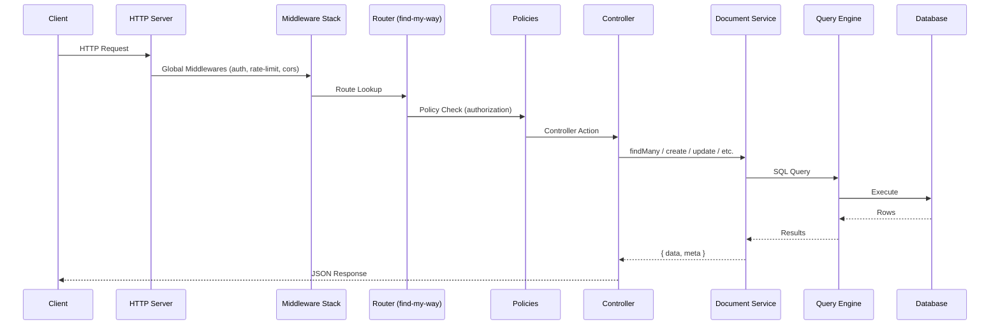
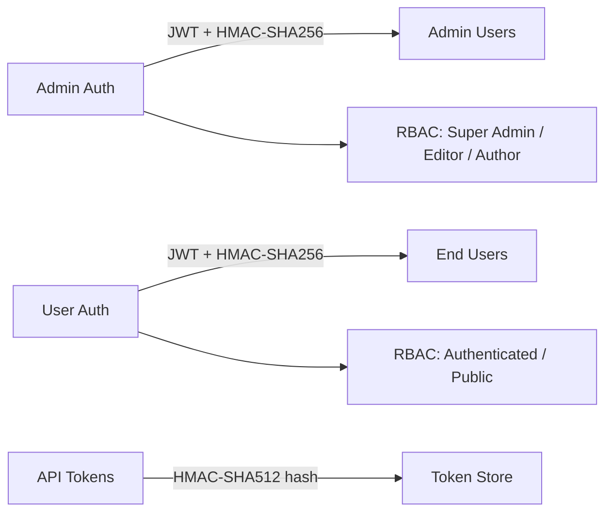
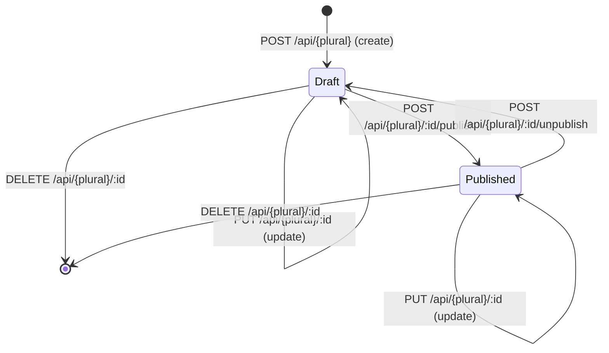

# APICK Architecture

## System Overview

APICK (API Construction Kit) is a pure headless CMS built TypeScript-first. Every operation — content CRUD, schema management, user management, role configuration, plugin settings — is performed via REST API. There is no admin UI.

### Technology Stack

| Layer | Technology |
|-------|-----------|
| Language | TypeScript (strict mode, ESM) |
| Runtime | Node.js >=20.0.0 |
| HTTP | `node:http` + `find-my-way` trie router |
| Database | Drizzle ORM (SQLite via better-sqlite3, extensible to PostgreSQL/MySQL) |
| Validation | Zod (TypeScript-native schema validation) |
| Auth | JWT (HMAC-SHA256) + CASL (fine-grained RBAC) |
| Logging | Pino (structured JSON, high performance) |
| Testing | Vitest, `server.inject()` for HTTP integration tests |
| Email | Provider-based (Resend default) |
| Upload | Provider-based (Cloudflare R2 default) |
| AI | Provider-based (OpenAI, Anthropic, Google, Ollama) |

### Pure Headless Philosophy

APICK has **no built-in admin UI**. Every operation — content CRUD, content type creation, user management, role configuration, plugin settings — is performed via REST API. This enables:

1. **Testability** — Every feature testable via HTTP requests (curl, Vitest)
2. **Flexibility** — Consumers build their own admin UIs, CLI tools, or LLM integrations
3. **Predictability** — Single source of truth: the API contract

### Key Design Decisions

| Decision | Choice | Rationale |
|----------|--------|-----------|
| HTTP layer | `node:http` + `find-my-way` | No framework dependency, cherry-picked standalone packages from Fastify ecosystem |
| Database ORM | Drizzle ORM | TypeScript-first, full type inference, SQL-like API, zero runtime overhead |
| Validation | Zod | TypeScript-native, composable, excellent inference |
| Auth | JWT + CASL | Stateless tokens with fine-grained RBAC via CASL abilities |
| Admin UI | None | Pure headless — all management via REST API |
| GraphQL | Not included | REST-only core; GraphQL available as plugin |

### Request Lifecycle



See [CONTENT_API_GUIDE.md](./CONTENT_API_GUIDE.md) for the full request pipeline detail.

## Package Structure

### Monorepo Layout

```
packages/
├── core/                        # Framework kernel
│   └── src/
│       ├── server/              # HTTP server, server.inject(), ctx helpers
│       ├── config/              # Configuration loader with dot-notation
│       ├── lifecycle/           # Apick bootstrap (load → listen → destroy)
│       ├── registries/          # Generic key-value registry factory
│       ├── content-api/         # Auto-generated REST endpoints
│       ├── content-types/       # Schema definition & normalization
│       ├── document-service/    # Document CRUD with draft/publish
│       ├── query-engine/        # SQL query builder (WHERE, ORDER BY, etc.)
│       ├── database/            # Drizzle ORM integration, schema sync, migrations
│       ├── auth/                # JWT sign/verify, password hashing
│       ├── sessions/            # Server-side session management
│       ├── middlewares/         # Rate-limit, CORS, security, body parser
│       ├── policies/            # Policy registry and execution
│       ├── factories/           # Core controller, service, router factories
│       ├── event-hub/           # Pub/sub event system
│       ├── cache/               # In-memory LRU cache with TTL
│       ├── logging/             # Pino structured logger
│       ├── errors/              # Error class definitions
│       ├── webhooks/            # Webhook CRUD + HMAC-signed delivery
│       ├── cron/                # Cron parser + in-process scheduler
│       ├── queue/               # Background job queue (AI, webhooks, email)
│       ├── plugins/             # Plugin manager with dependency resolution
│       ├── providers/           # Domain-based provider registry
│       └── request-context/     # AsyncLocalStorage request context
│
├── admin/                       # Admin users, roles, permissions, API tokens, audit logs
├── content-manager/             # Content CRUD service, history/versioning
├── users-permissions/           # End-user auth, roles, permissions
├── permissions/                 # CASL-based RBAC engine
├── i18n/                        # Internationalization (locales)
├── content-releases/            # Batch publish/unpublish releases
├── review-workflows/            # Editorial workflow stages
├── upload/                      # File/media management
├── email/                       # Provider-based email sending
├── data-transfer/               # Export/import with token auth
├── ai/                          # AI enrichment, generation, vector search, RAG
├── mcp-server/                  # Model Context Protocol server plugin
├── ai-gateway/                  # AI gateway plugin (proxy, cache, rate limit)
├── generators/                  # Code scaffolding (API, controller, service, plugin)
├── cli/                         # CLI tool (argument parser, command registry)
├── types/                       # Shared TypeScript type definitions
├── utils/                       # Errors, env, UID, object, string, validation
│
├── providers/
│   ├── email-resend/            # Resend email provider
│   ├── upload-r2/               # Cloudflare R2 upload (S3-compatible)
│   ├── ai-openai/               # OpenAI AI provider
│   ├── ai-anthropic/            # Anthropic AI provider
│   ├── ai-google/               # Google AI provider
│   └── ai-ollama/               # Ollama AI provider
│
└── e2e-tests/                   # HTTP-level integration tests (server.inject)
```

### User Project Structure

```
my-project/
├── config/
│   ├── server.ts              # Host, port, proxy, cron, logger
│   ├── admin.ts               # Admin API config, auth secrets
│   ├── database.ts            # Drizzle connection config
│   ├── api.ts                 # REST API config (responses, pagination)
│   ├── middlewares.ts         # Global middleware config (cors, helmet, body)
│   ├── plugins.ts             # Plugin enable/disable, plugin-specific config
│   └── env/
│       ├── development/       # Dev-specific overrides
│       ├── staging/
│       └── production/
├── src/
│   ├── index.ts               # Lifecycle hooks: register, bootstrap, destroy
│   ├── api/
│   │   └── article/
│   │       ├── content-types/
│   │       │   └── article/
│   │       │       └── schema.ts      # Zod schema + schema definition
│   │       ├── controllers/
│   │       │   └── article.ts
│   │       ├── services/
│   │       │   └── article.ts
│   │       ├── routes/
│   │       │   └── article.ts
│   │       ├── policies/              # Optional
│   │       └── middlewares/           # Optional
│   ├── components/
│   │   └── shared/
│   │       └── seo.ts                # Component schema
│   ├── plugins/                       # Local plugins
│   ├── extensions/                    # Override installed plugin behavior
│   ├── middlewares/                   # Global custom middlewares
│   └── policies/                      # Global custom policies
├── database/
│   └── migrations/                   # Drizzle migration files
├── public/                           # Static files served at /
├── types/
│   └── generated/
│       └── contentTypes.d.ts         # Auto-generated from schemas
├── .env
├── tsconfig.json
└── package.json
```

See [DEVELOPMENT_STANDARDS.md](./DEVELOPMENT_STANDARDS.md) for conventions and [CUSTOMIZATION_GUIDE.md](./CUSTOMIZATION_GUIDE.md) for extension patterns.

## Service Table

| Service | Package | Guide |
|---------|---------|-------|
| Content API | `@apick/core` | [CONTENT_API_GUIDE.md](./CONTENT_API_GUIDE.md) |
| Document Service | `@apick/core` | [DATABASE_GUIDE.md](./DATABASE_GUIDE.md) |
| Query Engine | `@apick/core` | [DATABASE_GUIDE.md](./DATABASE_GUIDE.md) |
| Schema Sync | `@apick/core` | [DATABASE_GUIDE.md](./DATABASE_GUIDE.md) |
| Auth (JWT, passwords) | `@apick/core` | [AUTH_GUIDE.md](./AUTH_GUIDE.md) |
| Session Management | `@apick/core` | [AUTH_GUIDE.md](./AUTH_GUIDE.md) |
| Rate Limiting | `@apick/core` | [CUSTOMIZATION_GUIDE.md](./CUSTOMIZATION_GUIDE.md) |
| Middleware Pipeline | `@apick/core` | [CUSTOMIZATION_GUIDE.md](./CUSTOMIZATION_GUIDE.md) |
| Policy System | `@apick/core` | [CUSTOMIZATION_GUIDE.md](./CUSTOMIZATION_GUIDE.md) |
| Factory Functions | `@apick/core` | [CUSTOMIZATION_GUIDE.md](./CUSTOMIZATION_GUIDE.md) |
| Event Hub | `@apick/core` | [PLUGINS_GUIDE.md](./PLUGINS_GUIDE.md) |
| Job Queue | `@apick/core` | [PLUGINS_GUIDE.md](./PLUGINS_GUIDE.md) |
| Webhook Service | `@apick/core` | [PLUGINS_GUIDE.md](./PLUGINS_GUIDE.md) |
| Cron Service | `@apick/core` | [PLUGINS_GUIDE.md](./PLUGINS_GUIDE.md) |
| Plugin Manager | `@apick/core` | [PLUGINS_GUIDE.md](./PLUGINS_GUIDE.md) |
| Provider Registry | `@apick/core` | [PLUGINS_GUIDE.md](./PLUGINS_GUIDE.md) |
| ContentManagerService | `@apick/content-manager` | [CONTENT_API_GUIDE.md](./CONTENT_API_GUIDE.md) |
| HistoryService | `@apick/content-manager` | [FEATURES_GUIDE.md](./FEATURES_GUIDE.md) |
| AdminService | `@apick/admin` | [AUTH_GUIDE.md](./AUTH_GUIDE.md) |
| AdminRoleService | `@apick/admin` | [AUTH_GUIDE.md](./AUTH_GUIDE.md) |
| AdminAuthService | `@apick/admin` | [AUTH_GUIDE.md](./AUTH_GUIDE.md) |
| ApiTokenService | `@apick/admin` | [AUTH_GUIDE.md](./AUTH_GUIDE.md) |
| AuditLogService | `@apick/admin` | [FEATURES_GUIDE.md](./FEATURES_GUIDE.md) |
| PermissionsEngine | `@apick/permissions` | [AUTH_GUIDE.md](./AUTH_GUIDE.md) |
| UserService | `@apick/users-permissions` | [AUTH_GUIDE.md](./AUTH_GUIDE.md) |
| UserAuthService | `@apick/users-permissions` | [AUTH_GUIDE.md](./AUTH_GUIDE.md) |
| LocaleService | `@apick/i18n` | [FEATURES_GUIDE.md](./FEATURES_GUIDE.md) |
| ReleaseService | `@apick/content-releases` | [FEATURES_GUIDE.md](./FEATURES_GUIDE.md) |
| WorkflowService | `@apick/review-workflows` | [FEATURES_GUIDE.md](./FEATURES_GUIDE.md) |
| UploadService | `@apick/upload` | [PLUGINS_GUIDE.md](./PLUGINS_GUIDE.md) |
| EmailService | `@apick/email` | [PLUGINS_GUIDE.md](./PLUGINS_GUIDE.md) |
| TransferService | `@apick/data-transfer` | [FEATURES_GUIDE.md](./FEATURES_GUIDE.md) |
| AI Plugin | `@apick/ai` | [AI_GUIDE.md](./AI_GUIDE.md) |
| MCP Server | `@apick/mcp-server` | [AI_GUIDE.md](./AI_GUIDE.md) |
| AI Gateway | `@apick/ai-gateway` | [AI_GUIDE.md](./AI_GUIDE.md) |
| CLI | `@apick/cli` | [DEPLOYMENT_GUIDE.md](./DEPLOYMENT_GUIDE.md) |
| Generators | `@apick/generators` | [DEVELOPMENT_STANDARDS.md](./DEVELOPMENT_STANDARDS.md) |

## UID Namespace System

Every content type, service, controller, and policy is identified by a **UID** (Unique Identifier) string.

| Prefix | Usage | Example |
|--------|-------|---------|
| `api::` | User-defined content types/APIs | `api::article.article` |
| `plugin::` | Plugin-provided artifacts | `plugin::users-permissions.user` |
| `admin::` | Admin-internal types | `admin::admin` |
| `apick::` | Framework internals | `apick::core-store` |
| `global::` | Global policies/middlewares | `global::is-authenticated` |

### UID Resolution Examples

```ts
// Content types
'api::article.article'                       // User content type
'plugin::upload.file'                        // Plugin content type

// Services (same UID as content type)
'api::article.article'                       // User service
'plugin::users-permissions.user'             // Plugin service

// Controllers
'api::article.article'                       // User controller
'plugin::content-manager.collection-types'   // Plugin controller

// Policies
'admin::isAuthenticatedAdmin'                // Admin policy
'plugin::users-permissions.isAuthenticated'  // Plugin policy
'global::is-owner'                           // Global policy (src/policies/)
```

See [CONTENT_MODELING_GUIDE.md](./CONTENT_MODELING_GUIDE.md) for content type schema definitions.

## Authentication & Authorization

Two separate auth systems with different token secrets and user stores.



The auth middleware inspects incoming requests and dispatches to the appropriate strategy:

```
Authorization: Bearer <token>
    |
    +-- URL starts with /admin?
    |       YES → authenticateAdminJWT (uses ADMIN_JWT_SECRET)
    |       NO  → is token JWT format (3 dot-separated segments)?
    |               YES → authenticateContentJWT (uses JWT_SECRET)
    |               NO  → authenticateApiToken (hash lookup in DB)
```

See [AUTH_GUIDE.md](./AUTH_GUIDE.md) for complete authentication and authorization documentation.

## Event System

| Event | Triggered By | Consumers |
|-------|-------------|-----------|
| `entry.create` | Document Service | Webhooks, Audit Logs, Cache Invalidation |
| `entry.update` | Document Service | Webhooks, Audit Logs, Cache Invalidation |
| `entry.delete` | Document Service | Webhooks, Audit Logs, Cache Invalidation |
| `entry.publish` | Document Service | Webhooks, Release Actions |
| `entry.unpublish` | Document Service | Webhooks |
| `entry.draft-discard` | Document Service | Webhooks |
| `media.create` | Upload Service | Webhooks |

See [PLUGINS_GUIDE.md](./PLUGINS_GUIDE.md) for event hub API and webhook integration.

## Draft & Publish



- **Default GET** returns published entries only
- **`?status=draft`** returns draft entries
- **Create with `status: "published"`** in request body creates an already-published entry

See [CONTENT_API_GUIDE.md](./CONTENT_API_GUIDE.md) for draft/publish API details.

## Config Loading

Config is loaded from `config/` with environment-specific overrides:

1. Read `.env` file and populate `process.env`
2. Load base config from `config/{name}.ts`
3. Load environment override from `config/env/{NODE_ENV}/{name}.ts`
4. Deep merge: `defaults` < `base config` < `env-specific overrides`

Only these config filenames are recognized:

| Filename | Required |
|----------|----------|
| `server.ts` | Yes |
| `database.ts` | Yes |
| `admin.ts` | No |
| `api.ts` | No |
| `middlewares.ts` | No |
| `plugins.ts` | No |

See [DEPLOYMENT_GUIDE.md](./DEPLOYMENT_GUIDE.md) for environment variable reference.

## Glossary

| Term | Definition |
|------|-----------|
| **Content Type** | A data model defining fields, relations, and behavior. Stored as TypeScript schema definition. |
| **Collection Type** | Content type with multiple entries (e.g., articles, products). |
| **Single Type** | Content type with exactly one entry (e.g., homepage, site settings). |
| **Component** | Reusable group of fields embeddable in any content type. |
| **Dynamic Zone** | Polymorphic field accepting ordered list of different component types. |
| **UID** | Unique identifier for content types, components, services, controllers. Format: `api::article.article`. |
| **Document** | A content entry identified by stable `documentId`, spanning locales and draft/published states. |
| **Document Service** | High-level API for content CRUD with draft/publish, i18n, and event support. |
| **Query Engine** | Low-level database API via Drizzle ORM, bypasses Document Service features. |
| **Content API** | Public REST endpoints under `/api/*` for content consumption. |
| **Admin API** | Management REST endpoints under `/admin/*` for CMS administration. |
| **Plugin** | Modular extension registering content types, services, controllers, routes. |
| **Provider** | Swappable implementation for infrastructure (upload storage, email delivery, AI). |
| **Policy** | Authorization gate that allows or denies request processing. |
| **Middleware** | Request/response transformer using async `(ctx, next)` pipeline pattern. |
| **Lifecycle Hook** | Database-level callback fired before/after CRUD operations. |
| **Zod Schema** | TypeScript-first validation schema used for all input/output validation. |
| **Job Queue** | Async processing system (`apick.queue`) for background work — AI inference, webhooks, email, data transfer. |
| **SSE** | Server-Sent Events — streaming response mechanism (`ctx.sse()`) for real-time data (LLM tokens, job progress). |
| **Provider Domain** | A registered category of swappable implementations (upload, email, AI). |
