# APICK CMS Authentication & Authorization Guide

## Table of Contents

- [Architecture](#architecture)
- [Admin Authentication](#admin-authentication)
- [End-User Authentication](#end-user-authentication)
- [API Tokens](#api-tokens)
- [Role-Based Access Control (RBAC)](#role-based-access-control-rbac)
- [Permissions Engine (CASL)](#permissions-engine-casl)
- [Session Management](#session-management)
- [SSO Infrastructure](#sso-infrastructure)
- [Rate Limiting](#rate-limiting)
- [Middleware Integration](#middleware-integration)
- [Key Files](#key-files)

---

## Architecture

APICK runs two independent auth systems on two URL namespaces. They share nothing except the underlying JWT algorithm.

| Aspect | Admin Auth (`/admin/*`) | End-User Auth (`/api/*`) |
|---|---|---|
| Secret config key | `admin.auth.secret` | `plugin.users-permissions.jwtSecret` |
| JWT default TTL | 7 days | 30 days |
| Token payload | `{ id, isAdmin: true }` | `{ id }` |
| Password hashing | SHA-512 (`createHash`) | HMAC-SHA512 (`createHmac`) |
| User table | `admin_users` | `up_users` |
| Role table | `admin_roles` + `admin_permissions` | `up_roles` (permissions as JSON column) |
| Service UIDs | `admin::user`, `admin::auth` | `plugin::users-permissions.user`, `plugin::users-permissions.auth` |

All JWTs use HMAC-SHA256 (`HS256`), constructed without external libraries. Password hashes are stored as `salt:hash` where the salt is 32 random bytes (hex-encoded).

### Auth Middleware Strategy Resolution

The auth middleware (`createAuthMiddleware`) inspects the incoming request and dispatches to one of three strategies:

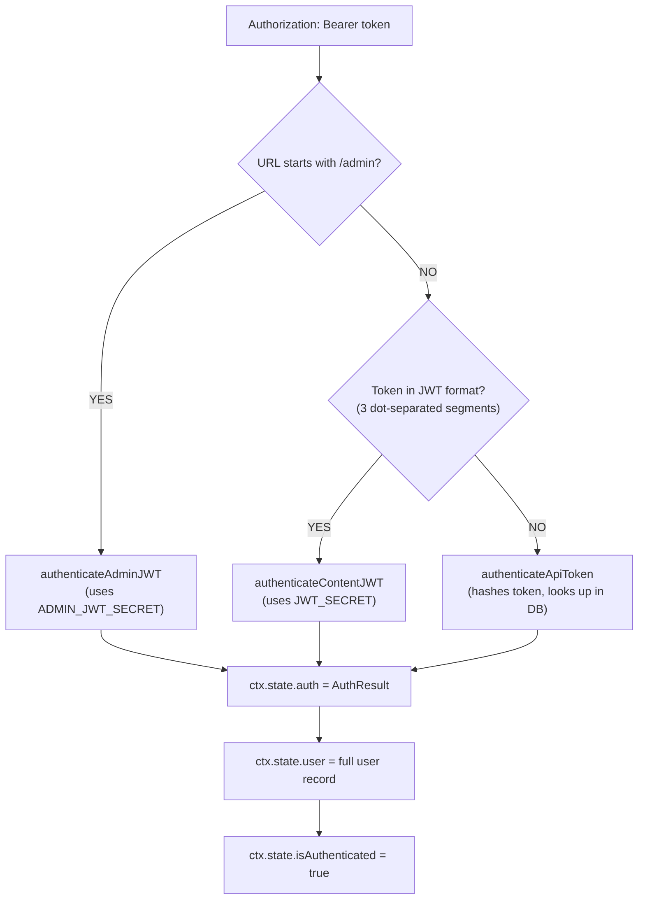

Each strategy implements the same interface:

```ts
interface AuthStrategy {
  name: string;
  authenticate(ctx: ApickContext): Promise<AuthResult | null>;
  verify(auth: AuthResult, config: RouteAuthConfig): Promise<void>;
}

interface AuthResult {
  authenticated: boolean;
  credentials: {
    id: number | string;
    type: 'user' | 'api-token';
  };
  ability: CASLAbility;
}
```

After authentication, the middleware sets:
- `ctx.state.auth` -- the `AuthResult` object
- `ctx.state.user` -- the full user record (loaded from the appropriate user service)
- `ctx.state.isAuthenticated` -- boolean

Routes can opt out of auth entirely by setting `config.auth = false` on the route definition.

### Authentication Sequence (Detailed)

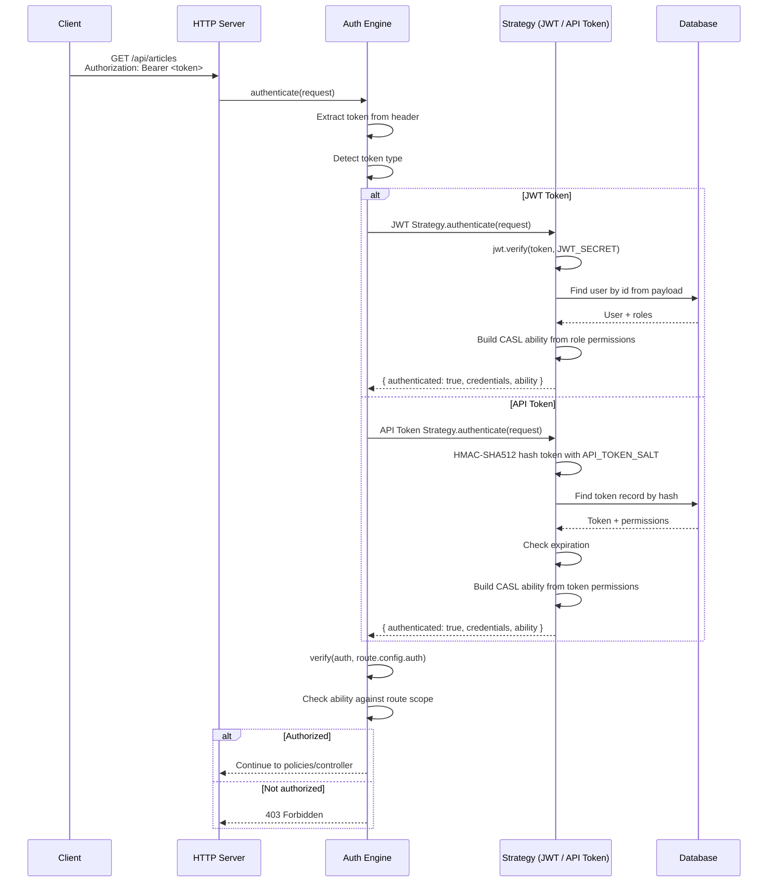

For how the auth system fits into the overall server architecture, see [ARCHITECTURE.md](./ARCHITECTURE.md).

---

## Admin Authentication

### First-Admin Registration

On a fresh install, `POST /admin/register-admin` is the only way to create the initial admin. It fails with 403 if any admin already exists.

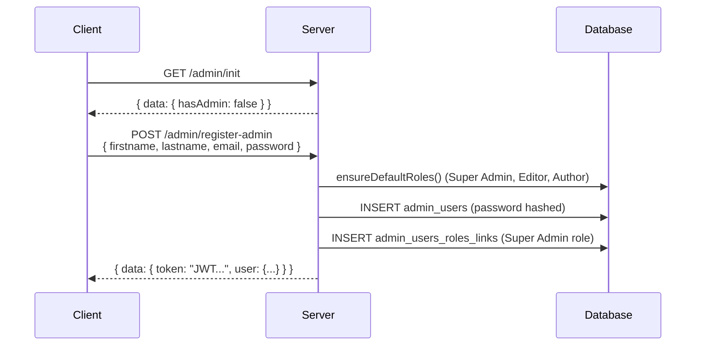

#### curl Example

```bash
# Check if any admin exists
curl -s http://localhost:1337/admin/init | jq

# Register the first admin
curl -X POST http://localhost:1337/admin/register-admin \
  -H "Content-Type: application/json" \
  -d '{
    "firstname": "Jane",
    "lastname": "Doe",
    "email": "admin@example.com",
    "password": "StrongP@ssw0rd!"
  }'
```

### Login & Token Lifecycle

| Endpoint | Method | Auth | Body | Returns |
|---|---|---|---|---|
| `/admin/login` | POST | No | `{ email, password }` | `{ token, user }` |
| `/admin/renew-token` | POST | Yes | `{ token }` | `{ token }` |
| `/admin/forgot-password` | POST | No | `{ email }` | `{ ok: true }` (always, prevents enumeration) |
| `/admin/reset-password` | POST | No | `{ resetPasswordToken, password }` | `{ ok: true }` |
| `/admin/logout` | POST | Yes | -- | `200 OK` |

Reset tokens are 32 random bytes (hex), stored in-memory with a 1-hour expiry.

#### curl Examples

```bash
# Login
curl -X POST http://localhost:1337/admin/login \
  -H "Content-Type: application/json" \
  -d '{
    "email": "admin@example.com",
    "password": "StrongP@ssw0rd!"
  }'

# Renew token (pass the refresh token in the body)
curl -X POST http://localhost:1337/admin/renew-token \
  -H "Content-Type: application/json" \
  -H "Authorization: Bearer <access-jwt>" \
  -d '{
    "token": "<refresh-jwt>"
  }'

# Forgot password
curl -X POST http://localhost:1337/admin/forgot-password \
  -H "Content-Type: application/json" \
  -d '{
    "email": "admin@example.com"
  }'

# Reset password
curl -X POST http://localhost:1337/admin/reset-password \
  -H "Content-Type: application/json" \
  -d '{
    "resetPasswordToken": "a1b2c3d4e5f6...",
    "password": "NewStrongP@ssw0rd!"
  }'
```

### Admin JWT Payload

```json
{
  "id": 1,
  "isAdmin": true,
  "iat": 1709500000,
  "exp": 1710104800
}
```

### Admin Session Configuration

Admin sessions always use the refresh pattern with short-lived access tokens and long-lived refresh tokens:

```ts
// config/admin.ts
export default ({ env }) => ({
  auth: {
    secret: env('ADMIN_JWT_SECRET'),
    options: {
      expiresIn: '1h',           // Access token TTL
    },
    session: {
      refreshTokenTTL: '30d',    // Refresh token TTL
    },
  },
});
```

See [Session Management](#session-management) for full details on token rotation and revocation.

---

## End-User Authentication

The Users & Permissions plugin (`@apick/plugin-users-permissions`) provides end-user authentication and role-based access control for the **Content API**. This is separate from admin-level authentication.

### Authentication Endpoints

| Method | Endpoint | Description | Auth Required |
|---|---|---|---|
| POST | `/api/auth/local` | Login with email/password | No |
| POST | `/api/auth/local/register` | Register a new user | No |
| GET | `/api/auth/:provider/callback` | OAuth/social login callback | No |
| POST | `/api/auth/forgot-password` | Request password reset email | No |
| POST | `/api/auth/reset-password` | Reset password with token | No |
| POST | `/api/auth/change-password` | Change password (current + new) | Yes |
| GET | `/api/auth/email-confirmation` | Confirm email via token | No |
| POST | `/api/auth/send-email-confirmation` | Resend confirmation email | No |
| POST | `/api/auth/token/refresh` | Refresh access token (refresh mode only) | No |
| POST | `/api/auth/logout` | Logout / revoke session (refresh mode only) | Yes |

### Registration

```bash
curl -X POST http://localhost:1337/api/auth/local/register \
  -H "Content-Type: application/json" \
  -d '{
    "username": "johndoe",
    "email": "user@example.com",
    "password": "securePassword123"
  }'
```

Response:

```json
{
  "jwt": "eyJhbGciOiJIUzI1NiIsInR5cCI6IkpXVCJ9...",
  "user": {
    "id": 1,
    "documentId": "abc123",
    "username": "johndoe",
    "email": "user@example.com",
    "confirmed": true,
    "blocked": false,
    "role": {
      "id": 1,
      "name": "Authenticated",
      "type": "authenticated"
    }
  }
}
```

New users are assigned the **Authenticated** role by default. Email confirmation can be required via plugin settings.

### Login

```bash
curl -X POST http://localhost:1337/api/auth/local \
  -H "Content-Type: application/json" \
  -d '{
    "identifier": "user@example.com",
    "password": "securePassword123"
  }'
```

The `identifier` field accepts an email address. Login checks both `blocked` and `confirmed` flags before verifying password.

### Token Modes

| Mode | Behavior |
|---|---|
| `legacy` (default) | Returns a single long-lived JWT; no refresh flow |
| `refresh` | Returns JWT + refresh token; use refresh token to get new JWT |

Configure in the plugin settings:

```ts
// config/plugins.ts
export default {
  'users-permissions': {
    config: {
      jwt: {
        expiresIn: '7d',       // Access token TTL (or '1h' for refresh mode)
      },
      token: {
        mode: 'legacy',        // 'legacy' or 'refresh'
      },
      session: {
        enabled: false,        // Set to true for refresh mode
        refreshTokenTTL: '30d',
      },
    },
  },
};
```

When `session.enabled` is `true`:
- Login returns both `jwt` and `refreshToken`
- A session record is created in the database
- `POST /api/auth/token/refresh` endpoint becomes available
- Logout deletes the session record

When `session.enabled` is `false` (default):
- Login returns only `jwt` (long-lived)
- No session records in the database
- No refresh endpoint
- Logout is client-side only (discard the JWT)

### Email Confirmation Flow

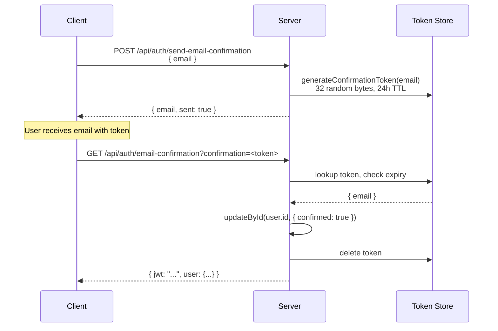

### Password Reset Flow

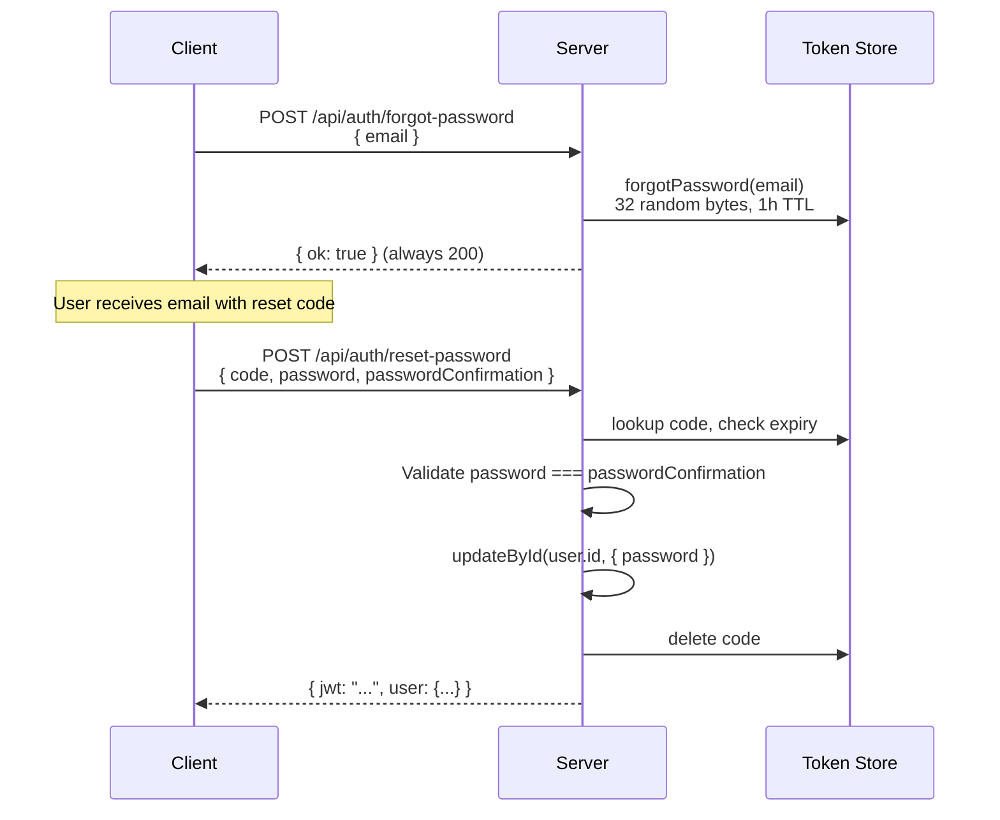

#### curl Examples

```bash
# Forgot password
curl -X POST http://localhost:1337/api/auth/forgot-password \
  -H "Content-Type: application/json" \
  -d '{ "email": "user@example.com" }'

# Reset password
curl -X POST http://localhost:1337/api/auth/reset-password \
  -H "Content-Type: application/json" \
  -d '{
    "code": "a1b2c3d4e5f6...",
    "password": "newSecurePassword456",
    "passwordConfirmation": "newSecurePassword456"
  }'

# Change password (authenticated)
curl -X POST http://localhost:1337/api/auth/change-password \
  -H "Content-Type: application/json" \
  -H "Authorization: Bearer <jwt>" \
  -d '{
    "currentPassword": "securePassword123",
    "password": "newSecurePassword456",
    "passwordConfirmation": "newSecurePassword456"
  }'
```

### Social / OAuth Providers

APICK supports OAuth login via third-party providers (Google, GitHub, etc.) for end-users:

```bash
# Redirect user to provider login
GET /api/connect/github

# Provider redirects back to
GET /api/auth/github/callback?access_token=...
```

The callback returns the same JWT + user payload as local login.

### Usage Example with Fetch

```ts
// Login
const loginRes = await fetch('https://api.example.com/api/auth/local', {
  method: 'POST',
  headers: { 'Content-Type': 'application/json' },
  body: JSON.stringify({
    identifier: 'user@example.com',
    password: 'securePassword123',
  }),
});
const { jwt } = await loginRes.json();

// Fetch protected content
const articlesRes = await fetch('https://api.example.com/api/articles', {
  headers: { Authorization: `Bearer ${jwt}` },
});
const articles = await articlesRes.json();
```

For content API response formats and query parameters, see [CONTENT_API_GUIDE.md](./CONTENT_API_GUIDE.md).

---

## API Tokens

API tokens authenticate Content API requests (`/api/*`) as an alternative to user JWTs. They provide stateless authentication for server-to-server integrations, CI/CD pipelines, static site generators, and any client that needs programmatic API access. Tokens are not in JWT format -- they are random hex strings, so the auth middleware identifies them by their non-JWT structure (no dots).

### Token Types

| Type | Allowed Actions | Use Case |
|---|---|---|
| `read-only` | `find`, `findOne` | Public data fetching, SSG builds |
| `full-access` | `find`, `findOne`, `create`, `update`, `delete` | Backend integrations |
| `custom` | Defined per-permission with action + subject | Fine-grained service accounts |

### Security Model

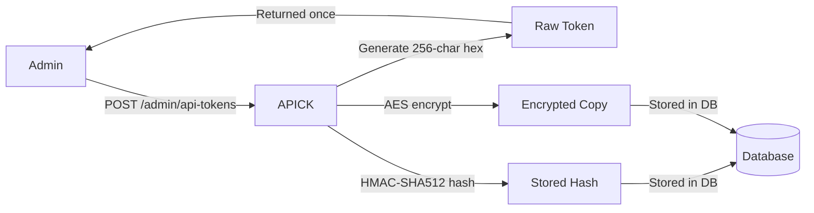

| What is stored | How | Purpose |
|---|---|---|
| Hash | HMAC-SHA512 of the raw token using `admin.apiToken.salt` | Authentication (comparison on request) |
| Encrypted copy | AES-encrypted raw token | Token regeneration / display |

The raw token value is returned **only once** at creation time. APICK does not store the plaintext token. On subsequent requests, the incoming token is hashed and compared against the stored hash.

### Token Lifecycle

| Lifespan value | Behavior |
|---|---|
| `null` | Never expires |
| `7` | Expires after 7 days |
| `30` | Expires after 30 days |
| `90` | Expires after 90 days |

The `expiresAt` timestamp is calculated from the creation date. Expired tokens are rejected with `401 Unauthorized`. Every successful authentication updates the `lastUsedAt` field on the token record.

### Management API

All token management endpoints require admin authentication.

| Endpoint | Method | Description |
|---|---|---|
| `/admin/api-tokens` | GET | List all tokens (does not return `accessKey` values) |
| `/admin/api-tokens/:id` | GET | Get token by ID |
| `/admin/api-tokens` | POST | Create token. Body: `{ name, type, description?, lifespan?, permissions? }`. Returns `accessKey` once. |
| `/admin/api-tokens/:id` | PUT | Update metadata (name, description, type, permissions) |
| `/admin/api-tokens/:id` | DELETE | Revoke and delete a token |
| `/admin/api-tokens/:id/regenerate` | POST | Regenerate token hash, returns new `accessKey` |

#### curl Examples

```bash
# Create a custom API token
curl -X POST http://localhost:1337/admin/api-tokens \
  -H "Content-Type: application/json" \
  -H "Authorization: Bearer <admin-jwt>" \
  -d '{
    "name": "CI/CD Pipeline",
    "description": "Used by GitHub Actions for deployment",
    "type": "custom",
    "lifespan": 90,
    "permissions": [
      "api::article.article.find",
      "api::article.article.findOne",
      "api::article.article.create",
      "api::article.article.update"
    ]
  }'

# List all tokens
curl http://localhost:1337/admin/api-tokens \
  -H "Authorization: Bearer <admin-jwt>"

# Regenerate a token (old secret immediately invalidated)
curl -X POST http://localhost:1337/admin/api-tokens/1/regenerate \
  -H "Authorization: Bearer <admin-jwt>"

# Delete a token
curl -X DELETE http://localhost:1337/admin/api-tokens/1 \
  -H "Authorization: Bearer <admin-jwt>"

# Use an API token to access the Content API
curl http://localhost:1337/api/articles \
  -H "Authorization: Bearer a1b2c3d4e5f6..."
```

### Custom Token Permissions

For `custom` type tokens, permissions are an array of `{ action, subject? }` objects. The ability check matches both action and subject:

```json
{
  "name": "blog-reader",
  "type": "custom",
  "permissions": [
    { "action": "find", "subject": "api::article.article" },
    { "action": "findOne", "subject": "api::article.article" }
  ]
}
```

Each permission string maps to a specific controller action:

| Permission | Maps to |
|---|---|
| `api::article.article.find` | `GET /api/articles` |
| `api::article.article.findOne` | `GET /api/articles/:id` |
| `api::article.article.create` | `POST /api/articles` |
| `api::article.article.update` | `PUT /api/articles/:id` |
| `api::article.article.delete` | `DELETE /api/articles/:id` |

The ability shim for API tokens:

```ts
// read-only token ability
{ can(action, _subject) { return ['find', 'findOne'].includes(action); } }

// custom token ability
{ can(action, subject) {
    return permissions.some(p => p.action === action && (!p.subject || p.subject === subject));
  }
}
```

---

## Role-Based Access Control (RBAC)

APICK implements two separate RBAC systems: one for admin users (CASL-based, fine-grained) and one for end-users (flat permission map).

### Admin Roles

Three built-in roles are created by `ensureDefaultRoles()`. Built-in roles cannot be deleted.

| Role | Code | Description |
|---|---|---|
| Super Admin | `apick-super-admin` | Full access to all features |
| Editor | `apick-editor` | Can manage and publish all content types |
| Author | `apick-author` | Can create and manage own content only |

#### Permission Comparison

| Action | Super Admin | Editor | Author |
|---|:---:|:---:|:---:|
| Create content | Yes | Yes | Yes |
| Read all content | Yes | Yes | No (own only) |
| Update all content | Yes | Yes | No (own only) |
| Delete all content | Yes | Yes | No (own only) |
| Publish content | Yes | Yes | No |
| Manage admin users | Yes | No | No |
| Manage roles | Yes | No | No |
| Manage API tokens | Yes | No | No |
| Manage settings | Yes | No | No |
| Install plugins | Yes | No | No |

#### Admin Permission Structure

Admin permissions are stored relationally in `admin_permissions`:

```ts
interface AdminPermission {
  action: string;          // e.g. "plugin::content-manager.explorer.create"
  subject: string | null;  // e.g. "api::article.article" or null for all
  properties: {
    fields?: string[];     // Field-level restriction
  } | null;
  conditions: string[];    // e.g. ["isCreator"]
  roleId: number;
}
```

Permissions are set atomically per role -- `setPermissions` deletes all existing permissions for the role and inserts the new set.

#### Example Admin Permission Records

```ts
// Full access to articles (all fields)
{
  action: 'plugin::content-manager.explorer.create',
  subject: 'api::article.article',
  properties: { fields: ['title', 'slug', 'content', 'cover', 'category'] },
  conditions: [],
}

// Read-only access to own articles
{
  action: 'plugin::content-manager.explorer.read',
  subject: 'api::article.article',
  properties: { fields: ['title', 'slug', 'content'] },
  conditions: ['isCreator'],
}

// Publish permission (no field restrictions)
{
  action: 'plugin::content-manager.explorer.publish',
  subject: 'api::article.article',
  properties: {},
  conditions: [],
}
```

#### Role Management API

| Method | Endpoint | Description |
|---|---|---|
| `GET` | `/admin/roles` | List all roles with permission counts |
| `GET` | `/admin/roles/:id` | Get role with full permission details |
| `POST` | `/admin/roles` | Create custom role |
| `PUT` | `/admin/roles/:id` | Update role metadata and permissions |
| `DELETE` | `/admin/roles/:id` | Delete custom role (not built-in) |
| `GET` | `/admin/permissions` | List all registered permission actions |

```bash
# Create a custom admin role
curl -X POST http://localhost:1337/admin/roles \
  -H "Authorization: Bearer <admin-jwt>" \
  -H "Content-Type: application/json" \
  -d '{
    "name": "Content Reviewer",
    "description": "Can read all content and update review status",
    "permissions": [
      {
        "action": "plugin::content-manager.explorer.read",
        "subject": "api::article.article",
        "properties": { "fields": ["title", "content", "status", "reviewNotes"] },
        "conditions": []
      },
      {
        "action": "plugin::content-manager.explorer.update",
        "subject": "api::article.article",
        "properties": { "fields": ["status", "reviewNotes"] },
        "conditions": []
      }
    ]
  }'
```

### End-User Roles

Two built-in roles, stored in `up_roles`. Cannot be deleted.

| Role | Type | Description |
|---|---|---|
| Authenticated | `authenticated` | Default role for logged-in end-users |
| Public | `public` | Applied to unauthenticated requests |

End-user permissions use a flat `Record<string, boolean>` map:

```json
{
  "api::article.article.find": true,
  "api::article.article.findOne": true,
  "api::article.article.create": false
}
```

Permission checking: `roleService.checkPermission(roleId, action)` returns `true` only if `permissions[action] === true`.

#### Configuring End-User Permissions

```ts
const roleService = apick.plugin('users-permissions').service('role');
const publicRole = await roleService.findOne({ type: 'public' });

await roleService.updateRole(publicRole.id, {
  permissions: {
    'api::article.article': {
      controllers: {
        article: {
          find: { enabled: true },
          findOne: { enabled: true },
          create: { enabled: false },
          update: { enabled: false },
          delete: { enabled: false },
        },
      },
    },
  },
});
```

---

## Permissions Engine (CASL)

APICK uses a [CASL](https://casl.js.org/)-based permissions engine for fine-grained access control. Permissions are stored as records in the database, converted to CASL abilities at runtime, and checked at multiple points in the request pipeline.

### Architecture

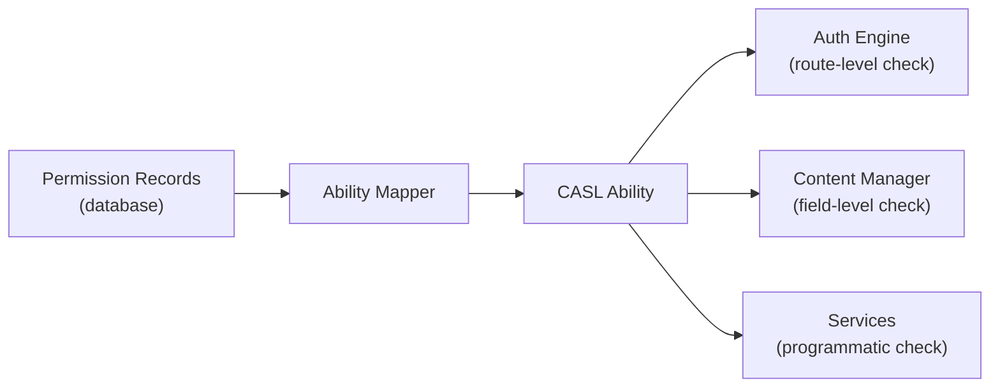

### Permission to Ability Mapping

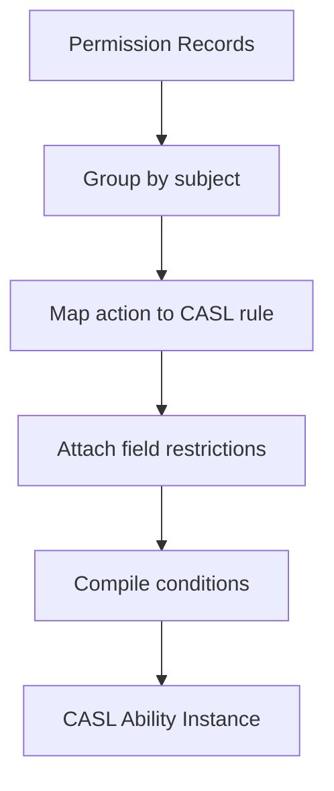

The mapping process:

1. Load all permission records for the caller (role permissions or API token permissions)
2. For each permission, create a CASL rule: `{ action, subject, fields?, conditions? }`
3. Template variables in conditions (e.g., `{{ user.id }}`) are interpolated with the current user's data
4. Rules are compiled into a CASL `Ability` instance

```ts
import { AbilityBuilder, createMongoAbility } from '@casl/ability';

function generateAbility(permissions: Permission[], user: User) {
  const { can, build } = new AbilityBuilder(createMongoAbility);

  for (const perm of permissions) {
    const conditions = interpolateConditions(perm.conditions, user);

    if (perm.properties?.fields) {
      can(perm.action, perm.subject, perm.properties.fields, conditions);
    } else {
      can(perm.action, perm.subject, conditions);
    }
  }

  return build();
}
```

### Permission Evaluation Flow

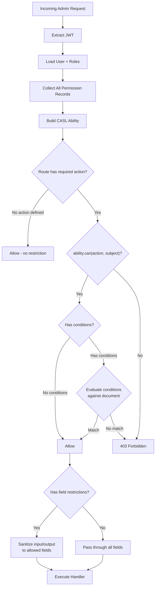

### Engine API

#### `generateAbility(permissions, user)`

Build a CASL ability from permission records:

```ts
const permissions = await apick.query('admin::permission').findMany({
  where: { role: { id: roleId } },
});

const ability = apick.service('admin::permission').engine.generateAbility(
  permissions,
  currentUser,
);
```

With condition handlers:

```ts
import { generateAbility } from '@apick/permissions';

const ability = generateAbility(permissions, {
  conditionHandlers: {
    isCreator: (user) => ({ createdBy: { id: user.id } }),
  },
  user: ctx.state.user,
});
```

#### `checkMany(ability, actions, subject)`

Check multiple actions at once:

```ts
const results = apick.service('admin::permission').engine.checkMany(
  ability,
  ['read', 'update', 'delete'],
  'api::article.article',
);
// { read: true, update: true, delete: false }
```

#### `can(ability, action, subject, entity?)`

Check a single action, optionally against a specific entity (for condition evaluation):

```ts
// Route-level check (no entity data)
const canRead = ability.can('find', 'api::article.article');

// Entity-level check (with data for condition evaluation)
const article = await apick.documents('api::article.article').findOne({ documentId: 'abc123' });
const canUpdate = ability.can('update', subject('api::article.article', article));
// If conditions include { createdBy: { id: 42 } }, this checks article.createdBy.id === 42

// Field-level check
ability.can('plugin::content-manager.explorer.read', 'api::article.article', 'title');
// => true
ability.can('plugin::content-manager.explorer.read', 'api::article.article', 'internalNotes');
// => false (not in properties.fields)
```

### Condition Evaluation

Conditions use **sift** operators (MongoDB-style query syntax) for runtime evaluation:

| Operator | Description | Example |
|---|---|---|
| `$eq` | Equal | `{ status: { $eq: 'published' } }` |
| `$ne` | Not equal | `{ status: { $ne: 'archived' } }` |
| `$in` | In array | `{ category: { $in: ['tech', 'science'] } }` |
| `$nin` | Not in array | `{ role: { $nin: ['banned'] } }` |
| `$lt`, `$lte` | Less than (or equal) | `{ price: { $lt: 100 } }` |
| `$gt`, `$gte` | Greater than (or equal) | `{ priority: { $gte: 5 } }` |
| `$exists` | Field exists | `{ publishedAt: { $exists: true } }` |
| `$regex` | Pattern match | `{ email: { $regex: '@company\\.com$' } }` |
| `$and` | Logical AND | `{ $and: [{ status: 'draft' }, { author: 1 }] }` |
| `$or` | Logical OR | `{ $or: [{ role: 'editor' }, { role: 'admin' }] }` |
| `$elemMatch` | Array element match | `{ tags: { $elemMatch: { name: 'featured' } } }` |

#### Template Variables

Conditions can reference the current user's properties using `{{ user.* }}` syntax:

```ts
// Permission record
{
  action: 'update',
  subject: 'api::article.article',
  conditions: [{ createdBy: { id: '{{ user.id }}' } }],
}

// At runtime, for user { id: 42 }, this becomes:
// { createdBy: { id: 42 } }
```

Supported template variables:

| Variable | Resolves To |
|---|---|
| `{{ user.id }}` | Authenticated user's ID |
| `{{ user.email }}` | User's email |
| `{{ user.username }}` | User's username |
| `{{ user.roles }}` | User's role codes |

#### Built-in Conditions

| Condition | Description | Resolves To |
|---|---|---|
| `isCreator` | User created the document | `{ createdBy: { id: user.id } }` |

#### Custom Conditions

Register custom conditions in the admin bootstrap:

```ts
// src/index.ts
export default {
  register({ apick }) {
    apick.service('admin::permission').conditionProvider.register({
      displayName: 'Is Assigned Reviewer',
      name: 'isAssignedReviewer',
      handler: (user) => ({
        'reviewers.id': { $eq: user.id },
      }),
    });
  },
};
```

Use the custom condition in role permissions:

```ts
{
  action: 'plugin::content-manager.explorer.update',
  subject: 'api::article.article',
  properties: { fields: ['content', 'status'] },
  conditions: ['isAssignedReviewer'],
}
```

### Field-Level Permissions

Permissions can restrict access to specific fields:

```ts
// Permission: read only title and slug
{
  action: 'find',
  subject: 'api::article.article',
  properties: { fields: ['title', 'slug', 'publishedAt'] },
}
```

#### How Field Permissions Are Enforced

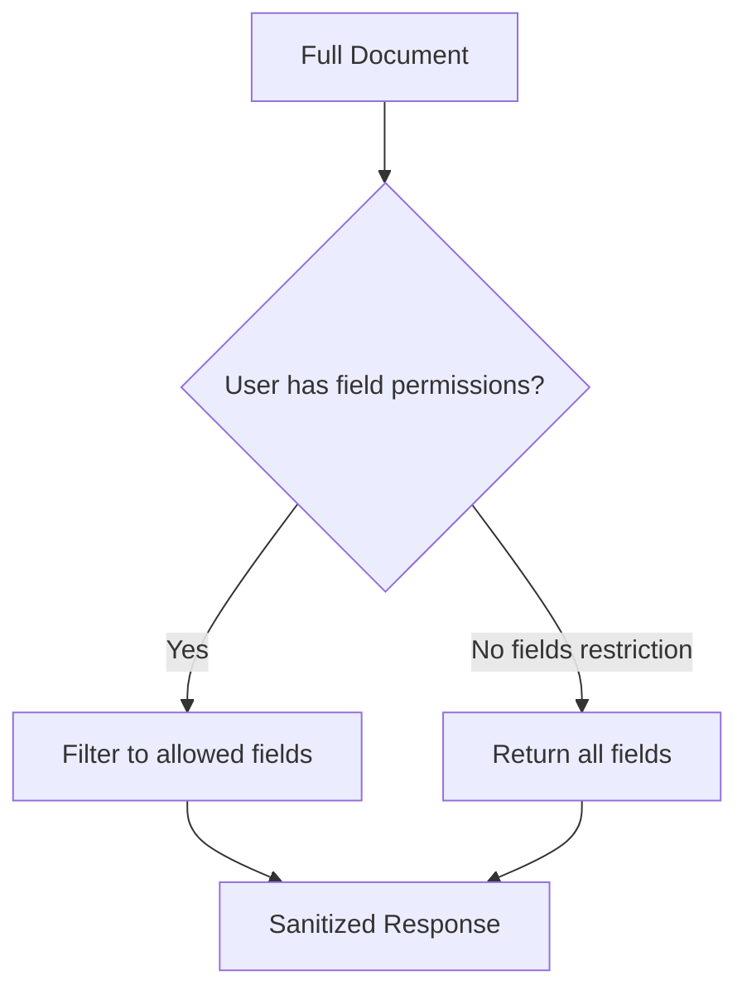

| Stage | Enforcement |
|---|---|
| **Query input** | `sanitizeQuery()` strips `fields` and `populate` entries the caller cannot access |
| **Query output** | `sanitizeOutput()` removes fields not in the allowed set |
| **Write input** | `sanitizeInput()` strips fields the caller cannot write |

```ts
// In a controller
async find(ctx) {
  const sanitizedQuery = await this.sanitizeQuery(ctx.query);
  const { results, pagination } = await apick.service('api::article.article').find(sanitizedQuery);
  const sanitizedResults = await this.sanitizeOutput(results, ctx);
  return this.transformResponse(sanitizedResults, { pagination });
}
```

### Permissions Engine Hook System

#### `willRegisterPermission`

Modify or reject permissions before they are stored:

```ts
apick.service('admin::permission').engine.hooks.willRegisterPermission.register(
  async ({ permission }) => {
    if (permission.action === 'delete') {
      permission.conditions = [
        ...(permission.conditions || []),
        { deletedAt: { $exists: false } },
      ];
    }
    return permission;
  },
);
```

#### `willCheckPermission`

Intercept permission checks:

```ts
apick.service('admin::permission').engine.hooks.willCheckPermission.register(
  async ({ ability, action, subject }) => {
    apick.log.debug({ action, subject }, 'permission check');
  },
);
```

#### Ability Generation Hooks

```ts
apick.service('admin::permission').on('before-build-ability', async ({ permissions, user }) => {
  // Inject time-based permissions
  if (isBusinessHours()) {
    permissions.push({
      action: 'plugin::content-manager.explorer.publish',
      subject: null,
      properties: {},
      conditions: [],
    });
  }
  return { permissions, user };
});
```

### Programmatic Usage

```ts
// Check if a user can perform an action
const ability = await apick.service('admin::permission').generateUserAbility(user);
const canPublish = ability.can(
  'plugin::content-manager.explorer.publish',
  'api::article.article'
);

// Get all actions a user can perform on a subject
const permissions = await apick.service('admin::permission').findUserPermissions(user);
const articlePerms = permissions.filter(p => p.subject === 'api::article.article');

// Register a new permission action (in plugin register phase)
apick.service('admin::permission').actionProvider.register({
  section: 'plugins',
  displayName: 'Access Analytics',
  uid: 'plugin::analytics.read',
  pluginName: 'analytics',
});
```

For extending the permissions engine via plugins, see [PLUGINS_GUIDE.md](./PLUGINS_GUIDE.md).

---

## Session Management

APICK implements database-backed JWT sessions with access and refresh tokens. This provides stateful session control (revocation, expiration management) while maintaining the stateless benefits of JWT for request authentication.

### Token Types

| Token | Lifetime | Purpose | Stored In |
|---|---|---|---|
| **Access token** | Short-lived (default: 1 hour) | Authenticates API requests via `Authorization` header | Client only (not in DB) |
| **Refresh token** | Long-lived (default: 30 days) | Obtains a new access token when the current one expires | Database-backed session record |

The access token is a stateless JWT verified by signature alone. The refresh token is tied to a session record in the database, enabling server-side revocation.

### JWT Payload Structure

**Access Token:**
```ts
{
  type: 'access',
  sessionId: 'sess_abc123def456',
  iat: 1709312400,    // Issued at (Unix timestamp)
  exp: 1709316000,    // Expiration (Unix timestamp)
}
```

**Refresh Token:**
```ts
{
  type: 'refresh',
  sessionId: 'sess_abc123def456',
  iat: 1709312400,
  exp: 1711904400,    // 30 days from issue
}
```

Both tokens reference the same `sessionId`, linking them to a single session record.

### Session Lifecycle

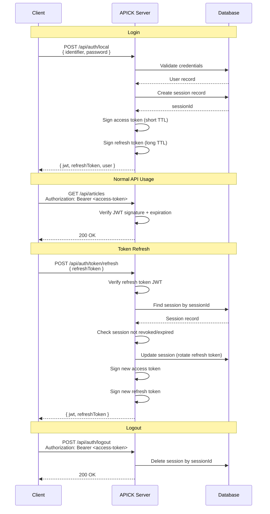

### Session Record Structure

```ts
interface Session {
  id: number;
  sessionId: string;          // Unique session identifier (UUID)
  userId: number;             // Associated user ID
  refreshTokenHash: string;   // HMAC-SHA512 hash of the current refresh token
  expiresAt: Date;            // When the session expires (matches refresh token TTL)
  createdAt: Date;
  updatedAt: Date;
  userAgent?: string;         // Client user-agent for session management UI
  ip?: string;                // Client IP address
}
```

### Token Rotation

Each refresh rotates the refresh token. The old refresh token becomes invalid immediately because the stored hash is updated. If a client attempts to use an old refresh token (token reuse), the entire session is revoked as a security measure.

### Session Service API

```ts
const sessionService = apick.service('admin::session');
// or for content API sessions:
// apick.service('plugin::users-permissions.session');
```

| Method | Signature | Description |
|---|---|---|
| `create` | `(data: SessionData) => Promise<Session>` | Create a new session record |
| `findBySessionId` | `(sessionId: string) => Promise<Session \| null>` | Find session by ID |
| `updateBySessionId` | `(sessionId: string, data: Partial<SessionData>) => Promise<Session>` | Update session (e.g., rotate refresh token hash) |
| `deleteBySessionId` | `(sessionId: string) => Promise<void>` | Delete a specific session (logout) |
| `deleteExpired` | `() => Promise<number>` | Remove all expired sessions (cleanup) |
| `deleteBy` | `(criteria: object) => Promise<number>` | Delete sessions matching criteria |

### Revoking Sessions

```ts
// Revoke a single session (logout)
await sessionService.deleteBySessionId('sess_abc123def456');

// Revoke all sessions for a user (force re-login on all devices)
await sessionService.deleteBy({ userId: 42 });

// Revoke all sessions (nuclear option)
await sessionService.deleteBy({});
```

After a session is deleted, the access token remains valid until it expires (it is stateless). For immediate revocation, use very short access token TTLs (e.g., 5 minutes) so the window of continued access is minimal.

### Session Cleanup

Expired sessions accumulate in the database. Configure automated cleanup via cron:

```ts
// config/server.ts
export default ({ env }) => ({
  cron: {
    enabled: true,
    tasks: {
      // Run daily at 3 AM
      '0 3 * * *': async ({ apick }) => {
        const adminDeleted = await apick.service('admin::session').deleteExpired();
        const userDeleted = await apick.service('plugin::users-permissions.session').deleteExpired();
        apick.log.info(`Session cleanup: ${adminDeleted} admin, ${userDeleted} user sessions removed`);
      },
    },
  },
});
```

---

## SSO Infrastructure

APICK supports **admin** authentication via external identity providers using OAuth2, OpenID Connect (OIDC), and SAML. Built on [Passport.js](https://www.passportjs.org/), the SSO system integrates with any provider that has a Passport strategy.

### SSO Authentication Flow

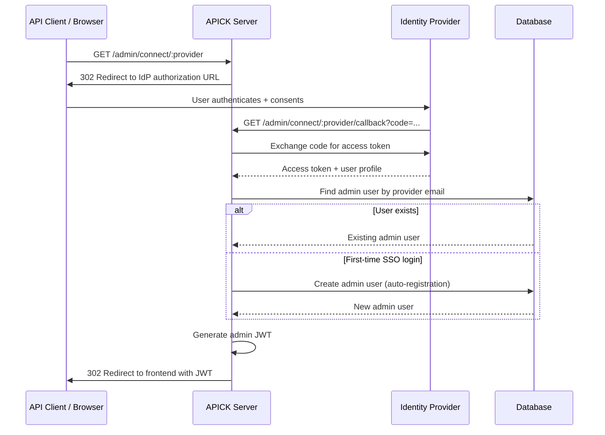

### SSO REST API

| Method | Endpoint | Auth | Description |
|---|---|---|---|
| GET | `/admin/providers` | No | List configured SSO providers (for rendering login buttons) |
| GET | `/admin/connect/:provider` | No | Initiate SSO redirect to identity provider |
| GET | `/admin/connect/:provider/callback` | No | Handle callback from identity provider |

### Configuration

Configure SSO providers in `config/admin.ts`:

```ts
// config/admin.ts
export default ({ env }) => ({
  auth: {
    secret: env('ADMIN_JWT_SECRET'),
    autoRegister: true,  // Set false to require pre-provisioned admin accounts
    providers: [
      {
        uid: 'google',
        displayName: 'Google',
        icon: 'https://cdn.example.com/google-icon.svg',
        createStrategy: (apick) => {
          const GoogleStrategy = require('passport-google-oauth20').Strategy;
          return new GoogleStrategy(
            {
              clientID: env('GOOGLE_CLIENT_ID'),
              clientSecret: env('GOOGLE_CLIENT_SECRET'),
              callbackURL: `${env('APICK_URL', 'http://localhost:1337')}/admin/connect/google/callback`,
              scope: ['email', 'profile'],
            },
            (accessToken, refreshToken, profile, done) => {
              done(null, {
                email: profile.emails[0].value,
                firstname: profile.name.givenName,
                lastname: profile.name.familyName,
              });
            }
          );
        },
      },
    ],
  },
  // Role assigned to new SSO users (default: Editor)
  defaultRole: {
    name: 'Editor',
  },
});
```

### Provider Configuration Fields

| Field | Type | Required | Description |
|---|---|---|---|
| `uid` | `string` | Yes | Unique identifier for the provider (used in URLs) |
| `displayName` | `string` | Yes | Human-readable name for the provider |
| `icon` | `string` | No | URL to provider icon (for custom frontends) |
| `createStrategy` | `function` | Yes | Factory function returning a Passport.js strategy instance |

### Supported Providers

Any Passport.js strategy works. Common examples:

| Provider | Protocol | npm Package |
|---|---|---|
| Google | OAuth2 | `passport-google-oauth20` |
| GitHub | OAuth2 | `passport-github2` |
| Microsoft Azure AD | OIDC | `passport-openidconnect` |
| Okta | SAML | `passport-saml` |
| Keycloak | OIDC | `passport-keycloak-oauth2-oidc` |

### Auto-Registration

| Aspect | Behavior |
|---|---|
| Email | Set from the identity provider profile |
| Name | Set from provider profile (`firstname`, `lastname`) |
| Password | Not set (SSO-only users cannot use password login) |
| Role | Assigned the default role for new admin users (configurable) |
| Active | Set to `true` immediately |

When `autoRegister` is `false`, SSO authentication will fail for any email that does not already exist as an admin user.

### Environment Variables for SSO

| Variable | Description |
|---|---|
| `ADMIN_JWT_SECRET` | Secret for signing admin JWTs |
| `APICK_URL` | Public URL of the APICK instance |
| `GOOGLE_CLIENT_ID` | Google OAuth client ID |
| `GOOGLE_CLIENT_SECRET` | Google OAuth client secret |
| `GITHUB_CLIENT_ID` | GitHub OAuth app client ID |
| `GITHUB_CLIENT_SECRET` | GitHub OAuth app client secret |
| `AZURE_TENANT_ID` | Azure AD tenant ID |
| `AZURE_CLIENT_ID` | Azure AD app client ID |
| `AZURE_CLIENT_SECRET` | Azure AD app client secret |

### Security Considerations

| Concern | Recommendation |
|---|---|
| Callback URL validation | Always use `APICK_URL` env variable; do not hardcode. Ensure the callback URL registered with the IdP exactly matches. |
| State parameter | Passport.js handles CSRF protection via the state parameter by default. Do not disable it. |
| Token exposure | The JWT is passed as a URL query parameter on redirect. Use HTTPS in production. |
| Email verification | SSO providers typically verify emails. If your provider does not, validate emails before creating admin users. |
| Provider secrets | Store `clientSecret` values in environment variables, never in version control. |
| Session fixation | APICK generates a new JWT on each SSO login, preventing session fixation. |

---

## Rate Limiting

Implemented as a standalone middleware with an in-memory sliding-window store.

### Configuration

```ts
import { createRateLimitMiddleware } from '@apick/core/middlewares/rate-limit';

apick.server.use(createRateLimitMiddleware({
  max: 100,                    // requests per window (default: 100)
  window: 60_000,              // window in ms (default: 60000)
  keyGenerator: (ctx) => ctx.ip, // default: client IP
  message: 'Too Many Requests', // 429 error message
  headers: true,               // send rate limit headers (default: true)
}));
```

### Response Headers

| Header | Description | When |
|---|---|---|
| `X-RateLimit-Limit` | Max requests per window | Every response |
| `X-RateLimit-Remaining` | Remaining requests in current window | Every response |
| `X-RateLimit-Reset` | Unix timestamp (seconds) when window resets | Every response |
| `Retry-After` | Seconds until client can retry | Only on 429 |

When the limit is exceeded, the middleware throws `RateLimitError` which results in HTTP 429. The store automatically sweeps expired entries every 5 minutes (or the window size, whichever is larger). The sweep timer is `unref`'d so it does not prevent process exit.

### Per-Route Rate Limiting

Apply different limits to auth-sensitive endpoints:

```ts
// Tight limit on login
server.route({
  method: 'POST',
  path: '/api/auth/local',
  middleware: [createRateLimitMiddleware({ max: 5, window: 60_000 })],
  handler: loginHandler,
});

// Looser limit on reads
server.route({
  method: 'GET',
  path: '/api/articles',
  middleware: [createRateLimitMiddleware({ max: 200, window: 60_000 })],
  handler: listHandler,
});
```

---

## Middleware Integration

### createAuthMiddleware Usage

```ts
import { createAuthMiddleware } from '@apick/core/auth';

const authMiddleware = createAuthMiddleware({
  apick,
  adminSecret: apick.config.get('admin.auth.secret'),
  jwtSecret: apick.config.get('plugin.users-permissions.jwtSecret'),
  apiTokenSalt: apick.config.get('admin.apiToken.salt'),
});

apick.server.use(authMiddleware);
```

### Route-Level Auth Control

```ts
// Public route -- skip auth entirely
server.route({
  method: 'GET',
  path: '/api/public-data',
  config: { auth: false },
  handler: async (ctx) => { ... },
});

// Protected with scope
server.route({
  method: 'DELETE',
  path: '/api/articles/:id',
  config: { auth: { scope: ['delete'] } },
  handler: async (ctx) => {
    // ctx.state.isAuthenticated === true
    // ctx.state.user is loaded
    // ability.can('delete', routeUID) already verified
  },
});

// Default (auth: undefined) -- proceeds without auth if no header,
// authenticates if header is present
server.route({
  method: 'GET',
  path: '/api/articles',
  handler: async (ctx) => {
    if (ctx.state.isAuthenticated) { /* ... */ }
  },
});
```

Routes can require multiple scopes:

```ts
config: {
  auth: {
    scope: ['create', 'publish'],
    // Caller must have BOTH create AND publish permissions
  },
}
```

When `auth: false`:
- No `Authorization` header required
- `ctx.state.auth` is `undefined`
- Policies still run (if configured)
- The controller must handle the absence of user context

### Custom Auth Middleware Pattern

```ts
function requireSuperAdmin(ctx, next) {
  if (!ctx.state.isAuthenticated) {
    throw new UnauthorizedError('Authentication required');
  }
  const roles = ctx.state.user?.roles || [];
  const roleService = apick.service('admin::role');
  const superAdmin = roleService.getSuperAdminRole();
  if (!roles.includes(superAdmin.id)) {
    throw new ForbiddenError('Super Admin access required');
  }
  return next();
}
```

### Programmatic Permission Checks in Services

```ts
async updateArticle(documentId: string, data: any, ctx: ApickContext) {
  const ability = ctx.state.auth?.ability;

  if (!ability) {
    throw new UnauthorizedError('Not authenticated');
  }

  const article = await apick.documents('api::article.article').findOne({ documentId });

  if (!ability.can('update', subject('api::article.article', article))) {
    throw new ForbiddenError('Cannot update this article');
  }

  return apick.documents('api::article.article').update({ documentId, data });
}
```

For writing custom middleware and extending the pipeline, see [CUSTOMIZATION_GUIDE.md](./CUSTOMIZATION_GUIDE.md).

---

## Key Files

| File | Description |
|---|---|
| `packages/core/src/auth/index.ts` | JWT sign/verify, API token hashing, `createAuthMiddleware`, strategy dispatch |
| `packages/admin/src/services/admin-auth.ts` | Admin auth service: login, register first admin, reset password, token renewal |
| `packages/admin/src/services/admin-user.ts` | Admin user CRUD, SHA-512 password hashing (`createHash`) |
| `packages/admin/src/services/admin-role.ts` | Admin roles + permissions CRUD, built-in role seeding |
| `packages/admin/src/services/api-token.ts` | API token CRUD, HMAC-SHA512 hashing, regeneration |
| `packages/admin/src/routes/index.ts` | All `/admin/*` route registrations |
| `packages/users-permissions/src/services/auth.ts` | End-user auth: login, register, forgot/reset password, email confirmation |
| `packages/users-permissions/src/services/user.ts` | End-user CRUD, HMAC-SHA512 password hashing (`createHmac`) |
| `packages/users-permissions/src/services/role.ts` | End-user roles + permissions, Public/Authenticated role seeding |
| `packages/users-permissions/src/routes/index.ts` | `/api/auth/*` and `/admin/users-permissions/*` route registrations |
| `packages/core/src/middlewares/rate-limit.ts` | Rate limiting middleware with in-memory store |

---

## Related Guides

- [ARCHITECTURE.md](./ARCHITECTURE.md) -- Overall system design, lifecycle, and package structure
- [CONTENT_API_GUIDE.md](./CONTENT_API_GUIDE.md) -- Content API endpoints, query parameters, response formats
- [CUSTOMIZATION_GUIDE.md](./CUSTOMIZATION_GUIDE.md) -- Custom middleware, policies, and extending the pipeline
- [PLUGINS_GUIDE.md](./PLUGINS_GUIDE.md) -- Plugin development, including registering custom permission actions and conditions
