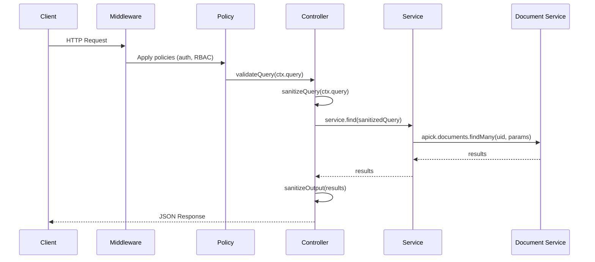
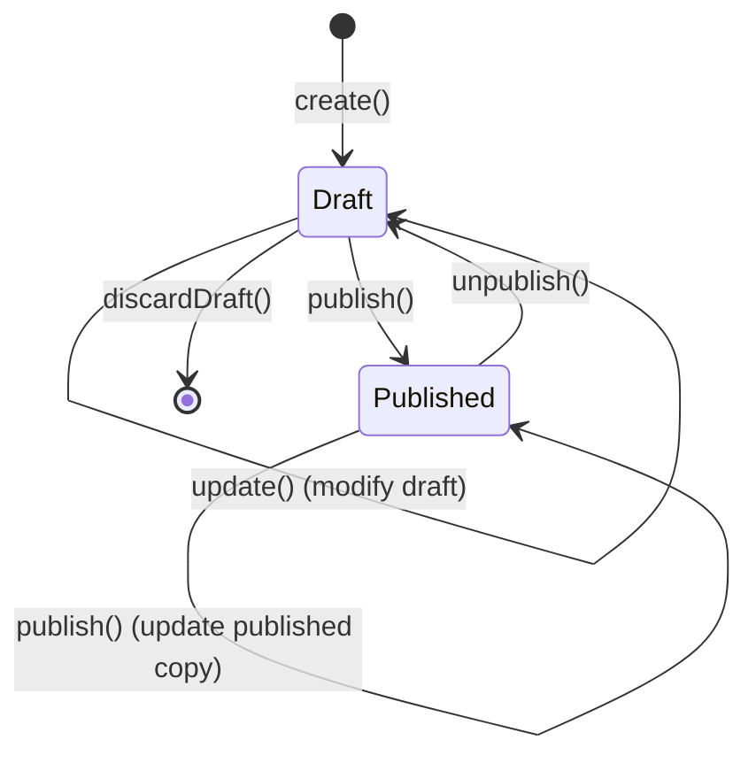

# Content API Guide

The Content API auto-generates REST endpoints for every registered content type. No manual route definitions required — register a content type schema, and the API surfaces immediately.

## Architecture

`registerContentApi(apick)` iterates the content type registry and creates routes based on `kind`:

- **`collectionType`** — routes use `pluralName` (e.g., `articles`)
- **`singleType`** — routes use `singularName` (e.g., `homepage`)

If a custom controller exists for the UID, its methods take priority over the default document service calls. See [CUSTOMIZATION_GUIDE.md](./CUSTOMIZATION_GUIDE.md) for controller customization.

### Request Pipeline



1. **validateQuery** — Validates query parameters against the content type schema using Zod
2. **sanitizeQuery** — Strips parameters the requesting role is not permitted to use
3. **Service call** — Delegates to Document Service
4. **sanitizeOutput** — Removes fields the requesting role cannot read

## Content API Endpoints

### Collection Types

For a content type with `pluralName: 'articles'`:

| Method | Path | Action | Description |
|--------|------|--------|-------------|
| `GET` | `/api/articles` | `find` | List entries with filtering, sorting, pagination |
| `GET` | `/api/articles/:id` | `findOne` | Get single entry by document ID |
| `POST` | `/api/articles` | `create` | Create new entry |
| `PUT` | `/api/articles/:id` | `update` | Update existing entry |
| `DELETE` | `/api/articles/:id` | `delete` | Delete entry |
| `POST` | `/api/articles/:id/publish` | `publish` | Publish entry |
| `POST` | `/api/articles/:id/unpublish` | `unpublish` | Unpublish entry |

### Single Types

For a content type with `singularName: 'homepage'`:

| Method | Path | Action | Description |
|--------|------|--------|-------------|
| `GET` | `/api/homepage` | `find` | Get the single entry |
| `PUT` | `/api/homepage` | `update` | Update the single entry |
| `DELETE` | `/api/homepage` | `delete` | Delete the single entry |

### curl Examples

```bash
# List all articles
curl http://localhost:1337/api/articles

# Get single article
curl http://localhost:1337/api/articles/abc123def456

# Create article
curl -X POST http://localhost:1337/api/articles \
  -H "Authorization: Bearer $TOKEN" \
  -H "Content-Type: application/json" \
  -d '{
    "data": {
      "title": "Getting Started with APICK",
      "slug": "getting-started-with-apick",
      "content": "APICK is a pure headless CMS...",
      "category": 3
    }
  }'

# Update article
curl -X PUT http://localhost:1337/api/articles/abc123def456 \
  -H "Authorization: Bearer $TOKEN" \
  -H "Content-Type: application/json" \
  -d '{
    "data": {
      "title": "Updated Title"
    }
  }'

# Delete article
curl -X DELETE http://localhost:1337/api/articles/abc123def456 \
  -H "Authorization: Bearer $TOKEN"
```

## Request/Response Format

### Create / Update Request

```json
{
  "data": {
    "title": "Getting Started with APICK",
    "slug": "getting-started-with-apick",
    "content": "APICK is a pure headless CMS...",
    "category": 3
  }
}
```

### Single Entry Response

```json
{
  "data": {
    "id": 1,
    "document_id": "abc123def456",
    "title": "Getting Started with APICK",
    "slug": "getting-started-with-apick",
    "content": "APICK is a pure headless CMS...",
    "created_at": "2026-01-15T10:30:00.000Z",
    "updated_at": "2026-01-15T10:30:00.000Z",
    "published_at": "2026-01-15T10:30:00.000Z",
    "locale": "en"
  },
  "meta": {}
}
```

### List Response

```json
{
  "data": [ ... ],
  "meta": {
    "pagination": {
      "page": 1,
      "pageSize": 25,
      "pageCount": 4,
      "total": 87
    }
  }
}
```

> **Flat response format.** APICK does not wrap fields inside a nested `attributes` object. All fields sit directly on the data object alongside `id`, `document_id`, and timestamps.

### Error Response

```json
{
  "data": null,
  "error": {
    "status": 400,
    "name": "ValidationError",
    "message": "Invalid query parameters",
    "details": {
      "errors": [
        { "path": ["filters", "nonexistent"], "message": "Field does not exist" }
      ]
    }
  }
}
```

| Status | Name | When |
|--------|------|------|
| `400` | `ValidationError` | Invalid request body, query params, or field values |
| `401` | `UnauthorizedError` | Missing or invalid authentication token |
| `403` | `ForbiddenError` | Authenticated but lacking required permissions |
| `404` | `NotFoundError` | Entry with given `document_id` does not exist |
| `409` | `ConflictError` | Unique constraint violation |
| `500` | `InternalServerError` | Unhandled server error |

## Query Parameters

### Filtering

Filter entries using `filters[field][operator]=value` syntax.

#### Operators

| Operator | Description | Example |
|----------|-------------|---------|
| `$eq` | Equal (default) | `filters[title][$eq]=Hello` |
| `$ne` | Not equal | `filters[status][$ne]=archived` |
| `$in` | Included in array | `filters[status][$in][0]=draft&filters[status][$in][1]=published` |
| `$notIn` | Not in array | `filters[status][$notIn][0]=archived` |
| `$gt` | Greater than | `filters[price][$gt]=100` |
| `$gte` | Greater than or equal | `filters[price][$gte]=100` |
| `$lt` | Less than | `filters[price][$lt]=50` |
| `$lte` | Less than or equal | `filters[price][$lte]=50` |
| `$contains` | Contains (case-sensitive) | `filters[title][$contains]=apick` |
| `$containsi` | Contains (case-insensitive) | `filters[title][$containsi]=apick` |
| `$startsWith` | Starts with | `filters[slug][$startsWith]=getting` |
| `$endsWith` | Ends with | `filters[email][$endsWith]=@example.com` |
| `$null` | Is null | `filters[publishedAt][$null]=true` |
| `$notNull` | Is not null | `filters[publishedAt][$notNull]=true` |
| `$between` | Between two values | `filters[price][$between][0]=10&filters[price][$between][1]=50` |
| `$not` | Negates nested condition | `filters[title][$not][$contains]=draft` |

#### Logical Operators

| Operator | Description | Example |
|----------|-------------|---------|
| `$or` | Matches any condition | `filters[$or][0][title][$eq]=Hello&filters[$or][1][title][$eq]=World` |
| `$and` | Matches all conditions (implicit) | `filters[$and][0][price][$gt]=10&filters[$and][1][price][$lt]=100` |

#### Deep Filtering on Relations

```bash
curl "http://localhost:1337/api/articles?filters[category][name][\$eq]=Technology"
curl "http://localhost:1337/api/articles?filters[tags][slug][\$in][0]=typescript"
```

### Sorting

```bash
# Single field
curl "http://localhost:1337/api/articles?sort=title:asc"

# Multiple fields
curl "http://localhost:1337/api/articles?sort[0]=publishedAt:desc&sort[1]=title:asc"

# Default direction is ascending
curl "http://localhost:1337/api/articles?sort=title"
```

### Pagination

Two strategies supported. Both return `meta.pagination`.

#### Page-Based (default)

| Parameter | Description | Default |
|-----------|-------------|---------|
| `pagination[page]` | Page number (1-indexed) | `1` |
| `pagination[pageSize]` | Entries per page | `25` |

```bash
curl "http://localhost:1337/api/articles?pagination[page]=2&pagination[pageSize]=10"
```

Response meta: `{ "page": 2, "pageSize": 10, "pageCount": 9, "total": 87 }`

#### Offset-Based

| Parameter | Description | Default |
|-----------|-------------|---------|
| `pagination[start]` | Starting index (0-based) | `0` |
| `pagination[limit]` | Number of entries | `25` |

```bash
curl "http://localhost:1337/api/articles?pagination[start]=20&pagination[limit]=10"
```

Response meta: `{ "start": 20, "limit": 10, "total": 87 }`

#### Configuration

```ts
// config/api.ts
export default {
  rest: {
    defaultLimit: 25,   // Default pageSize/limit when not specified
    maxLimit: 100,       // Upper bound — requests exceeding this are clamped
  },
};
```

### Field Selection

```bash
curl "http://localhost:1337/api/articles?fields[0]=title&fields[1]=slug&fields[2]=publishedAt"
```

> `id` and `document_id` are always included regardless of `fields` selection.

### Population

By default, relations and components are not included.

```bash
# Populate all first-level relations
curl "http://localhost:1337/api/articles?populate=*"

# Populate specific relation
curl "http://localhost:1337/api/articles?populate[author]=true"

# Populate with field selection
curl "http://localhost:1337/api/articles?populate[author][fields][0]=name&populate[author][fields][1]=email"

# Nested population
curl "http://localhost:1337/api/articles?populate[author][populate][avatar]=true"

# Populate with filtering
curl "http://localhost:1337/api/articles?populate[tags][filters][active][\$eq]=true"

# Populate with sorting and limit
curl "http://localhost:1337/api/articles?populate[comments][sort]=createdAt:desc&populate[comments][pagination][limit]=5"
```

### Full-Text Search

```bash
curl "http://localhost:1337/api/articles?_q=typescript+headless"
```

### Locale

When the i18n plugin is enabled:

```bash
curl "http://localhost:1337/api/articles?locale=en"
curl "http://localhost:1337/api/articles?locale=fr"
```

See [FEATURES_GUIDE.md](./FEATURES_GUIDE.md) for i18n details.

### Complete Query Example

```bash
curl "http://localhost:1337/api/articles\
?filters[category][slug][\$eq]=technology\
&filters[publishedAt][\$gte]=2026-01-01\
&sort[0]=publishedAt:desc\
&sort[1]=title:asc\
&fields[0]=title&fields[1]=slug&fields[2]=publishedAt\
&populate[author][fields][0]=name&populate[author][fields][1]=avatar\
&populate[tags]=true\
&pagination[page]=1&pagination[pageSize]=10\
&locale=en\
&status=published"
```

## Draft & Publish

When `draftAndPublish: true` is set on a content type, every document maintains up to two rows per locale: draft and published.



| State | `publishedAt` | Default GET returns | `?status=draft` returns |
|-------|---------------|---------------------|------------------------|
| Draft | `null` | No | Yes |
| Published | ISO 8601 timestamp | Yes | No |

### REST API Usage

```bash
# Published entries (default)
curl "http://localhost:1337/api/articles"

# Draft entries
curl "http://localhost:1337/api/articles?status=draft"

# Specific document's draft
curl "http://localhost:1337/api/articles/abc123?status=draft"

# Create as published
curl -X POST http://localhost:1337/api/articles \
  -H "Authorization: Bearer $TOKEN" \
  -H "Content-Type: application/json" \
  -d '{ "data": { "title": "Published immediately" }, "status": "published" }'
```

### Document Service Methods

```ts
// Publish
await apick.documents('api::article.article').publish({
  documentId: 'abc123',
  locale: 'en',
});

// Unpublish (removes published row, draft remains)
await apick.documents('api::article.article').unpublish({
  documentId: 'abc123',
  locale: 'en',
});

// Discard draft (reset draft to match published version)
await apick.documents('api::article.article').discardDraft({
  documentId: 'abc123',
  locale: 'en',
});

// Publish (locale is optional — omit to publish default locale)
await apick.documents('api::article.article').publish({
  documentId: 'abc123',
});
```

### Lifecycle Events

| Event | Trigger |
|-------|---------|
| `entry.publish` | `publish()` succeeds |
| `entry.unpublish` | `unpublish()` succeeds |
| `entry.draft-discard` | `discardDraft()` succeeds |

## Admin API

The Admin API provides full CMS management via REST endpoints under `/admin/`. All endpoints require an admin JWT except `POST /admin/register-admin` and `POST /admin/login`.

### Authentication

```bash
# Register first admin (only works when no admins exist)
curl -X POST http://localhost:1337/admin/register-admin \
  -H "Content-Type: application/json" \
  -d '{
    "firstname": "Admin",
    "lastname": "User",
    "email": "admin@example.com",
    "password": "SecureP@ssw0rd!"
  }'
# Returns: { data: { token: "eyJ...", user: { ... } } }

# Login
curl -X POST http://localhost:1337/admin/login \
  -H "Content-Type: application/json" \
  -d '{ "email": "admin@example.com", "password": "SecureP@ssw0rd!" }'

# Renew token
curl -X POST http://localhost:1337/admin/renew-token \
  -H "Authorization: Bearer $ADMIN_TOKEN" \
  -H "Content-Type: application/json" \
  -d '{ "token": "'$ADMIN_TOKEN'" }'
```

### Admin API Endpoint Summary

| Area | Endpoints | Description |
|------|-----------|-------------|
| Content Types | `/admin/content-types` | CRUD for content type schemas |
| Components | `/admin/components` | CRUD for component schemas |
| Admin Users | `/admin/users` | CRUD for admin users, `/admin/users/me` |
| Roles | `/admin/roles` | CRUD for roles + permission assignment |
| Permissions | `/admin/permissions` | List available permission tree |
| API Tokens | `/admin/api-tokens` | CRUD + regenerate |
| Transfer Tokens | `/admin/transfer-tokens` | CRUD + regenerate (push/pull/push-pull) |
| Webhooks | `/admin/webhooks` | CRUD for webhook subscriptions |
| Settings | `/admin/settings` | Get/update system settings |

See [AUTH_GUIDE.md](./AUTH_GUIDE.md) for authentication details, [CONTENT_MODELING_GUIDE.md](./CONTENT_MODELING_GUIDE.md) for content type management, and [FEATURES_GUIDE.md](./FEATURES_GUIDE.md) for audit logs.

### Default Admin Roles

| Role | Code | Description |
|------|------|-------------|
| Super Admin | `apick-super-admin` | Full access, cannot be modified or deleted |
| Editor | `apick-editor` | Content management, no settings or user management |
| Author | `apick-author` | Create and manage own content only |

### API Token Types

| Type | Description |
|------|-------------|
| `read-only` | `GET` requests only on Content API |
| `full-access` | All Content API operations |
| `custom` | Fine-grained per-action, per-content-type permissions |

```bash
# Create read-only token
curl -X POST http://localhost:1337/admin/api-tokens \
  -H "Authorization: Bearer $ADMIN_TOKEN" \
  -H "Content-Type: application/json" \
  -d '{
    "name": "Mobile App Token",
    "description": "Read-only access for mobile application",
    "type": "read-only",
    "lifespan": 2592000000
  }'
# Returns accessKey — store it securely, cannot be retrieved later

# Use the token
curl http://localhost:1337/api/articles \
  -H "Authorization: Bearer $API_TOKEN"
```

### Webhook Events

| Event | Trigger |
|-------|---------|
| `entry.create` | Content entry created |
| `entry.update` | Content entry updated |
| `entry.delete` | Content entry deleted |
| `entry.publish` | Content entry published |
| `entry.unpublish` | Content entry unpublished |
| `media.create` | Media file uploaded |
| `media.update` | Media file updated |
| `media.delete` | Media file deleted |

Webhook payload example:

```json
{
  "event": "entry.publish",
  "createdAt": "2026-03-02T10:30:00.000Z",
  "model": "article",
  "uid": "api::article.article",
  "entry": {
    "id": 42,
    "document_id": "abc123def456",
    "title": "Published Article",
    "published_at": "2026-03-02T10:30:00.000Z"
  }
}
```

See [PLUGINS_GUIDE.md](./PLUGINS_GUIDE.md) for webhook HMAC signing and delivery details.

## Configuration

### API Prefix

```ts
// config/api.ts
export default {
  rest: {
    prefix: '/api',         // Change to '/v1' or any custom prefix
    defaultLimit: 25,
    maxLimit: 100,
  },
};
```

### Per-Content-Type Route Configuration

```ts
// src/api/article/routes/article.ts
import { defineRoutes } from '@apick/core';

export default defineRoutes('api::article.article', {
  type: 'content-api',
  config: {
    find: {
      policies: ['global::is-public'],
      middlewares: ['global::cache'],
    },
    create: {
      policies: ['admin::isAuthenticatedAdmin'],
    },
  },
});
```

See [CUSTOMIZATION_GUIDE.md](./CUSTOMIZATION_GUIDE.md) for route, controller, and middleware customization.
