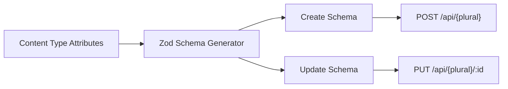
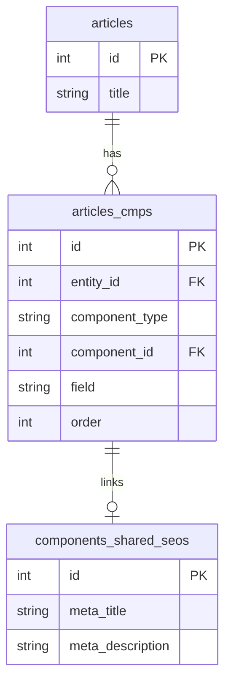
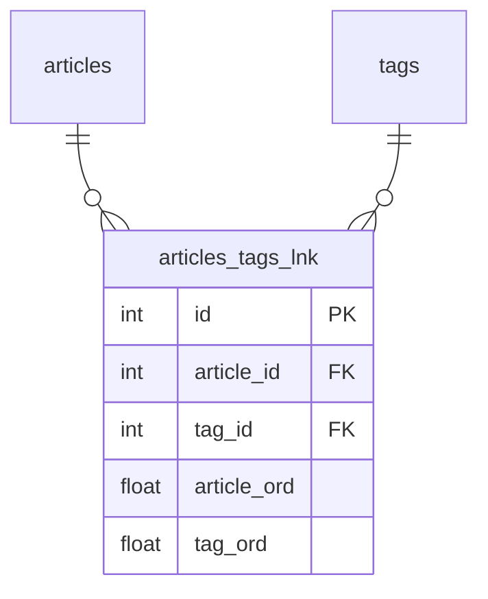

# Content Modeling Guide

Content types are the data models of APICK. Every content type produces a database table, REST endpoints, and Zod validation schemas automatically.

## Content Types

### Two Kinds

| Kind | `kind` value | Entries | Generated Endpoints |
|------|-------------|---------|---------------------|
| **Collection Type** | `collectionType` | 0..N | `GET /api/{plural}`, `GET /api/{plural}/:id`, `POST`, `PUT /:id`, `DELETE /:id`, `POST /:id/publish`, `POST /:id/unpublish` |
| **Single Type** | `singleType` | Exactly 1 | `GET /api/{singular}`, `PUT /api/{singular}`, `DELETE /api/{singular}` |

Collection types model repeating entities (articles, products). Single types model one-off data (homepage hero, global settings).

### Schema Definition

Content types are defined as TypeScript files, not JSON. This provides full type inference and IDE support.

```ts
// src/api/article/content-types/article/schema.ts
import { defineContentType } from '@apick/core';
import { z } from 'zod';

export default defineContentType({
  kind: 'collectionType',
  collectionName: 'articles',
  info: {
    singularName: 'article',
    pluralName: 'articles',
    displayName: 'Article',
    description: 'Blog articles',
  },
  options: {
    draftAndPublish: true,
  },
  attributes: {
    title: { type: 'string', required: true, maxLength: 255 },
    content: { type: 'richtext' },
    slug: { type: 'uid', targetField: 'title' },
    cover: { type: 'media', multiple: false },
    category: {
      type: 'relation',
      relation: 'manyToOne',
      target: 'api::category.category',
      inversedBy: 'articles',
    },
  },
});
```

### File Location

```
src/api/{singularName}/content-types/{singularName}/schema.ts
```

Every API module follows this directory structure:

```
src/api/article/
  content-types/article/schema.ts
  controllers/article.ts
  services/article.ts
  routes/article.ts
```

### UID Format

| Source | Format | Example |
|--------|--------|---------|
| User-defined API | `api::{singularName}.{singularName}` | `api::article.article` |
| Plugin | `plugin::{pluginName}.{typeName}` | `plugin::users-permissions.user` |
| Admin | `admin::{name}` | `admin::user` |

See [ARCHITECTURE.md](./ARCHITECTURE.md) for the full UID namespace system.

### Schema Object Reference

#### `info`

| Property | Required | Description |
|----------|----------|-------------|
| `singularName` | Yes | Lowercase kebab-case. Drives UID and file paths. |
| `pluralName` | Yes | Lowercase kebab-case. Drives API route prefix. |
| `displayName` | Yes | Human-readable label. |
| `description` | No | Free-text description. |

#### `options`

| Property | Default | Description |
|----------|---------|-------------|
| `draftAndPublish` | `true` | Enable draft/publish workflow. When `false`, entries are published immediately. |
| `populateCreatorFields` | `false` | Include `createdBy`/`updatedBy` in default API response. |

#### `pluginOptions`

Per-plugin configuration. Example enabling i18n:

```ts
pluginOptions: {
  i18n: { localized: true },
},
```

### System Fields

APICK auto-injects these fields into every content type. Do not declare them in `attributes`.

| Field | Type | Description |
|-------|------|-------------|
| `id` | `integer` (auto-increment) | Primary key. Internal only. |
| `document_id` | `string` (UUID) | Stable public identifier across draft/published states and locales. |
| `created_at` | `datetime` | Row creation timestamp. |
| `updated_at` | `datetime` | Last modification timestamp. |
| `published_at` | `datetime \| null` | Publication timestamp (`null` = draft). Only when `draftAndPublish: true`. |
| `first_published_at` | `datetime` | Set once on first publish. Never overwritten. |
| `createdBy` | `relation` | Admin user who created the entry (admin API only). |
| `updatedBy` | `relation` | Admin user who last updated the entry (admin API only). |
| `locale` | `string \| null` | Locale code. Only when i18n is enabled on the content type. |

`document_id` vs `id`: The `id` is the database row primary key. The `document_id` groups all versions (draft, published, localized) of a single content entry. Always use `document_id` in the Content API.

### Composite Indexes

```ts
export default defineContentType({
  // ...
  options: {
    indexes: [
      { name: 'unique_slug_per_locale', columns: ['slug', 'locale'], type: 'unique' },
      { name: 'idx_published_category', columns: ['publishedAt', 'category'], type: 'index' },
    ],
  },
});
```

| Index Type | Purpose |
|-----------|---------|
| `unique` | Enforce uniqueness across the column combination |
| `index` | Improve query performance (no uniqueness constraint) |

### Default Values

**Static defaults:**

```ts
attributes: {
  status: { type: 'enumeration', enum: ['draft', 'review', 'published'], default: 'draft' },
  featured: { type: 'boolean', default: false },
}
```

**Dynamic defaults** via lifecycle hooks:

```ts
// src/api/article/content-types/article/lifecycles.ts
export default {
  beforeCreate(event) {
    if (!event.params.data.publishCode) {
      event.params.data.publishCode = crypto.randomUUID().slice(0, 8);
    }
  },
};
```

See [CUSTOMIZATION_GUIDE.md](./CUSTOMIZATION_GUIDE.md) for lifecycle hook details.

### Content Type Management API

Since APICK is pure headless, content types are managed entirely via REST API.

| Method | Endpoint | Description |
|--------|----------|-------------|
| `GET` | `/admin/content-types` | List all content types with full schema |
| `GET` | `/admin/content-types/:uid` | Get single content type by UID |
| `POST` | `/admin/content-types` | Create new content type |
| `PUT` | `/admin/content-types/:uid` | Update existing content type |
| `DELETE` | `/admin/content-types/:uid` | Delete content type and drop table |

```bash
# Create a content type
curl -X POST http://localhost:1337/admin/content-types \
  -H "Authorization: Bearer $ADMIN_TOKEN" \
  -H "Content-Type: application/json" \
  -d '{
    "contentType": {
      "kind": "collectionType",
      "displayName": "Product",
      "singularName": "product",
      "pluralName": "products",
      "attributes": {
        "name": { "type": "string", "required": true },
        "price": { "type": "decimal" }
      }
    }
  }'
```

This request validates the schema, generates `src/api/product/content-types/product/schema.ts`, runs database sync (creates the `products` table via Drizzle), registers routes/controllers/services, and returns the full content type object with its UID.

### Programmatic Access

```ts
// Get a single content type by UID
const articleSchema = apick.contentType('api::article.article');

// Iterate all registered content types
const allTypes = apick.contentTypes;
// Returns: Record<string, ContentTypeSchema>
```

---

## Field Types

Every attribute in a content type schema has a `type`. APICK supports 17 scalar types and 5 special types.

### Scalar Types

| Type | DB Column | Zod Schema | Description | Key Options |
|------|-----------|------------|-------------|-------------|
| `string` | `varchar(255)` | `z.string()` | Short text | `minLength`, `maxLength`, `regex` |
| `text` | `text` / `longtext` | `z.string()` | Long text | `minLength`, `maxLength` |
| `richtext` | `text` / `longtext` | `z.string()` | HTML or Markdown content | `minLength`, `maxLength` |
| `blocks` | `json` | `z.array(BlockSchema)` | Structured block editor content | — |
| `email` | `varchar(255)` | `z.string().email()` | Validated email address | `minLength`, `maxLength` |
| `password` | `varchar(255)` | `z.string()` | Hashed on write, hidden on read | `minLength`, `maxLength` |
| `uid` | `varchar(255)` | `z.string()` | URL-friendly slug | `targetField` |
| `integer` | `integer` | `z.number().int()` | 32-bit integer | `min`, `max` |
| `biginteger` | `bigint` | `z.string()` | Arbitrary-precision integer (string in JSON) | `min`, `max` |
| `float` | `float` | `z.number()` | Floating-point number | `min`, `max` |
| `decimal` | `decimal(10,2)` | `z.number()` | Fixed-precision decimal | `min`, `max` |
| `boolean` | `boolean` | `z.boolean()` | true/false | `default` |
| `date` | `date` | `z.string()` | ISO date: `2025-01-15` | — |
| `time` | `time` | `z.string()` | Time: `14:30:00` | — |
| `datetime` | `datetime` | `z.string().datetime()` | Full: `2025-01-15T14:30:00.000Z` | — |
| `enumeration` | `varchar(255)` | `z.enum([...])` | One of predefined values | `enum` (required) |
| `json` | `json` / `jsonb` | `z.unknown()` | Arbitrary JSON | — |

**Notes:**
- **password** — Auto-hashed before storage. Always excluded from API responses via implicit `private` option.
- **uid** — Auto-generated from `targetField` by slugifying. Collisions append a numeric suffix.
- **biginteger** — String in JSON responses because JavaScript `Number` cannot safely represent integers beyond `2^53 - 1`.

### Special Types

#### media

References uploaded files managed by the Upload plugin.

```ts
cover: { type: 'media', multiple: false, allowedTypes: ['images'] }
gallery: { type: 'media', multiple: true, allowedTypes: ['images', 'videos'] }
```

| Option | Type | Default | Description |
|--------|------|---------|-------------|
| `multiple` | `boolean` | `false` | Accept multiple files |
| `allowedTypes` | `string[]` | `['images','files','videos','audios']` | Restrict MIME categories |

#### relation

Links to other content types. See [Relations](#relations) below.

#### component

Embeds a reusable component. See [Components](#components) below.

```ts
seo: { type: 'component', component: 'shared.seo', repeatable: false }
gallery: { type: 'component', component: 'shared.slide', repeatable: true, min: 1, max: 10 }
```

#### dynamiczone

Polymorphic list of different component types. See [Dynamic Zones](#dynamic-zones) below.

```ts
body: {
  type: 'dynamiczone',
  components: ['blocks.hero', 'blocks.text', 'blocks.gallery'],
  min: 1,
  max: 20,
  required: true,
}
```

#### customField

Extends the type system with custom validation. See [Custom Fields](#custom-fields) below.

### Common Attribute Options

| Option | Type | Default | Description |
|--------|------|---------|-------------|
| `required` | `boolean` | `false` | Field must be present and non-null |
| `unique` | `boolean` | `false` | Enforced at DB level with unique index |
| `default` | `any` | — | Default value when field is omitted |
| `private` | `boolean` | `false` | Excluded from all API responses |
| `configurable` | `boolean` | `true` | Can be modified via Content Type Management API |
| `pluginOptions` | `object` | `{}` | Per-plugin field config (e.g., `{ i18n: { localized: true } }`) |

### Zod Schema Auto-Generation

APICK auto-generates Zod validation schemas from content type attributes for request body validation:



| Attribute Property | Zod Transform |
|-------------------|---------------|
| `type: 'string'` | `z.string()` |
| `type: 'integer'` | `z.number().int()` |
| `type: 'float'` / `'decimal'` | `z.number()` |
| `type: 'boolean'` | `z.boolean()` |
| `type: 'email'` | `z.string().email()` |
| `type: 'datetime'` | `z.string().datetime()` |
| `type: 'enumeration'` | `z.enum(values)` |
| `type: 'json'` | `z.unknown()` |
| `type: 'relation'` | `z.number()` or `z.array(z.number())` (IDs) |
| `type: 'media'` | `z.number()` or `z.array(z.number())` (file IDs) |
| `type: 'component'` (single) | Nested `z.object(...)` |
| `type: 'component'` (repeatable) | `z.array(z.object(...))` |
| `type: 'dynamiczone'` | `z.array(z.discriminatedUnion('__component', [...]))` |
| `required: true` | Field is non-optional |
| `required: false` | `.optional()` |
| `maxLength: n` | `.max(n)` |
| `minLength: n` | `.min(n)` |
| `min: n` (number) | `.min(n)` |
| `max: n` (number) | `.max(n)` |
| `default: val` | `.default(val)` |

---

## Components

Components are reusable groups of fields that can be embedded in any content type.

### Schema Definition

```ts
// src/components/shared/seo.ts
import { defineComponent } from '@apick/core';

export default defineComponent({
  collectionName: 'components_shared_seos',
  info: {
    displayName: 'SEO',
    icon: 'search',
  },
  attributes: {
    metaTitle: { type: 'string', required: true },
    metaDescription: { type: 'text' },
    keywords: { type: 'string' },
  },
});
```

### File Location

```
src/components/{category}/{name}.ts
```

Components are organized by category folders:

```
src/components/
  shared/
    seo.ts           → UID: shared.seo
    social-link.ts   → UID: shared.social-link
  blog/
    featured-image.ts → UID: blog.featured-image
  layout/
    hero.ts          → UID: layout.hero
```

### Using Components

**Single component:**

```ts
seo: { type: 'component', component: 'shared.seo', repeatable: false }
```

**Repeatable component (array):**

```ts
slides: { type: 'component', component: 'shared.slide', repeatable: true, min: 1, max: 10 }
```

| Option | Type | Default | Description |
|--------|------|---------|-------------|
| `component` | `string` | — | Component UID (required) |
| `repeatable` | `boolean` | `false` | Single instance vs array |
| `min` | `number` | — | Minimum items (repeatable only) |
| `max` | `number` | — | Maximum items (repeatable only) |
| `required` | `boolean` | `false` | Must be present |

### API Data Shape

```json
// Single component
{ "seo": { "id": 1, "metaTitle": "My Article", "metaDescription": "..." } }

// Repeatable component
{ "slides": [
    { "id": 1, "title": "Slide 1", "image": { "url": "/uploads/s1.jpg" } },
    { "id": 2, "title": "Slide 2", "image": { "url": "/uploads/s2.jpg" } }
] }
```

### Database Storage

Each component gets its own table. A join table links content type entries to component data:



### Nesting Components

Components can contain other components but **cannot contain dynamic zones**. Circular references are rejected at registration time.

### Component Management API

| Method | Endpoint | Description |
|--------|----------|-------------|
| `GET` | `/admin/components` | List all components |
| `GET` | `/admin/components/:uid` | Get component by UID |
| `POST` | `/admin/components` | Create new component |
| `PUT` | `/admin/components/:uid` | Update component schema |
| `DELETE` | `/admin/components/:uid` | Delete component |

```bash
curl -X POST http://localhost:1337/admin/components \
  -H "Authorization: Bearer $ADMIN_TOKEN" \
  -H "Content-Type: application/json" \
  -d '{
    "component": {
      "category": "shared",
      "displayName": "Address",
      "attributes": {
        "street": { "type": "string", "required": true },
        "city": { "type": "string", "required": true },
        "zip": { "type": "string" },
        "country": { "type": "enumeration", "enum": ["US", "CA", "GB", "DE", "FR"] }
      }
    }
  }'
```

---

## Dynamic Zones

A dynamic zone is a polymorphic field that accepts an ordered list of different component types. Each entry carries a `__component` discriminator.

### When to Use

| Use Case | Field Type |
|----------|-----------|
| All items are the same type | Component (repeatable) |
| Items vary by type | Dynamic zone |

Common uses: page builders, flexible content (blog posts mixing text/embeds/galleries), form builders.

### Schema Definition

```ts
body: {
  type: 'dynamiczone',
  components: ['blocks.hero', 'blocks.rich-text', 'blocks.gallery', 'blocks.cta'],
  min: 1,
  max: 20,
  required: true,
}
```

### Data Structure

```json
{
  "body": [
    { "__component": "blocks.hero", "id": 1, "heading": "Welcome" },
    { "__component": "blocks.rich-text", "id": 2, "content": "<p>Lorem ipsum</p>" },
    { "__component": "blocks.gallery", "id": 3, "images": [ ... ] }
  ]
}
```

When writing, include `__component` in each item:

```bash
curl -X POST http://localhost:1337/api/pages \
  -H "Authorization: Bearer $TOKEN" \
  -H "Content-Type: application/json" \
  -d '{
    "data": {
      "title": "Homepage",
      "body": [
        { "__component": "blocks.hero", "heading": "Welcome" },
        { "__component": "blocks.rich-text", "content": "<p>Hello</p>" }
      ]
    }
  }'
```

### Querying

Dynamic zone data is **not populated by default**. You must explicitly request it:

```
GET /api/pages?populate[body]=true
GET /api/pages?populate[body][populate]=*
```

### Zod Validation

```ts
// Auto-generated discriminated union:
const bodySchema = z.array(
  z.discriminatedUnion('__component', [
    z.object({ __component: z.literal('blocks.hero'), heading: z.string() }),
    z.object({ __component: z.literal('blocks.rich-text'), content: z.string().optional() }),
    z.object({ __component: z.literal('blocks.gallery'), images: z.array(z.number()).optional() }),
  ])
).min(1).max(20);
```

### Constraints

- Dynamic zones **cannot be nested** inside components — only content types can have dynamic zone fields
- Dynamic zones **cannot contain other dynamic zones**
- The `components` array must reference existing, registered component UIDs
- Array order is the source of truth

---

## Relations

Relations link content types to each other. APICK supports 8 relation types.

### Relation Types

| Relation | Cardinality | Join Table | Inverse |
|----------|-------------|------------|---------|
| `oneToOne` | 1:1 | No (FK column) | `oneToOne` |
| `oneToMany` | 1:N | No (FK on "many" side) | `manyToOne` |
| `manyToOne` | N:1 | No (FK column) | `oneToMany` |
| `manyToMany` | M:N | Yes | `manyToMany` |
| `morphToOne` | polymorphic 1 | No (type + id columns) | — |
| `morphToMany` | polymorphic N | Yes (morph join table) | — |
| `morphOne` | inverse poly 1 | — | `morphToOne` |
| `morphMany` | inverse poly N | — | `morphToMany` |

### Bidirectional Relations

Standard relations are bidirectional. Each side declares its role:

| Property | Side | Description |
|----------|------|-------------|
| `inversedBy` | **Owner** | This side owns the relation. Foreign key or join table is managed here. |
| `mappedBy` | **Non-owner** | This side is the inverse. |

### Standard Relations

**manyToOne / oneToMany** (most common):

```ts
// api::article.article — owner side
category: {
  type: 'relation',
  relation: 'manyToOne',
  target: 'api::category.category',
  inversedBy: 'articles',
}

// api::category.category — inverse side
articles: {
  type: 'relation',
  relation: 'oneToMany',
  target: 'api::article.article',
  mappedBy: 'category',
}
```

**manyToMany:**

```ts
// api::article.article — owner side
tags: {
  type: 'relation',
  relation: 'manyToMany',
  target: 'api::tag.tag',
  inversedBy: 'articles',
}

// api::tag.tag — inverse side
articles: {
  type: 'relation',
  relation: 'manyToMany',
  target: 'api::article.article',
  mappedBy: 'tags',
}
```

Join table: `{ownerTable}_{fieldName}_lnk` with order columns for each side.



### Self-Referencing Relations

```ts
// api::category.category — tree structure
parent: {
  type: 'relation',
  relation: 'manyToOne',
  target: 'api::category.category',
  inversedBy: 'children',
}
children: {
  type: 'relation',
  relation: 'oneToMany',
  target: 'api::category.category',
  mappedBy: 'parent',
}
```

### Polymorphic Relations

**morphToOne** — Entry references one target of any type:

```ts
commentable: { type: 'relation', relation: 'morphToOne' }
// DB: commentable_type + commentable_id columns
```

**morphToMany** — Entry references multiple targets of mixed types:

```ts
taggables: { type: 'relation', relation: 'morphToMany' }
// DB: morph join table with related_id, related_type, field, order columns
```

### Cascade Behavior

| Scenario | Behavior |
|----------|----------|
| Delete entry with FK relations | FK set to `NULL` on related entries |
| Delete entry with join table entries | Join table rows `CASCADE` deleted |
| Delete entry with morph references | Morph join rows `CASCADE` deleted |

Relations never cascade-delete the **target** entry itself.

### Querying Relations

Relations are not populated by default:

```
GET /api/articles?populate=category
GET /api/articles?populate[category][fields]=name,slug
GET /api/articles?populate[tags][sort]=name:asc
GET /api/articles?populate=*
```

See [CONTENT_API_GUIDE.md](./CONTENT_API_GUIDE.md) for the full query parameter reference.

### Setting Relations via API

**To-one** (manyToOne, oneToOne):

```json
{ "data": { "category": 3 } }
```

**To-many** with connect/disconnect:

```json
{ "data": { "tags": { "connect": [{ "id": 1 }, { "id": 2 }], "disconnect": [{ "id": 3 }] } } }
```

Or replace entirely:

```json
{ "data": { "tags": [1, 2, 4] } }
```

---

## Custom Fields

Custom fields extend the type system by layering validation, transformation, and behavior on top of existing base types.

### Registration

```ts
// src/index.ts
export default {
  register({ apick }) {
    apick.customFields.register({
      name: 'color',
      plugin: 'color-picker',      // omit for global:: prefix
      type: 'string',              // base type → varchar(255)
      zodSchema: (field) =>
        z.string().regex(/^#[0-9A-Fa-f]{6}$/, 'Invalid hex color'),
    });
  },
};
```

| Property | Required | Description |
|----------|----------|-------------|
| `name` | Yes | Lowercase alphanumeric + hyphens |
| `plugin` | No | Plugin name. Omit for `global::` prefix |
| `type` | Yes | One of the 16 scalar base types |
| `zodSchema` | No | Function returning Zod schema for validation |
| `inputTransform` | No | Transform input before database write |
| `outputTransform` | No | Transform output before API response |

### Allowed Base Types

`string`, `text`, `richtext`, `email`, `password`, `integer`, `biginteger`, `float`, `decimal`, `boolean`, `date`, `time`, `datetime`, `enumeration`, `json`, `uid`

### Usage

```ts
attributes: {
  color: {
    type: 'customField',
    customField: 'plugin::color-picker.color',
    required: true,
  },
}
```

### Example: Phone Number Field

```ts
apick.customFields.register({
  name: 'phone-number',
  type: 'string',
  zodSchema: () => z.string().regex(/^\+[1-9]\d{1,14}$/, 'E.164 format required'),
  inputTransform: (value) => value.replace(/[\s()-]/g, ''),
});
```

Input `"+1 (555) 123-4567"` is transformed to `"+15551234567"` before storage.

### Custom Field Management API

| Method | Endpoint | Description |
|--------|----------|-------------|
| `GET` | `/admin/custom-fields` | List all registered custom fields |
| `GET` | `/admin/custom-fields/:uid` | Get single custom field by UID |

Custom fields are registered in code (not created via API), but the management API exposes their metadata for tooling and introspection.
