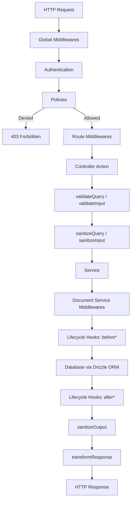
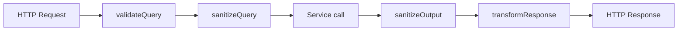
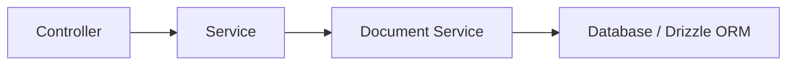
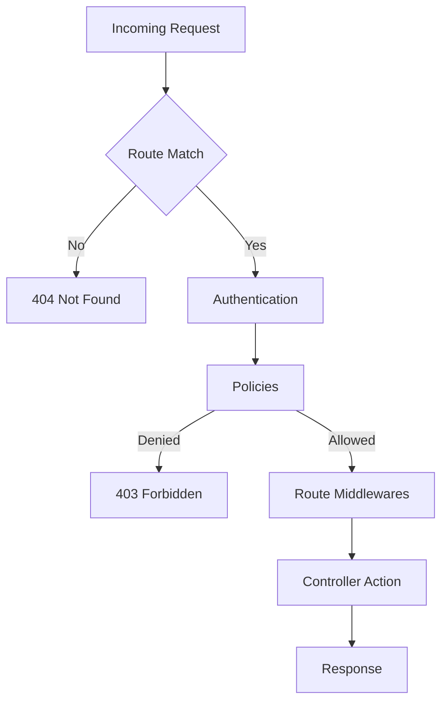
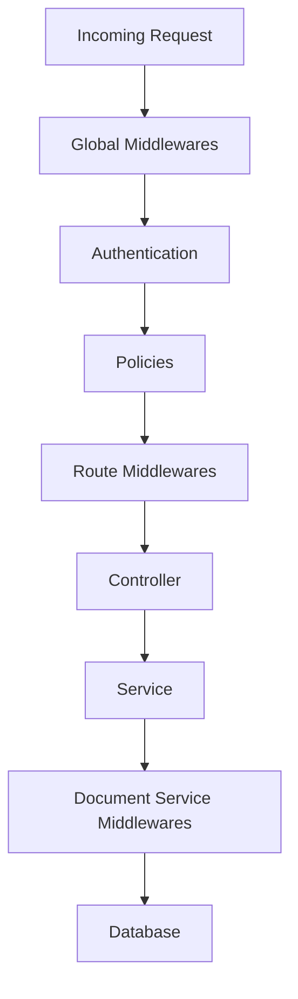
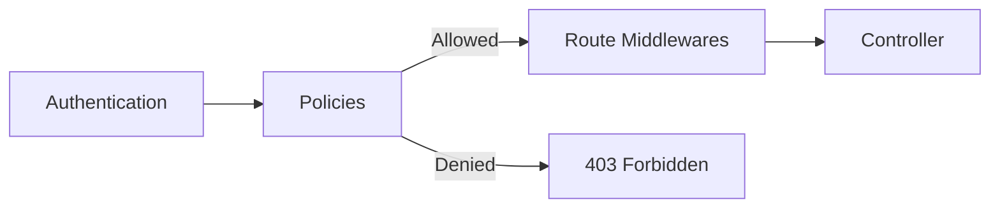
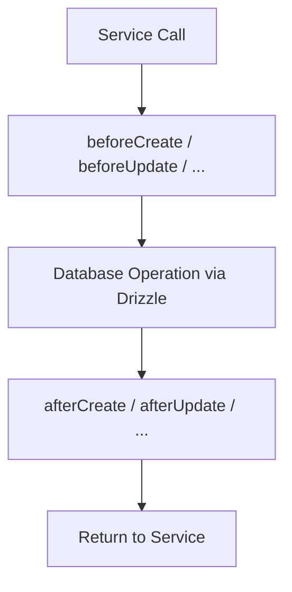
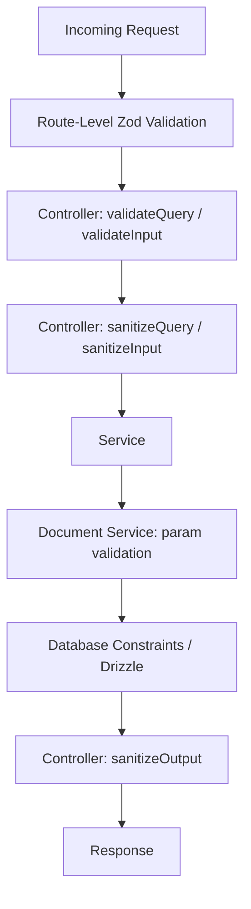

# APICK CMS Backend Customization Guide

This guide covers every extension point in APICK CMS -- from controllers and services to security hardening. It is written for two audiences: **developers** building on top of APICK (extending, wrapping, replacing behavior) and **API consumers** who need to understand how requests are processed, validated, and secured.

**Related guides:**
- [ARCHITECTURE.md](./ARCHITECTURE.md) -- system design, registries, and startup lifecycle
- [CONTENT_API_GUIDE.md](./CONTENT_API_GUIDE.md) -- querying, filtering, pagination, and population
- [DATABASE_GUIDE.md](./DATABASE_GUIDE.md) -- Drizzle ORM, migrations, and schema management
- [AUTH_GUIDE.md](./AUTH_GUIDE.md) -- JWT, API tokens, and permissions
- [PLUGINS_GUIDE.md](./PLUGINS_GUIDE.md) -- plugin architecture and extension patterns

---

## Table of Contents

1. [Request Lifecycle Overview](#1-request-lifecycle-overview)
2. [Controllers](#2-controllers)
3. [Services](#3-services)
4. [Routes](#4-routes)
5. [Middlewares](#5-middlewares)
6. [Policies](#6-policies)
7. [Lifecycle Hooks](#7-lifecycle-hooks)
8. [Input Validation (Zod)](#8-input-validation-zod)
9. [Rate Limiting](#9-rate-limiting)
10. [Security Hardening](#10-security-hardening)

---

## 1. Request Lifecycle Overview

Every HTTP request passes through a layered pipeline before reaching business logic and the database. Understanding this pipeline is the key to knowing where and how to customize APICK.

### Full Request Pipeline



### Controller Action Pipeline (Detailed)



### Extension Point Summary

| Extension Point | Purpose | Runs When |
|-----------------|---------|-----------|
| Global middleware | Cross-cutting concerns for every request | Every request, in stack order |
| Policy | Boolean allow/deny gate | After authentication, before route middleware |
| Route middleware | Per-route request/response transformation | After policies, before controller |
| Controller | HTTP request handling and response formatting | Per matched route |
| Service | Business logic between controller and database | Called by controller or other services |
| Document Service middleware | Data-layer interception | Every document operation |
| Lifecycle hook | Database-level before/after callbacks | Every CRUD database operation |

---

## 2. Controllers

Controllers handle incoming HTTP requests and return responses. APICK auto-generates a full set of CRUD controllers for every content type, so most endpoints work out of the box. You customize by **wrapping**, **replacing**, or **adding** actions.

### 2.1 File Location

```
src/api/{content-type}/controllers/{content-type}.ts
```

Example: `src/api/article/controllers/article.ts`

### 2.2 Core Controller Actions

Every content type receives these actions automatically:

| Content Type | Action | HTTP Method | Path |
|--------------|--------|-------------|------|
| Collection | `find` | GET | `/{plural}` |
| Collection | `findOne` | GET | `/{plural}/:id` |
| Collection | `create` | POST | `/{plural}` |
| Collection | `update` | PUT | `/{plural}/:id` |
| Collection | `delete` | DELETE | `/{plural}/:id` |
| Single | `find` | GET | `/{singular}` |
| Single | `update` | PUT | `/{singular}` |
| Single | `delete` | DELETE | `/{singular}` |

### 2.3 Controller Utility Methods

These are available on every controller created via `factories.createCoreController()`:

| Method | Purpose |
|--------|---------|
| `sanitizeQuery(query)` | Strips disallowed query params (fields, filters, populate) based on content type schema |
| `validateQuery(query)` | Validates query params against Zod schema derived from content type |
| `sanitizeInput(data)` | Removes fields the caller is not allowed to write |
| `validateInput(data)` | Validates input payload against content type Zod schema |
| `sanitizeOutput(data, ctx)` | Strips private fields, respects field-level permissions |
| `transformResponse(data, meta?)` | Wraps data in standard `{ data, meta }` response envelope |

### 2.4 Context Object (ctx)

Controllers receive a single `ctx` (context) object that wraps the request and response:

```ts
async find(ctx: ApickContext) {
  // ---- Request data ----
  // ctx.query          -- parsed query string
  // ctx.request.body   -- parsed request body
  // ctx.params         -- route params (:id, etc.)
  // ctx.request.headers -- HTTP headers

  // ---- State ----
  // ctx.state.user     -- authenticated user (set by auth middleware)
  // ctx.state.auth     -- route auth configuration
  // ctx.state.route    -- current route metadata

  // ---- Response helpers ----
  // ctx.send(data)     -- 200 response
  // ctx.created(data)  -- 201 response
  // ctx.notFound(msg)  -- 404 error (throws)

  // ---- Response control ----
  // ctx.status = 200   -- set status code
  // ctx.body = data    -- set response body
  // ctx.set(k, v)      -- set response header
  // ctx.get(k)         -- get request header

  return ctx.send({ data: [] });
}
```

### 2.5 Customization Pattern: Wrap (Extend Core)

Use `factories.createCoreController()` to get the default implementation, then override specific actions. Call `super` to retain default behavior.

```ts
// src/api/article/controllers/article.ts
import { factories } from '@apick/core';

export default factories.createCoreController('api::article.article', ({ apick }) => ({
  async find(ctx) {
    // Run custom logic before
    apick.log.info('Articles queried');

    // Call the default core action
    const { data, meta } = await super.find(ctx);

    // Run custom logic after -- e.g. inject computed fields
    const enriched = data.map((article) => ({
      ...article,
      readTimeMinutes: Math.ceil((article.content?.length ?? 0) / 1500),
    }));

    return { data: enriched, meta };
  },
}));
```

This pattern is ideal when you need to add a small transformation before or after the default behavior without rewriting the entire action.

### 2.6 Customization Pattern: Replace (Complete Override)

Return an action without calling `super` to completely replace the default behavior:

```ts
// src/api/article/controllers/article.ts
import { factories } from '@apick/core';

export default factories.createCoreController('api::article.article', ({ apick }) => ({
  async find(ctx) {
    // Validate and sanitize as you normally would
    const sanitizedQuery = await this.sanitizeQuery(ctx.query);

    // Call the service directly -- skip default controller logic
    const { results, pagination } = await apick
      .service('api::article.article')
      .find({ ...sanitizedQuery, filters: { publishedAt: { $notNull: true } } });

    const sanitizedResults = await this.sanitizeOutput(results, ctx);

    return this.transformResponse(sanitizedResults, { pagination });
  },
}));
```

### 2.7 Customization Pattern: Add Custom Actions

Custom actions need matching custom routes (see [Section 4: Routes](#4-routes)).

```ts
// src/api/article/controllers/article.ts
import { factories } from '@apick/core';

export default factories.createCoreController('api::article.article', ({ apick }) => ({
  // Custom action -- must be wired in a custom route file
  async findPublished(ctx) {
    const sanitizedQuery = await this.sanitizeQuery(ctx.query);

    const { results, pagination } = await apick
      .service('api::article.article')
      .find({
        ...sanitizedQuery,
        filters: { ...sanitizedQuery.filters, publishedAt: { $notNull: true } },
      });

    const sanitizedResults = await this.sanitizeOutput(results, ctx);

    return this.transformResponse(sanitizedResults, { pagination });
  },

  // Another custom action
  async externalLookup(ctx) {
    const { id } = ctx.params;
    const article = await apick.service('api::article.article').findOne(id);

    if (!article) {
      return ctx.notFound('Article not found');
    }

    const externalData = await fetch(`https://api.example.com/meta/${article.slug}`);
    return ctx.send({ data: await externalData.json() });
  },
}));
```

### 2.8 Accessing Controllers Programmatically

```ts
// By content type UID
const controller = apick.controller('api::article.article');

// Invoke an action
const result = await controller.find(ctx);
```

---

## 3. Services

Services encapsulate reusable business logic. They sit between controllers and the Document Service (database layer), keeping controllers thin and logic testable. APICK auto-generates a core service for every content type.

### 3.1 Architecture



Controllers call services. Services call the Document Service. The Document Service talks to the database via Drizzle ORM.

### 3.2 File Location

```
src/api/{content-type}/services/{content-type}.ts
```

Example: `src/api/article/services/article.ts`

### 3.3 Core Service Methods

#### Collection Type

| Method | Signature | Description |
|--------|-----------|-------------|
| `find` | `find(params?) -> { results, pagination }` | Fetch paginated list |
| `findOne` | `findOne(documentId, params?) -> document` | Fetch single document by ID |
| `create` | `create(params) -> document` | Create a new document |
| `update` | `update(documentId, params) -> document` | Update an existing document |
| `delete` | `delete(documentId, params?) -> document` | Delete a document |

#### Single Type

| Method | Signature | Description |
|--------|-----------|-------------|
| `find` | `find(params?) -> document` | Fetch the single document |
| `createOrUpdate` | `createOrUpdate(params) -> document` | Create if absent, update if present |
| `delete` | `delete(params?) -> document` | Delete the single document |

### 3.4 Default Behavior

Core services automatically add `status: 'published'` to every query unless overridden. This ensures the Content API never leaks draft content by default.

```ts
// What the core find() does under the hood (simplified):
async find(params = {}) {
  return apick.documents(this.uid).findMany({
    ...params,
    status: params.status ?? 'published',
  });
}
```

### 3.5 Accessing Services

```ts
// By content type UID
const articleService = apick.service('api::article.article');

// Plugin services
const uploadService = apick.service('plugin::upload.upload');
```

Services are lazily instantiated -- created on first access, then cached for the lifetime of the process.

### 3.6 Customization Pattern: Wrap (Extend Core)

Use `factories.createCoreService()` and override specific methods. Call `super` to retain the default behavior.

```ts
// src/api/article/services/article.ts
import { factories } from '@apick/core';

export default factories.createCoreService('api::article.article', ({ apick }) => ({
  async find(params) {
    // Inject default filters -- e.g. always exclude archived
    const results = await super.find({
      ...params,
      filters: { ...params?.filters, archived: false },
    });

    return results;
  },

  async create(params) {
    // Auto-generate slug before creation
    const slug = params.data.title
      .toLowerCase()
      .replace(/[^a-z0-9]+/g, '-')
      .replace(/(^-|-$)/g, '');

    return super.create({
      ...params,
      data: { ...params.data, slug },
    });
  },
}));
```

### 3.7 Customization Pattern: Add Custom Methods

Add methods that do not exist on the core service. These are callable from controllers or other services.

```ts
// src/api/article/services/article.ts
import { factories } from '@apick/core';

export default factories.createCoreService('api::article.article', ({ apick }) => ({
  async findPublished(params) {
    return this.find({
      ...params,
      filters: { ...params?.filters, publishedAt: { $notNull: true } },
    });
  },

  async archive(documentId: string) {
    return this.update(documentId, {
      data: { archived: true, archivedAt: new Date().toISOString() },
    });
  },

  async bulkPublish(documentIds: string[]) {
    const now = new Date().toISOString();
    return Promise.all(
      documentIds.map((id) =>
        this.update(id, { data: { publishedAt: now } })
      )
    );
  },
}));
```

### 3.8 Standalone Service (No Content Type)

For logic not tied to a specific content type, create a standalone service using the factory function pattern.

```ts
// src/api/analytics/services/analytics.ts

export default ({ apick }) => ({
  async trackEvent(event: string, payload: Record<string, unknown>) {
    apick.log.info({ event, payload }, 'Analytics event');
    // Push to external analytics provider
    await fetch('https://analytics.example.com/events', {
      method: 'POST',
      headers: { 'Content-Type': 'application/json' },
      body: JSON.stringify({ event, ...payload, timestamp: Date.now() }),
    });
  },

  async getStats(contentTypeUid: string) {
    const docs = await apick.documents(contentTypeUid).findMany({});
    return {
      total: docs.pagination.total,
      published: docs.results.filter((d) => d.publishedAt).length,
    };
  },
});
```

Access it the same way:

```ts
await apick.service('api::analytics.analytics').trackEvent('page_view', { path: '/blog' });
```

### 3.9 Best Practice: Thin Controllers, Rich Services

Keep controllers focused on HTTP concerns (parsing requests, formatting responses). Push all business logic into services.

```ts
// Controller -- thin
async create(ctx) {
  const sanitizedInput = await this.sanitizeInput(ctx.request.body.data);
  const validatedInput = await this.validateInput(sanitizedInput);

  const document = await apick.service('api::article.article').create({
    data: validatedInput,
  });

  const sanitizedOutput = await this.sanitizeOutput(document, ctx);
  return this.transformResponse(sanitizedOutput);
}
```

```ts
// Service -- rich
async create(params) {
  // Business logic: slug generation, notifications, cache invalidation
  const slug = generateSlug(params.data.title);
  const doc = await super.create({ ...params, data: { ...params.data, slug } });

  await apick.service('api::notification.notification').notifyEditors(doc);
  await apick.service('api::cache.cache').invalidate('articles');

  return doc;
}
```

---

## 4. Routes

Routes map HTTP method + path combinations to controller actions. APICK auto-generates core routes for every content type. You can configure those core routes or define entirely custom ones.

### 4.1 File Location

```
src/api/{content-type}/routes/{content-type}.ts    # Core routes
src/api/{content-type}/routes/custom-{name}.ts     # Custom routes
```

### 4.2 Route Loading Order

1. Core routes (from `factories.createCoreRouter()`) load first.
2. Custom route files load alphabetically.

If paths overlap, the first registered route wins. Name custom route files with a descriptive prefix (e.g., `custom-published.ts`) to control ordering.

### 4.3 Core Routes with Factory

Use the factory to generate standard CRUD routes with optional per-action configuration:

```ts
// src/api/article/routes/article.ts
import { factories } from '@apick/core';

export default factories.createCoreRouter('api::article.article', {
  // Per-action configuration (all optional)
  config: {
    find: {
      auth: false,              // Public -- no authentication required
      policies: [],
      middlewares: [],
    },
    findOne: {
      auth: false,
    },
    create: {
      policies: ['global::is-admin'],
    },
    update: {
      policies: ['global::is-admin'],
    },
    delete: {
      policies: ['global::is-admin'],
    },
  },
});
```

#### Generated Routes (Collection Type)

| Action | Method | Path |
|--------|--------|------|
| `find` | GET | `/api/articles` |
| `findOne` | GET | `/api/articles/:id` |
| `create` | POST | `/api/articles` |
| `update` | PUT | `/api/articles/:id` |
| `delete` | DELETE | `/api/articles/:id` |

#### Generated Routes (Single Type)

| Action | Method | Path |
|--------|--------|------|
| `find` | GET | `/api/homepage` |
| `update` | PUT | `/api/homepage` |
| `delete` | DELETE | `/api/homepage` |

### 4.4 Custom Routes

Define custom routes by exporting an object with a `routes` array:

```ts
// src/api/article/routes/custom-published.ts

export default {
  routes: [
    {
      method: 'GET',
      path: '/api/articles/published',
      handler: 'api::article.article.findPublished',
      config: {
        auth: false,
        policies: [],
        middlewares: [],
      },
    },
    {
      method: 'POST',
      path: '/api/articles/:id/archive',
      handler: 'api::article.article.archive',
      config: {
        policies: ['global::is-admin'],
      },
    },
    {
      method: 'GET',
      path: '/api/articles/:slug/by-slug',
      handler: 'api::article.article.findBySlug',
      config: {
        auth: false,
      },
    },
  ],
};
```

### 4.5 Route Configuration Reference

| Property | Type | Description |
|----------|------|-------------|
| `method` | `string` | HTTP method: `GET`, `POST`, `PUT`, `DELETE`, `PATCH` |
| `path` | `string` | URL path, supports params (`:id`, `:slug`) -- parsed by `find-my-way` |
| `handler` | `string \| Function` | Controller UID string or inline function |
| `config` | `object` | Optional route-level configuration |
| `config.auth` | `false \| { scope: string[] }` | Authentication settings |
| `config.policies` | `Array<string \| Function \| object>` | Policy chain |
| `config.middlewares` | `Array<string \| Function \| object>` | Route-level middleware chain |

### 4.6 Handler Resolution

The `handler` string resolves to a controller action through the controller registry:

```
'api::article.article.findPublished'
  |         |        |
  |         |        +-- action name (method on controller)
  |         +----------- content type name
  +---------------------- scope (api, plugin)
```

You can also use an inline function (useful for quick one-offs, but prefer named controller actions for testability):

```ts
{
  method: 'GET',
  path: '/api/health',
  handler: async (ctx) => {
    return ctx.send({ status: 'ok', timestamp: Date.now() });
  },
}
```

### 4.7 Authentication Configuration

**Disable auth (public route):**

```ts
config: {
  auth: false,
}
```

**Require specific scope:**

```ts
config: {
  auth: {
    scope: ['api::article.article.find'],
  },
}
```

**Default behavior:** When `config.auth` is omitted, the route requires a valid authenticated session (token or API key). The default scope is derived from the handler UID. See [AUTH_GUIDE.md](./AUTH_GUIDE.md) for full authentication details.

### 4.8 Execution Flow



---

## 5. Middlewares

Middlewares intercept requests and responses at multiple levels. APICK supports three distinct middleware layers: **global**, **route-level**, and **Document Service**.

### 5.1 Middleware Composition



| Level | Scope | Registration |
|-------|-------|-------------|
| **Global** | Every request | `config/middlewares.ts` |
| **Route** | Specific routes | `config.middlewares` on route definition |
| **Document Service** | Data operations (find, create, update, delete) | `apick.documents.use()` |

### 5.2 Global Middlewares

#### Default Stack

Configured in `config/middlewares.ts`. Order matters -- middlewares execute top to bottom on request, bottom to top on response.

```ts
// config/middlewares.ts
export default [
  'apick::logger',
  'apick::errors',
  'apick::security',
  'apick::cors',
  'apick::poweredBy',
  'apick::query',
  'apick::body',
  'apick::session',
  'apick::favicon',
  'apick::public',
];
```

#### Built-in Middleware Reference

| Middleware | Purpose |
|-----------|---------|
| `apick::logger` | Request logging |
| `apick::errors` | Global error handler |
| `apick::security` | Helmet-based security headers |
| `apick::cors` | CORS headers |
| `apick::poweredBy` | `X-Powered-By` header |
| `apick::query` | Query string parser |
| `apick::body` | Request body parser |
| `apick::session` | Session management |
| `apick::favicon` | Favicon handler |
| `apick::public` | Static file serving |

#### Configuring Built-in Middlewares

Pass a configuration object to override defaults:

```ts
// config/middlewares.ts
export default [
  'apick::logger',
  'apick::errors',
  // Security -- configures Helmet
  {
    name: 'apick::security',
    config: {
      contentSecurityPolicy: {
        useDefaults: true,
        directives: {
          'script-src': ["'self'"],
          'img-src': ["'self'", 'data:', 'cdn.example.com'],
        },
      },
      frameguard: { action: 'deny' },
    },
  },
  // CORS
  {
    name: 'apick::cors',
    config: {
      origin: ['https://app.example.com', 'https://admin.example.com'],
      methods: ['GET', 'POST', 'PUT', 'DELETE'],
      credentials: true,
    },
  },
  'apick::poweredBy',
  'apick::query',
  // Body parser -- set limits
  {
    name: 'apick::body',
    config: {
      jsonLimit: '10mb',
      formLimit: '10mb',
      textLimit: '10mb',
    },
  },
  'apick::session',
  'apick::favicon',
  'apick::public',
];
```

#### Disabling a Built-in Middleware

```ts
{
  name: 'apick::poweredBy',
  config: { enabled: false },
}
```

### 5.3 Creating a Custom Global Middleware

File location: `src/middlewares/{name}.ts`

A middleware factory receives `(config, { apick })` and returns a middleware function with the signature `(ctx, next)`.

```ts
// src/middlewares/request-id.ts
import { randomUUID } from 'node:crypto';

export default (config, { apick }) => {
  return async (ctx, next) => {
    const requestId = ctx.get('x-request-id') ?? randomUUID();

    // Attach to state for downstream access
    ctx.state.requestId = requestId;

    // Set response header
    ctx.set('X-Request-Id', requestId);

    await next();
  };
};
```

Register it in the global stack:

```ts
// config/middlewares.ts
export default [
  'apick::logger',
  'apick::errors',
  'apick::security',
  'apick::cors',
  'global::request-id',   // Custom middleware
  'apick::poweredBy',
  'apick::query',
  'apick::body',
  'apick::session',
  'apick::favicon',
  'apick::public',
];
```

### 5.4 Route-Level Middlewares

Applied to specific routes via the `config.middlewares` array:

```ts
// src/api/article/routes/custom-upload.ts
export default {
  routes: [
    {
      method: 'POST',
      path: '/api/articles/:id/cover',
      handler: 'api::article.article.uploadCover',
      config: {
        middlewares: [
          // Reference a global middleware
          'global::request-id',
          // Inline middleware
          async (ctx, next) => {
            ctx.log.debug('Processing cover upload');
            await next();
          },
          // Middleware with config
          {
            name: 'global::rate-limit',
            config: { max: 5, window: 60_000 },
          },
        ],
      },
    },
  ],
};
```

### 5.5 Document Service Middlewares

Intercept data-layer operations. Useful for cross-cutting concerns like audit logging or cache invalidation that apply regardless of which controller triggered the operation.

```ts
// src/index.ts (bootstrap)
export default {
  async bootstrap({ apick }) {
    apick.documents.use(async (ctx, next) => {
      // ctx.action  -- 'findMany' | 'findOne' | 'create' | 'update' | 'delete' | ...
      // ctx.uid     -- content type UID, e.g. 'api::article.article'
      // ctx.params  -- operation params

      apick.log.debug({ action: ctx.action, uid: ctx.uid }, 'Document operation');

      const startTime = performance.now();
      const result = await next();
      const duration = performance.now() - startTime;

      apick.log.debug({ action: ctx.action, uid: ctx.uid, duration }, 'Document operation complete');

      return result;
    });
  },
};
```

#### Scoped Document Service Middleware

Filter by content type UID or action:

```ts
apick.documents.use(async (ctx, next) => {
  if (ctx.uid !== 'api::article.article') return next();
  if (!['create', 'update'].includes(ctx.action)) return next();

  // Only runs for article create/update
  apick.log.info('Article mutated');
  return next();
});
```

### 5.6 Server Hook Equivalents via Middleware

APICK uses an async middleware pipeline instead of framework lifecycle hooks. Common hook patterns are implemented as middleware position + `await next()`:

| Hook Equivalent | Middleware Pattern |
|-----------------|-------------------|
| "onRequest" | Middleware placed early in the pipeline (before `await next()`) |
| "preHandler" | Route-level middleware |
| "onSend" | Logic after `await next()` in a middleware |
| "onResponse" | Logic after `await next()` in a late-stage middleware |
| "onError" | `try/catch` around `await next()` in the error middleware |

```ts
// Example: timing middleware (replaces onRequest + onResponse hooks)
// src/middlewares/timing.ts
export default (config, { apick }) => {
  return async (ctx, next) => {
    ctx.state.startTime = performance.now();
    await next();  // handler and downstream middleware run here
    const duration = performance.now() - ctx.state.startTime;
    ctx.set('X-Response-Time', `${duration.toFixed(2)}ms`);
    apick.log.info({ method: ctx.request.method, url: ctx.request.url, duration }, 'Request complete');
  };
};
```

### 5.7 Middleware vs Policy

| | Middleware | Policy |
|---|-----------|--------|
| **Purpose** | Transform request/response | Allow or deny access |
| **Return value** | Calls `next()` to continue | Returns `boolean` |
| **Can modify request?** | Yes | No (read-only) |
| **Can modify response?** | Yes | No |
| **Execution order** | After policies | Before middlewares |
| **Use case** | Logging, rate limiting, headers, body transforms | Authorization, role checks, ownership checks |

---

## 6. Policies

Policies are boolean gates that decide whether a request proceeds or is rejected. They run after authentication but before route middlewares and controllers. A policy either allows the request (returns `true` / resolves) or denies it (returns `false` / throws).

### 6.1 Execution Order



### 6.2 File Location

```
src/policies/{name}.ts
```

### 6.3 Policy Function Signature

```ts
(policyContext, config, { apick }) => boolean | Promise<boolean>
```

| Parameter | Description |
|-----------|-------------|
| `policyContext` | Request context with auth state and request data |
| `config` | Configuration object passed from the route definition |
| `{ apick }` | The APICK instance for accessing services, etc. |

### 6.4 Policy Context Properties

| Property | Type | Description |
|----------|------|-------------|
| `state.user` | `object \| undefined` | Authenticated user object |
| `state.auth` | `object` | Authentication details (strategy, credentials) |
| `state.isAuthenticated` | `boolean` | Whether the request is authenticated |
| `request` | `object` | The request object (body, headers, method, url) |
| `request.params` | `object` | Route parameters |
| `request.query` | `object` | Parsed query string |
| `request.body` | `object` | Parsed request body |

### 6.5 Creating Policies

#### Basic Policy

```ts
// src/policies/is-admin.ts

export default (policyContext, config, { apick }) => {
  const user = policyContext.state.user;

  if (user && user.role?.type === 'admin') {
    return true;
  }

  return false;
};
```

#### Policy with Config Validation

Use the `.handler` + `.validator` pattern to validate configuration passed from route definitions:

```ts
// src/policies/has-role.ts
import { z } from 'zod';

const configSchema = z.object({
  roles: z.array(z.string()).min(1),
});

export default {
  validator: (config: unknown) => {
    return configSchema.parse(config);
  },
  handler: (policyContext, config: z.infer<typeof configSchema>, { apick }) => {
    const userRole = policyContext.state.user?.role?.type;
    return config.roles.includes(userRole);
  },
};
```

#### isAuthenticated Policy

```ts
// src/policies/is-authenticated.ts

export default (policyContext) => {
  return policyContext.state.isAuthenticated === true;
};
```

#### isOwner Policy (Async, with Config)

```ts
// src/policies/is-owner.ts

export default async (policyContext, config, { apick }) => {
  const { id } = policyContext.request.params;
  const userId = policyContext.state.user?.id;

  if (!userId || !id) return false;

  const contentTypeUid = config?.contentType ?? 'api::article.article';
  const document = await apick.documents(contentTypeUid).findOne({
    documentId: id,
    fields: ['createdBy'],
    populate: { createdBy: { fields: ['id'] } },
  });

  return document?.createdBy?.id === userId;
};
```

#### Rate Limit Gate Policy

```ts
// src/policies/rate-limit-gate.ts
const requestCounts = new Map<string, { count: number; resetAt: number }>();

export default (policyContext, config) => {
  const ip = policyContext.request.ip;
  const max = config?.max ?? 100;
  const windowMs = config?.window ?? 60_000;
  const now = Date.now();

  const entry = requestCounts.get(ip);

  if (!entry || now > entry.resetAt) {
    requestCounts.set(ip, { count: 1, resetAt: now + windowMs });
    return true;
  }

  entry.count += 1;
  return entry.count <= max;
};
```

### 6.6 Applying Policies to Routes

#### By Global Name

```ts
config: {
  create: {
    policies: ['global::is-admin'],
  },
}
```

#### Plugin Policy

```ts
policies: ['plugin::users-permissions.isAuthenticated']
```

#### Inline Function

```ts
policies: [
  (policyContext, config, { apick }) => {
    return policyContext.state.isAuthenticated;
  },
]
```

#### With Configuration

```ts
policies: [
  {
    name: 'global::has-role',
    config: { roles: ['admin', 'editor'] },
  },
]
```

#### Chaining Policies

Policies execute in order. The first `false` return short-circuits and returns 403.

```ts
policies: [
  'plugin::users-permissions.isAuthenticated',
  'global::is-admin',
  {
    name: 'global::has-role',
    config: { roles: ['super-admin'] },
  },
]
```

### 6.7 Policy vs Middleware

| | Policy | Middleware |
|---|--------|-----------|
| **Purpose** | Allow or deny access | Transform request/response |
| **Return value** | `boolean` | Calls `next()` |
| **Can modify request?** | No (read-only) | Yes |
| **Can modify response?** | No | Yes |
| **Runs when** | After auth, before middlewares | After policies |
| **Failure behavior** | Returns 403 Forbidden | Can return any error |
| **Typical use** | Role checks, ownership, feature flags | Logging, headers, rate limiting, body transforms |

---

## 7. Lifecycle Hooks

Lifecycle hooks are database-level callbacks that fire before and after CRUD operations. Use them for side effects that must happen whenever data changes, regardless of which controller or service triggered the change.

### 7.1 All Available Hooks

| Hook | Fires | Event Properties |
|------|-------|-----------------|
| `beforeCreate` | Before INSERT | `params.data` |
| `afterCreate` | After INSERT | `params.data`, `result` |
| `beforeUpdate` | Before UPDATE | `params.data`, `params.where` |
| `afterUpdate` | After UPDATE | `params.data`, `params.where`, `result` |
| `beforeDelete` | Before DELETE | `params.where` |
| `afterDelete` | After DELETE | `params.where`, `result` |
| `beforeFindOne` | Before SELECT (single) | `params.where` |
| `afterFindOne` | After SELECT (single) | `params.where`, `result` |
| `beforeFindMany` | Before SELECT (list) | `params.where`, `params.orderBy`, `params.limit` |
| `afterFindMany` | After SELECT (list) | `params.where`, `result` |
| `beforeCount` | Before COUNT | `params.where` |
| `afterCount` | After COUNT | `params.where`, `result` (number) |

### 7.2 Hook Flow



### 7.3 Event Object

Every hook callback receives an `event` object:

| Property | Type | Description |
|----------|------|-------------|
| `event.action` | `string` | The operation: `'create'`, `'update'`, `'delete'`, `'findOne'`, `'findMany'`, `'count'` |
| `event.model` | `object` | Model metadata |
| `event.model.uid` | `string` | Content type UID, e.g. `'api::article.article'` |
| `event.model.tableName` | `string` | Database table name |
| `event.model.attributes` | `object` | Schema attribute definitions |
| `event.params` | `object` | Operation parameters (`data`, `where`, `orderBy`, `limit`, etc.) |
| `event.params.data` | `object` | The data being written (create/update only) |
| `event.params.where` | `object` | Query conditions |
| `event.result` | `any` | Operation result (only in `after*` hooks) |
| `event.state` | `Map` | Shared state between before/after hook pairs |

### 7.4 Subscribing via Content Type Lifecycles File

Each content type can define a `lifecycles.ts` file alongside its schema:

```
src/api/{content-type}/content-types/{content-type}/lifecycles.ts
```

```ts
// src/api/article/content-types/article/lifecycles.ts

export default ({ apick }) => ({
  beforeCreate(event) {
    // Auto-generate slug from title
    const { data } = event.params;
    if (data.title && !data.slug) {
      data.slug = data.title
        .toLowerCase()
        .replace(/[^a-z0-9]+/g, '-')
        .replace(/(^-|-$)/g, '');
    }
  },

  afterCreate(event) {
    const { result } = event;
    // Fire-and-forget notification
    apick.log.info({ id: result.id, title: result.title }, 'Article created');
  },

  beforeUpdate(event) {
    // Set updatedAt timestamp
    event.params.data.updatedAt = new Date().toISOString();
  },

  beforeDelete(event) {
    // Cascade: delete related comments
    const { where } = event.params;
    // Handled in the hook to ensure it fires from any entry point
  },
});
```

### 7.5 Subscribing via Bootstrap

Use `apick.db.lifecycles.subscribe()` in the bootstrap function for hooks that span multiple content types or need access to the `apick` instance.

```ts
// src/index.ts
export default {
  async bootstrap({ apick }) {
    // Subscribe to a specific content type
    apick.db.lifecycles.subscribe({
      models: ['api::article.article'],

      beforeCreate(event) {
        const { data } = event.params;
        if (data.title && !data.slug) {
          data.slug = data.title
            .toLowerCase()
            .replace(/[^a-z0-9]+/g, '-')
            .replace(/(^-|-$)/g, '');
        }
      },

      afterCreate(event) {
        apick.log.info({ id: event.result.id }, 'Article created');
      },
    });
  },
};
```

### 7.6 Global Subscriber

Omit the `models` array to subscribe to all content types.

```ts
// src/index.ts
export default {
  async bootstrap({ apick }) {
    apick.db.lifecycles.subscribe({
      // No `models` -- fires for every content type

      afterCreate(event) {
        apick.log.info({
          model: event.model.uid,
          id: event.result?.id,
        }, 'Document created');
      },

      afterUpdate(event) {
        apick.log.info({
          model: event.model.uid,
          id: event.result?.id,
        }, 'Document updated');
      },

      afterDelete(event) {
        apick.log.info({
          model: event.model.uid,
          id: event.result?.id,
        }, 'Document deleted');
      },
    });
  },
};
```

### 7.7 Shared State Between Before/After Hooks

The `event.state` `Map` persists between a `before*` and its corresponding `after*` hook. Use it to pass data computed in the "before" phase to the "after" phase.

```ts
apick.db.lifecycles.subscribe({
  models: ['api::article.article'],

  beforeUpdate(event) {
    // Capture the old document before the update
    const existing = await apick.documents('api::article.article').findOne({
      documentId: event.params.where.id,
    });
    event.state.set('previousData', existing);
  },

  afterUpdate(event) {
    const previous = event.state.get('previousData');
    const current = event.result;

    // Detect status change
    if (previous?.status !== current.status) {
      apick.log.info({
        id: current.id,
        from: previous?.status,
        to: current.status,
      }, 'Article status changed');
    }
  },
});
```

### 7.8 Practical Examples

#### Audit Logging

```ts
apick.db.lifecycles.subscribe({
  async afterCreate(event) {
    await apick.documents('api::audit-log.audit-log').create({
      data: {
        action: 'create',
        contentType: event.model.uid,
        documentId: String(event.result.id),
        payload: JSON.stringify(event.params.data),
        timestamp: new Date().toISOString(),
      },
    });
  },

  async afterUpdate(event) {
    await apick.documents('api::audit-log.audit-log').create({
      data: {
        action: 'update',
        contentType: event.model.uid,
        documentId: String(event.result.id),
        payload: JSON.stringify(event.params.data),
        timestamp: new Date().toISOString(),
      },
    });
  },

  async afterDelete(event) {
    await apick.documents('api::audit-log.audit-log').create({
      data: {
        action: 'delete',
        contentType: event.model.uid,
        documentId: String(event.result?.id),
        timestamp: new Date().toISOString(),
      },
    });
  },
});
```

#### Cascade Delete

```ts
apick.db.lifecycles.subscribe({
  models: ['api::article.article'],

  async afterDelete(event) {
    const articleId = event.result.id;

    // Delete all comments belonging to this article
    const comments = await apick.documents('api::comment.comment').findMany({
      filters: { article: { id: articleId } },
    });

    await Promise.all(
      comments.results.map((comment) =>
        apick.documents('api::comment.comment').delete({ documentId: comment.id })
      )
    );
  },
});
```

#### Auto-Publish Scheduling

```ts
apick.db.lifecycles.subscribe({
  models: ['api::article.article'],

  beforeCreate(event) {
    const { data } = event.params;
    if (data.scheduledPublishAt && new Date(data.scheduledPublishAt) <= new Date()) {
      data.publishedAt = new Date().toISOString();
    }
  },
});
```

### 7.9 Lifecycle Hooks vs Event Hub

| | Lifecycle Hooks | Event Hub |
|---|----------------|-----------|
| **Trigger** | Database operations | Any application event |
| **Timing** | Synchronous -- blocks the operation | Asynchronous -- fire-and-forget |
| **Can modify data?** | Yes (`before*` hooks can mutate `params.data`) | No |
| **Can block operation?** | Yes (throw in `before*`) | No |
| **Scope** | Tied to content type models | Application-wide |
| **Use case** | Data integrity, computed fields, cascades | Notifications, analytics, webhooks |

---

## 8. Input Validation (Zod)

APICK uses **Zod** for validation throughout the stack. Schemas are auto-generated from content type definitions and enforced at every layer.

### 8.1 Validation and Sanitization Layers



| Layer | What It Does | Where |
|-------|-------------|-------|
| **Route-Level Zod** | Validates query params (fields, filters, sort, populate, pagination) against content type schema | Before controller |
| **Controller validateQuery** | Validates query structure and allowed values | Controller utility |
| **Controller sanitizeQuery** | Strips disallowed query params | Controller utility |
| **Controller validateInput** | Validates request body against content type Zod schema | Controller utility |
| **Controller sanitizeInput** | Removes fields caller cannot write | Controller utility |
| **Document Service** | Validates params passed to database operations | Data layer |
| **Database Constraints** | Type checks, NOT NULL, UNIQUE, etc. via Drizzle | Database |
| **Controller sanitizeOutput** | Strips private fields from response | Controller utility |

### 8.2 Route-Level Zod Validation

APICK auto-generates Zod schemas from content type attributes and validates incoming query parameters before the controller runs:

| Parameter | Validation |
|-----------|-----------|
| `fields` | Only attributes defined on the content type are allowed |
| `filters` | Only filterable attributes allowed; operators validated (`$eq`, `$ne`, `$in`, `$gt`, `$lt`, etc.) |
| `sort` | Only sortable attributes allowed; direction validated (`asc`, `desc`) |
| `populate` | Only defined relations allowed; nested populate validated recursively |
| `pagination` | `page`/`pageSize` or `start`/`limit` -- positive integers, `pageSize`/`limit` capped by config |

Example of an auto-generated schema (conceptual -- you do not write this):

```ts
import { z } from 'zod';

const articleQuerySchema = z.object({
  fields: z.array(z.enum(['title', 'slug', 'content', 'publishedAt', 'createdAt'])).optional(),
  filters: z.object({
    title: z.object({ $eq: z.string(), $contains: z.string() /* ... */ }).partial().optional(),
    publishedAt: z.object({ $gt: z.string(), $lt: z.string(), $notNull: z.boolean() }).partial().optional(),
    // ... one entry per filterable attribute
  }).partial().optional(),
  sort: z.array(z.string().regex(/^[a-zA-Z]+:(asc|desc)$/)).optional(),
  populate: z.union([z.literal('*'), z.object({
    author: z.object({ fields: z.array(z.string()).optional() }).optional(),
    category: z.object({ fields: z.array(z.string()).optional() }).optional(),
  })]).optional(),
  pagination: z.object({
    page: z.number().int().positive().optional(),
    pageSize: z.number().int().positive().max(100).optional(),
  }).optional(),
}).strict();
```

### 8.3 Controller Validation and Sanitization Utilities

#### validateQuery / sanitizeQuery

```ts
async find(ctx) {
  // 1. Validate -- throws ValidationError if invalid
  await this.validateQuery(ctx.query);

  // 2. Sanitize -- strips disallowed fields based on permissions
  const sanitizedQuery = await this.sanitizeQuery(ctx.query);

  const { results, pagination } = await apick
    .service('api::article.article')
    .find(sanitizedQuery);

  // ...
}
```

#### validateInput / sanitizeInput

```ts
async create(ctx) {
  // Validate the request body against content type schema
  await this.validateInput(ctx.request.body.data);

  // Strip fields the caller cannot write (e.g., createdBy, internal fields)
  const sanitizedData = await this.sanitizeInput(ctx.request.body.data, ctx);

  const document = await apick
    .service('api::article.article')
    .create({ data: sanitizedData });

  // ...
}
```

#### sanitizeOutput

Removes private fields and enforces field-level read permissions:

```ts
async find(ctx) {
  const sanitizedQuery = await this.sanitizeQuery(ctx.query);
  const { results, pagination } = await apick
    .service('api::article.article')
    .find(sanitizedQuery);

  // Strips private fields, respects populate restrictions
  const sanitizedResults = await this.sanitizeOutput(results, ctx);

  return this.transformResponse(sanitizedResults, { pagination });
}
```

### 8.4 Programmatic Content API Access

For validation and sanitization outside controllers (e.g., in services or custom scripts), use the Content API sanitizer and validator directly.

#### Sanitization

```ts
// Sanitize input data
const cleanInput = await apick.contentAPI.sanitize.input(
  'api::article.article',
  rawData,
  { auth: request.state.auth }
);

// Sanitize output data
const cleanOutput = await apick.contentAPI.sanitize.output(
  'api::article.article',
  document,
  { auth: request.state.auth }
);

// Sanitize query params
const cleanQuery = await apick.contentAPI.sanitize.query(
  'api::article.article',
  rawQuery,
  { auth: request.state.auth }
);
```

#### Validation

```ts
// Validate query params
await apick.contentAPI.validate.query(
  'api::article.article',
  rawQuery,
  { auth: request.state.auth }
);

// Validate input body
await apick.contentAPI.validate.input(
  'api::article.article',
  rawData,
  { auth: request.state.auth }
);
```

### 8.5 Private Fields

Mark fields as `private: true` in the content type schema. Private fields are stored in the database but automatically stripped from API responses by `sanitizeOutput`.

```ts
// Content type schema definition
{
  attributes: {
    title: { type: 'string', required: true },
    slug: { type: 'string', required: true },
    internalNotes: { type: 'text', private: true },      // Stripped from output
    internalScore: { type: 'float', private: true },      // Stripped from output
    publishedAt: { type: 'datetime' },
  },
}
```

Fields that are always private by default:

| Field | Reason |
|-------|--------|
| `createdBy` | Internal user reference |
| `updatedBy` | Internal user reference |
| `password` | Credential -- never exposed |

### 8.6 Custom Sanitizers and Validators

Register custom sanitizers and validators through the APICK registry for reuse across content types.

#### Custom Sanitizer

```ts
// src/index.ts
export default {
  async register({ apick }) {
    apick.sanitizers.add('api::article.article', {
      input: (data) => {
        // Trim all string fields
        for (const [key, value] of Object.entries(data)) {
          if (typeof value === 'string') {
            data[key] = value.trim();
          }
        }
        return data;
      },
      output: (data) => {
        // Mask email addresses in output
        if (data.authorEmail) {
          const [name, domain] = data.authorEmail.split('@');
          data.authorEmail = `${name[0]}***@${domain}`;
        }
        return data;
      },
    });
  },
};
```

#### Custom Validator

```ts
// src/index.ts
import { z } from 'zod';

export default {
  async register({ apick }) {
    apick.validators.add('api::article.article', {
      input: z.object({
        title: z.string().min(5, 'Title must be at least 5 characters'),
        slug: z.string().regex(/^[a-z0-9-]+$/, 'Slug must be lowercase alphanumeric with dashes'),
        content: z.string().min(100, 'Content must be at least 100 characters'),
      }).passthrough(),
    });
  },
};
```

### 8.7 Zod Validation Error Handling

When Zod validation fails, APICK converts the `ZodError` into an APICK `ValidationError` with a consistent structure that preserves Zod's path information so clients can map errors to specific fields.

**HTTP 400 response body:**

```json
{
  "data": null,
  "error": {
    "status": 400,
    "name": "ValidationError",
    "message": "Validation failed",
    "details": {
      "errors": [
        {
          "path": ["title"],
          "message": "Required",
          "name": "ValidationError"
        },
        {
          "path": ["publishedAt"],
          "message": "Invalid datetime string",
          "name": "ValidationError"
        }
      ]
    }
  }
}
```

### 8.8 Full Validation Flow Example

```ts
// src/api/article/controllers/article.ts
import { factories } from '@apick/core';

export default factories.createCoreController('api::article.article', ({ apick }) => ({
  async create(ctx) {
    // 1. Route-level Zod validation has already run (auto-generated)

    // 2. Validate input against content type schema
    await this.validateInput(ctx.request.body.data);

    // 3. Sanitize input -- strip disallowed fields
    const sanitizedData = await this.sanitizeInput(ctx.request.body.data, ctx);

    // 4. Service layer -- Document Service validates params
    const document = await apick
      .service('api::article.article')
      .create({ data: sanitizedData });

    // 5. Sanitize output -- strip private fields
    const sanitizedOutput = await this.sanitizeOutput(document, ctx);

    // 6. Transform into standard response envelope
    return this.transformResponse(sanitizedOutput);
  },
}));
```

---

## 9. Rate Limiting

APICK provides rate limiting middleware to protect APIs from abuse, enforce fair usage, and prevent resource exhaustion.

### 9.1 Quick Start

Add the rate limit middleware to the global stack:

```ts
// config/middlewares.ts
export default [
  'apick::logger',
  'apick::errors',
  'apick::security',
  'apick::cors',
  {
    name: 'apick::rate-limit',
    config: {
      max: 100,             // Maximum requests per window
      window: 60_000,       // Window size in milliseconds (1 minute)
    },
  },
  'apick::body',
  'apick::query',
];
```

### 9.2 Configuration Reference

| Option | Type | Default | Description |
|--------|------|---------|-------------|
| `max` | `number` | `100` | Maximum requests allowed per window |
| `window` | `number` | `60_000` | Time window in milliseconds |
| `keyGenerator` | `(ctx) => string` | Client IP | Function to derive the rate limit key |
| `store` | `'memory' \| 'redis'` | `'memory'` | Storage backend for counters |
| `message` | `string` | `'Too many requests'` | Error message when limit is exceeded |
| `headers` | `boolean` | `true` | Include `X-RateLimit-*` response headers |
| `skipFailedRequests` | `boolean` | `false` | Do not count failed requests (4xx/5xx) |
| `skipSuccessfulRequests` | `boolean` | `false` | Do not count successful requests (2xx) |

### 9.3 Full Configuration Example

```ts
{
  name: 'apick::rate-limit',
  config: {
    max: 100,
    window: 60_000,
    keyGenerator: (ctx) => {
      // Rate limit by authenticated user, or by IP for anonymous
      return ctx.state.user?.id?.toString() ?? ctx.ip;
    },
    store: 'redis',
    redis: {
      url: 'redis://localhost:6379',
      prefix: 'apick:ratelimit:',
    },
    headers: true,
    skipFailedRequests: false,
  },
}
```

### 9.4 Response Headers

When `headers: true` (default), every response includes rate limit information:

| Header | Description | Example |
|--------|-------------|---------|
| `X-RateLimit-Limit` | Maximum requests allowed in the window | `100` |
| `X-RateLimit-Remaining` | Requests remaining in the current window | `87` |
| `X-RateLimit-Reset` | Unix timestamp when the window resets | `1709312460` |
| `Retry-After` | Seconds until the next request is allowed (only on 429) | `42` |

When the rate limit is exceeded, clients receive:

```json
{
  "data": null,
  "error": {
    "status": 429,
    "name": "RateLimitError",
    "message": "Too many requests"
  }
}
```

### 9.5 Per-Route Rate Limiting

Apply different limits to specific routes using route-level middleware:

```ts
// src/api/article/routes/custom-article.ts
export default {
  routes: [
    {
      method: 'POST',
      path: '/api/articles',
      handler: 'api::article.article.create',
      config: {
        middlewares: [
          {
            name: 'apick::rate-limit',
            config: {
              max: 10,            // Stricter limit for writes
              window: 60_000,
            },
          },
        ],
      },
    },
    {
      method: 'POST',
      path: '/api/auth/local',
      handler: 'plugin::users-permissions.auth.callback',
      config: {
        middlewares: [
          {
            name: 'apick::rate-limit',
            config: {
              max: 5,             // Very strict for login attempts
              window: 300_000,    // 5 minute window
              keyGenerator: (ctx) => `login:${ctx.ip}`,
            },
          },
        ],
      },
    },
  ],
};
```

### 9.6 Storage Backends

#### In-Memory (Default)

Uses a `Map` with automatic expiry. Suitable for single-instance deployments.

- Counters are lost on server restart
- Not shared across cluster workers or multiple instances
- Zero external dependencies

#### Redis

Shared counters across all instances. Required for multi-instance deployments.

```ts
{
  name: 'apick::rate-limit',
  config: {
    store: 'redis',
    redis: {
      url: 'redis://localhost:6379',
      prefix: 'apick:ratelimit:',
    },
    max: 100,
    window: 60_000,
  },
}
```

Redis keys use `INCR` with `EXPIRE` for atomic increment-and-expire. Keys auto-expire after the window duration.

### 9.7 Custom Key Generators

Rate limit by different dimensions:

```ts
// By IP (default)
keyGenerator: (ctx) => ctx.ip,

// By authenticated user
keyGenerator: (ctx) => ctx.state.user?.id?.toString() ?? ctx.ip,

// By API token
keyGenerator: (ctx) => {
  if (ctx.state.auth?.credentials?.type === 'api-token') {
    return `token:${ctx.state.auth.credentials.id}`;
  }
  return ctx.ip;
},

// By route + IP
keyGenerator: (ctx) => `${ctx.request.method}:${ctx.request.url}:${ctx.ip}`,
```

### 9.8 Rate Limiting Summary

| Aspect | Detail |
|--------|--------|
| Middleware | `apick::rate-limit` -- global or per-route |
| Default limit | 100 requests per 60 seconds |
| Key | Client IP (configurable via `keyGenerator`) |
| Stores | In-memory (single instance), Redis (multi-instance) |
| Headers | `X-RateLimit-Limit`, `X-RateLimit-Remaining`, `X-RateLimit-Reset`, `Retry-After` |
| Error | `429 Too Many Requests` with `RateLimitError` |

---

## 10. Security Hardening

APICK includes multiple layers of protection by default. This section covers the security mechanisms, their configuration, and best practices for production hardening.

### 10.1 CSRF Protection

**APICK does not include CSRF middleware** because it is a **pure API server** (no cookie-based HTML forms):

- Authentication uses `Authorization: Bearer <token>` headers, not cookies
- The Same-Origin Policy prevents cross-origin requests from reading responses
- CORS middleware restricts which origins can make requests
- API tokens and JWTs are stored in client memory or secure storage, not in cookies

If you add cookie-based authentication (e.g., session cookies for an admin UI), you must add CSRF protection yourself.

### 10.2 SQL Injection Prevention

APICK uses **Drizzle ORM** with parameterized queries for all database operations. User input is never interpolated into SQL strings.

```ts
// Query Engine -- parameters are always bound, never interpolated
const articles = await apick.db.query('api::article.article').findMany({
  where: { title: { $contains: userInput } },
});
// Drizzle generates: SELECT ... WHERE title LIKE $1
// $1 = '%userInput%' (parameterized)
```

When using raw SQL via Drizzle, always use parameterized queries:

```ts
import { sql } from 'drizzle-orm';

// SAFE -- parameterized
const results = await db.execute(
  sql`SELECT * FROM articles WHERE slug = ${userSlug}`
);

// DANGEROUS -- never do this
// const results = await db.execute(sql.raw(`SELECT * FROM articles WHERE slug = '${userSlug}'`));
```

The `sql` template literal automatically parameterizes interpolated values. Only use `sql.raw()` for trusted, static SQL fragments. See [DATABASE_GUIDE.md](./DATABASE_GUIDE.md) for more details on working with Drizzle ORM.

### 10.3 Request Size Limits

The body parser middleware enforces size limits to prevent memory exhaustion attacks:

```ts
// config/middlewares.ts
{
  name: 'apick::body',
  config: {
    jsonLimit: '1mb',       // Maximum JSON body size
    formLimit: '1mb',       // Maximum form-encoded body size
    multipartLimit: '50mb', // Maximum multipart/file upload size
  },
}
```

Requests exceeding these limits receive `413 Payload Too Large`:

```json
{
  "data": null,
  "error": {
    "status": 413,
    "name": "PayloadTooLargeError",
    "message": "Request entity too large"
  }
}
```

### 10.4 Input Sanitization

#### JSON Parsing with secure-json-parse

APICK uses `secure-json-parse` for all JSON body parsing. This prevents prototype pollution attacks by stripping dangerous keys:

- `__proto__` -- removed from all parsed objects
- `constructor.prototype` -- removed
- Nested prototype pollution attempts -- blocked

```ts
// The body parser uses secure-json-parse internally
// No configuration needed -- it is always active

// Input: {"__proto__": {"isAdmin": true}, "name": "test"}
// Parsed: {"name": "test"} -- __proto__ is stripped
```

#### Content Type Validation

The body parser only processes expected content types:

| Content-Type | Parser |
|-------------|--------|
| `application/json` | `secure-json-parse` |
| `multipart/form-data` | `busboy` (file uploads) |
| Other | Rejected with `400 Bad Request` |

### 10.5 Security Headers

The `apick::security` middleware sets standard security headers:

```ts
// config/middlewares.ts
{
  name: 'apick::security',
  config: {
    contentSecurityPolicy: {
      useDefaults: true,
      directives: {
        'default-src': ["'self'"],
        'script-src': ["'self'"],
        'img-src': ["'self'", 'data:'],
      },
    },
    xContentTypeOptions: 'nosniff',
    xFrameOptions: 'DENY',
    strictTransportSecurity: {
      maxAge: 31536000,
      includeSubDomains: true,
    },
    xXssProtection: '1; mode=block',
    referrerPolicy: 'strict-origin-when-cross-origin',
  },
}
```

#### Default Security Headers

| Header | Default Value | Purpose |
|--------|--------------|---------|
| `X-Content-Type-Options` | `nosniff` | Prevents MIME type sniffing |
| `X-Frame-Options` | `SAMEORIGIN` | Prevents clickjacking |
| `Strict-Transport-Security` | `max-age=31536000` | Enforces HTTPS |
| `X-XSS-Protection` | `0` | Disabled (CSP is the modern replacement) |
| `Referrer-Policy` | `strict-origin-when-cross-origin` | Controls referrer header |
| `Content-Security-Policy` | Restrictive defaults | Controls resource loading |

### 10.6 CORS Configuration

The `apick::cors` middleware controls which origins can access the API:

```ts
{
  name: 'apick::cors',
  config: {
    origin: ['https://app.example.com', 'https://admin.example.com'],
    methods: ['GET', 'POST', 'PUT', 'DELETE', 'PATCH'],
    headers: ['Content-Type', 'Authorization'],
    credentials: true,
    maxAge: 86400,    // Preflight cache: 24 hours
  },
}
```

**Production best practice:** Never use `origin: '*'` (wildcard). Always list specific allowed origins.

### 10.7 Authentication Security

#### JWT Best Practices

| Practice | Configuration |
|----------|--------------|
| Use short-lived access tokens | `expiresIn: '1h'` (or shorter) |
| Use refresh token rotation | `session.enabled: true` |
| Use strong secrets | 256-bit random values for `JWT_SECRET` and `ADMIN_JWT_SECRET` |
| Separate admin and content secrets | `JWT_SECRET` != `ADMIN_JWT_SECRET` |

#### API Token Security

| Practice | Configuration |
|----------|--------------|
| Hash tokens at rest | Tokens are stored as HMAC-SHA512 hashes, not plaintext |
| Use unique salt | Set `API_TOKEN_SALT` to a random 256-bit value |
| Scope tokens narrowly | Use `read-only` or `custom` types, not `full-access` |
| Set expiration dates | Configure token expiration for time-limited access |

See [AUTH_GUIDE.md](./AUTH_GUIDE.md) for full authentication and authorization documentation.

### 10.8 Error Information Leakage

APICK prevents error details from leaking in production:

| Environment | 5xx Error Response |
|-------------|-------------------|
| Development | Full error message, stack trace in `details` |
| Production | Generic `"Internal Server Error"` message, no stack trace |

The error middleware automatically redacts sensitive information when `NODE_ENV=production`.

### 10.9 Security Protection Summary

| Layer | Protection | Package |
|-------|-----------|---------|
| JSON parsing | Prototype pollution prevention | `secure-json-parse` |
| SQL | Parameterized queries | Drizzle ORM |
| Request size | Body size limits | `apick::body` middleware |
| Headers | CSP, HSTS, X-Frame-Options, etc. | `apick::security` middleware |
| CORS | Origin restrictions | `apick::cors` middleware |
| Rate limiting | Request throttling | `apick::rate-limit` middleware |
| Auth | JWT + HMAC-hashed API tokens | `@apick/users-permissions` |
| Errors | Production error redaction | `apick::errors` middleware |

### 10.10 Production Checklist

| Item | Priority | Notes |
|------|----------|-------|
| Use unique secrets for all `*_SECRET` and `*_SALT` env vars | Required | Generate with `crypto.randomBytes(32)` |
| Set `NODE_ENV=production` | Required | Controls error leakage, schema sync |
| Enable HTTPS (terminate at reverse proxy) | Required | |
| Set specific CORS origins (not `*`) | Required | |
| Configure request size limits | Recommended | Default 1MB may need adjustment |
| Use Redis rate limiting for multi-instance | Recommended | In-memory not shared across instances |
| Enable database SSL | Recommended | `DATABASE_SSL=true` |
| Set short JWT TTL with refresh tokens | Recommended | `expiresIn: '1h'`, `session.enabled: true` |
| Disable unused middlewares | Optional | e.g., `apick::poweredBy` |
| Review field-level permissions | Recommended | Ensure sensitive fields are restricted |

---

## Cross-Reference Index

| Topic | Guide |
|-------|-------|
| System architecture, registries, startup lifecycle | [ARCHITECTURE.md](./ARCHITECTURE.md) |
| Querying, filtering, pagination, population | [CONTENT_API_GUIDE.md](./CONTENT_API_GUIDE.md) |
| Drizzle ORM, migrations, schema management | [DATABASE_GUIDE.md](./DATABASE_GUIDE.md) |
| JWT, API tokens, permissions | [AUTH_GUIDE.md](./AUTH_GUIDE.md) |
| Plugin architecture and extension patterns | [PLUGINS_GUIDE.md](./PLUGINS_GUIDE.md) |
