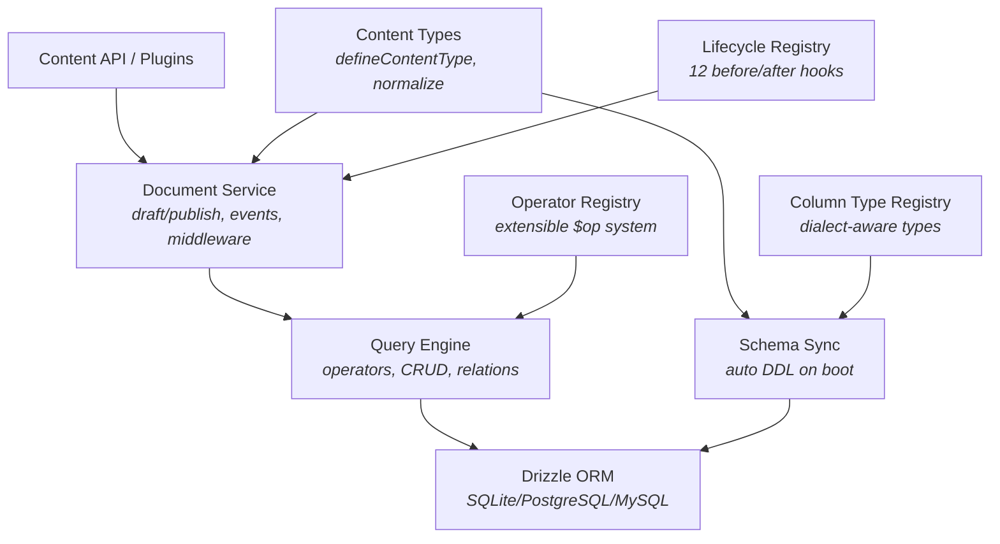
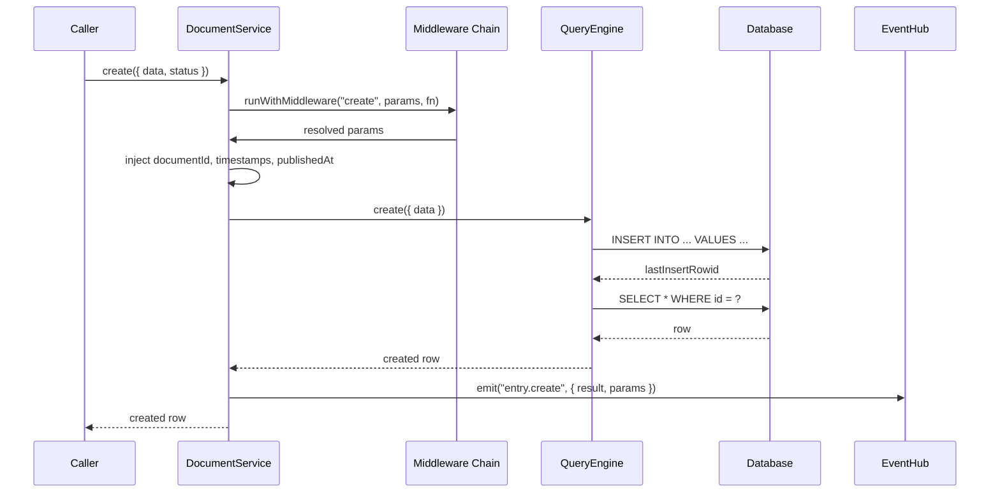

# Database Guide

## Architecture

Three layers with strict downward dependency:



| Layer | Access | Description |
|-------|--------|-------------|
| Document Service | `apick.documents(uid)` | High-level CRUD with draft/publish, i18n, events, sanitization |
| Query Engine | `apick.db.query(uid)` | Low-level SQL builder with operators, bypasses Document Service features |
| Drizzle ORM | `apick.db.connection` | Raw Drizzle instance for custom SQL, joins, aggregations |

### Data Flow (create request)



## Document Service

The Document Service is the primary API for content CRUD. It handles draft/publish states, i18n locale management, event emission, and input validation.

### Methods

| Method | Description |
|--------|-------------|
| `findMany(params)` | List entries with filtering, sorting, pagination |
| `findFirst(params)` | Return first matching entry |
| `findOne({ documentId })` | Get entry by documentId |
| `create({ data })` | Create new entry (draft by default) |
| `update({ documentId, data })` | Update existing entry |
| `delete({ documentId })` | Delete entry and all versions |
| `count(params)` | Count matching entries |
| `publish({ documentId })` | Copy draft to published state |
| `unpublish({ documentId })` | Remove published version |
| `discardDraft({ documentId })` | Reset draft to match published |

### Usage

```ts
// List published articles
const articles = await apick.documents('api::article.article').findMany({
  status: 'published',
  filters: { category: { slug: { $eq: 'technology' } } },
  sort: { publishedAt: 'desc' },
  populate: ['author', 'tags'],
  pagination: { page: 1, pageSize: 10 },
  locale: 'en',
});

// Create a draft
const article = await apick.documents('api::article.article').create({
  data: { title: 'New Article', content: 'Body text...' },
  locale: 'en',
});

// Update
await apick.documents('api::article.article').update({
  documentId: article.document_id,
  data: { title: 'Updated Title' },
  locale: 'en',
});

// Publish
await apick.documents('api::article.article').publish({
  documentId: article.document_id,
  locale: 'en',
});
```

See [CONTENT_API_GUIDE.md](./CONTENT_API_GUIDE.md) for draft/publish REST API details.

## Query Engine

The Query Engine provides low-level database operations via `apick.db.query(uid)`. It bypasses Document Service features (events, sanitization, draft/publish management).

### When to Use

| Scenario | Use |
|----------|-----|
| Standard content CRUD | Document Service |
| Draft/publish workflows | Document Service |
| Custom tables not managed by content types | **Query Engine** |
| Batch operations on thousands of rows | **Query Engine** |
| Performance-critical read paths | **Query Engine** |
| Background jobs that bypass permissions | **Query Engine** |
| Migrations or data seeding | **Query Engine** |

### Core Methods

| Method | Returns | Description |
|--------|---------|-------------|
| `findOne(params?)` | `Row \| null` | First row matching `where` |
| `findMany(params?)` | `Row[]` | All matching rows |
| `findWithCount(params?)` | `[Row[], number]` | Results + total count |
| `findPage(params?)` | `{ results, pagination }` | Page-based pagination |
| `count(params?)` | `number` | Count of matching rows |
| `create(params)` | `Row` | Insert single row |
| `createMany(params)` | `{ count }` | Bulk insert |
| `update(params)` | `Row \| null` | Update matching rows |
| `updateMany(params)` | `{ count }` | Bulk update |
| `delete(params)` | `Row \| null` | Delete matching rows |
| `deleteMany(params)` | `{ count }` | Bulk delete |

### Query Parameters

| Query Engine | Document Service | SQL Equivalent |
|-------------|------------------|----------------|
| `where` | `filters` | `WHERE` |
| `select` | `fields` | `SELECT columns` |
| `orderBy` | `sort` | `ORDER BY` |
| `populate` | `populate` | `JOIN` |
| `offset` | `pagination.start` | `OFFSET` |
| `limit` | `pagination.limit` | `LIMIT` |

### CRUD Examples

```ts
// Find with filtering
const articles = await apick.db.query('api::article.article').findMany({
  where: {
    publishedAt: { $notNull: true },
    category: { slug: 'technology' },
  },
  select: ['id', 'title', 'slug', 'publishedAt'],
  orderBy: [{ publishedAt: 'desc' }, { title: 'asc' }],
  offset: 0,
  limit: 25,
  populate: ['author', 'tags'],
});

// Count
const count = await apick.db.query('api::article.article').count({
  where: { publishedAt: { $notNull: true } },
});

// Paginated
const result = await apick.db.query('api::article.article').findPage({
  where: { publishedAt: { $notNull: true } },
  orderBy: { publishedAt: 'desc' },
  page: 2,
  pageSize: 10,
});

// Bulk insert
await apick.db.query('api::tag.tag').createMany({
  data: [
    { name: 'TypeScript', slug: 'typescript' },
    { name: 'Node.js', slug: 'nodejs' },
  ],
});

// Bulk update
await apick.db.query('api::article.article').updateMany({
  where: { category: 5 },
  data: { featured: false, updatedAt: new Date() },
});

// Bulk delete
await apick.db.query('api::article.article').deleteMany({
  where: { publishedAt: { $null: true }, createdAt: { $lt: new Date('2025-01-01') } },
});
```

### Relation Management

```ts
// Attach relations
await apick.db.query('api::article.article').attachRelations(42, { tags: [1, 5, 8] });

// Replace relations (set semantics)
await apick.db.query('api::article.article').updateRelations(42, {
  tags: [2, 3, 7],
  category: 4,
});

// Remove specific relations
await apick.db.query('api::article.article').deleteRelations(42, { tags: [1, 5] });

// Lazy load
const tags = await apick.db.query('api::article.article').load(article, 'tags', {
  select: ['id', 'name'],
  orderBy: { name: 'asc' },
});
```

### What Query Engine Bypasses

| Feature | Document Service | Query Engine |
|---------|-----------------|--------------|
| Lifecycle events | Emitted | **Not emitted** |
| Input/output sanitization | Applied | **Not applied** |
| Draft/publish management | Managed | **Manual** |
| i18n locale resolution | Managed | **Manual** |
| `documentId` generation | Automatic | **Manual** |
| Zod validation | Applied | **Not applied** |
| Middleware chain | Runs | **Bypassed** |
| Permission checks | Available | **Bypassed** |

## Operators

### Built-in Operators

| Operator | Description | Example |
|----------|-------------|---------|
| `$eq` | Equal (default) | `{ status: 'published' }` |
| `$ne` | Not equal | `{ status: { $ne: 'archived' } }` |
| `$in` | In array | `{ status: { $in: ['draft', 'published'] } }` |
| `$notIn` | Not in array | `{ id: { $notIn: [1, 2, 3] } }` |
| `$gt` | Greater than | `{ price: { $gt: 100 } }` |
| `$gte` | Greater than or equal | `{ price: { $gte: 100 } }` |
| `$lt` | Less than | `{ price: { $lt: 50 } }` |
| `$lte` | Less than or equal | `{ price: { $lte: 50 } }` |
| `$contains` | Contains substring | `{ title: { $contains: 'apick' } }` |
| `$containsi` | Contains (case-insensitive) | `{ title: { $containsi: 'APICK' } }` |
| `$startsWith` | Starts with | `{ slug: { $startsWith: 'getting' } }` |
| `$endsWith` | Ends with | `{ email: { $endsWith: '@example.com' } }` |
| `$null` | Is null | `{ publishedAt: { $null: true } }` |
| `$notNull` | Is not null | `{ publishedAt: { $notNull: true } }` |
| `$between` | Between two values | `{ price: { $between: [10, 50] } }` |
| `$not` | Negate condition | `{ title: { $not: { $contains: 'draft' } } }` |

### Logical Operators

```ts
// OR
{ $or: [{ status: 'published' }, { featured: true }] }

// AND (implicit — all top-level conditions)
{ status: 'published', featured: true }

// Nested
{ $and: [
  { publishedAt: { $notNull: true } },
  { $or: [{ category: 1 }, { featured: true }] },
] }
```

### Custom Operators

Plugins can register custom operators for domain-specific query logic:

```ts
apick.query.registerOperator('$vectorNear', {
  dialects: {
    postgresql: (column, value) =>
      sql`${column} <-> ${vectorLiteral(value.vector)}::vector < ${value.distance}`,
    sqlite: (column, value) =>
      sql`cosine_similarity(${column}, ${jsonLiteral(value.vector)}) > ${1 - value.distance}`,
  },
  schema: z.object({
    vector: z.array(z.number()),
    distance: z.number().positive().optional().default(0.5),
  }),
});
```

See [AI_GUIDE.md](./AI_GUIDE.md) for the `$vectorNear` operator used in semantic search.

## Schema Sync

Schema sync automatically creates and alters database tables to match content type schemas on startup.

| Aspect | Schema Sync (Auto) | User Migrations (Manual) |
|--------|-------------------|-------------------------|
| **When** | Every startup in dev mode | Explicitly via `apick migration:run` |
| **What** | Creates/alters tables to match schemas | Arbitrary SQL: data transforms, custom indexes |
| **Direction** | Forward only (additive) | Up and down |
| **Safety** | Never drops columns in production | Full control |
| **Use case** | Adding fields to content types | Backfilling data, renaming columns, custom indexes |

### Column Type Registry

The column type registry maps content type field types to database column types per dialect:

```ts
// Register a custom column type
apick.db.registerColumnType('vector', {
  sqlite: (field) => sql`TEXT`,           // Store as JSON string
  postgresql: (field) => sql`vector(${field.options.dimensions || 1536})`,
  mysql: (field) => sql`JSON`,
});
```

## Migrations

### Two Systems

| System | Location | Purpose |
|--------|----------|---------|
| **Internal** | Inside framework packages | Framework table schema updates between versions |
| **User** | `database/migrations/` | Custom data migrations, schema tweaks, seed data |

### User Migration File Format

```
database/migrations/
├── 2026.01.15T10.30.00.seed-categories.ts
├── 2026.02.01T09.00.00.add-article-index.ts
└── 2026.02.20T14.15.00.backfill-slugs.ts
```

Each migration exports `up` and `down` functions:

```ts
// database/migrations/2026.01.15T10.30.00.seed-categories.ts
import { sql } from 'drizzle-orm';
import type { DrizzleInstance } from '@apick/database';

export async function up(db: DrizzleInstance): Promise<void> {
  await db.execute(sql`
    INSERT INTO categories (document_id, title, slug, created_at, updated_at)
    VALUES
      (${crypto.randomUUID()}, 'Technology', 'technology', NOW(), NOW()),
      (${crypto.randomUUID()}, 'Science', 'science', NOW(), NOW())
    ON CONFLICT (slug) DO NOTHING
  `);
}

export async function down(db: DrizzleInstance): Promise<void> {
  await db.execute(sql`
    DELETE FROM categories WHERE slug IN ('technology', 'science')
  `);
}
```

### CLI Commands

```bash
apick migration:run          # Run all pending migrations
apick migration:rollback     # Roll back the last batch
apick migration:status       # Check migration status
apick migration:generate add-custom-index  # Generate new migration file
```

### Programmatic API

```ts
const runner = apick.db.migrations;

await runner.shouldRun();   // true if pending migrations exist
await runner.up();          // Run all pending
await runner.down();        // Roll back last batch
const status = await runner.status();
// [{ name: '2026.01.15T10.30.00.seed-categories.ts', appliedAt: '...' }, ...]
```

### Migration Tracking

Stored in the `apick_migrations` table:

| Column | Type | Description |
|--------|------|-------------|
| `id` | `integer` | Auto-increment primary key |
| `name` | `string` | Migration filename |
| `batch` | `integer` | Batch number (all in one `up()` share a batch) |
| `applied_at` | `datetime` | When applied |

Rolling back removes the last batch in reverse order.

## Transactions

Transactions guarantee atomicity via `apick.db.transaction()`. APICK uses `AsyncLocalStorage` to propagate transaction context implicitly.

### Basic Usage

```ts
await apick.db.transaction(async ({ trx, onCommit, onRollback }) => {
  const article = await apick.db.query('api::article.article').create({
    data: { title: 'New Article', slug: 'new-article' },
  });

  await apick.db.query('api::tag.tag').create({
    data: { name: 'new', article: article.id },
  });

  // If any operation throws, all changes roll back
});
```

### Context Propagation

Transaction context propagates automatically via `AsyncLocalStorage`. Nested service calls participate without explicit `trx` passing:

```ts
// Service method — no transaction awareness needed
const articleService = {
  async createWithTags(data, tags) {
    const article = await apick.db.query('api::article.article').create({ data });
    for (const tag of tags) {
      await apick.db.query('api::tag.tag').create({ data: { name: tag, article: article.id } });
    }
    return article;
  },
};

// Caller wraps in transaction
await apick.db.transaction(async () => {
  await articleService.createWithTags(
    { title: 'APICK Guide', slug: 'apick-guide' },
    ['tutorial', 'cms'],
  );
});
```

### Transaction Callbacks

```ts
await apick.db.transaction(async ({ onCommit, onRollback }) => {
  const article = await apick.db.query('api::article.article').create({ data });

  onCommit(async () => {
    // Runs after successful commit — send notifications, invalidate cache
    await apick.service('plugin::email.email').send({ to: 'editor@example.com', ... });
  });

  onRollback(async () => {
    // Runs after rollback — compensating actions (e.g., clean up S3 uploads)
    await deleteFromS3(fileUrl);
  });
});
```

### Implicit Transactions

These Document Service operations are automatically transactional:

| Operation | Why |
|-----------|-----|
| `publish()` | Copies draft to published row atomically |
| `unpublish()` | Removes published row + updates draft metadata |
| `discardDraft()` | Resets draft to match published state |
| `delete()` with relations | Entity + cascade relation cleanup |
| `create()` with components | Parent + components + join records |
| `update()` with relations | Entity + relation sync |

### State Check

```ts
const inTx = apick.db.inTransaction();  // true if inside transaction callback
```

Nested `apick.db.transaction()` calls reuse the outer transaction (no savepoints).

## Direct Drizzle Access

For operations beyond the Query Engine — raw SQL, joins, aggregations, CTEs:

```ts
const db = apick.db.connection;

// Raw SQL
import { sql } from 'drizzle-orm';
const result = await db.execute(
  sql`SELECT category_id, COUNT(*) as count
      FROM articles
      WHERE published_at IS NOT NULL
      GROUP BY category_id
      ORDER BY count DESC`
);

// Drizzle query builder
import { articles, categories } from './drizzle-schema';
const rows = await db
  .select({ title: articles.title, category: categories.name })
  .from(articles)
  .innerJoin(categories, eq(articles.categoryId, categories.id))
  .where(isNotNull(articles.publishedAt))
  .limit(10);
```

### When to Use Direct Access

- Aggregations (`GROUP BY`, `COUNT`, `SUM`, `AVG`)
- Complex joins across multiple tables
- CTEs and window functions
- Database-specific features (PostgreSQL `jsonb`, full-text search)
- Bulk upserts (`ON CONFLICT`)

## Lifecycle Hooks

Database-level callbacks fired before/after CRUD operations. See [CUSTOMIZATION_GUIDE.md](./CUSTOMIZATION_GUIDE.md) for the full lifecycle hook reference.

| Hook | Trigger |
|------|---------|
| `beforeCreate` / `afterCreate` | Insert operation |
| `beforeUpdate` / `afterUpdate` | Update operation |
| `beforeDelete` / `afterDelete` | Delete operation |
| `beforeFindOne` / `afterFindOne` | Single-row query |
| `beforeFindMany` / `afterFindMany` | Multi-row query |
| `beforeCount` / `afterCount` | Count query |
