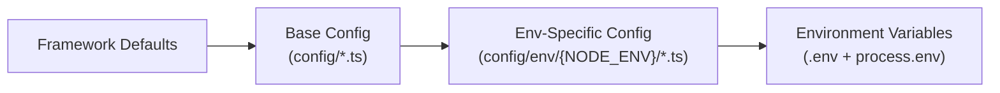

# Deployment Guide

APICK deploys as a standard Node.js application: install dependencies, compile TypeScript, and start the production server.

## Deployment Steps

```bash
# 1. Install production dependencies
npm ci --production

# 2. Compile TypeScript
NODE_ENV=production apick build

# 3. Run pending migrations (if any)
NODE_ENV=production apick migration:run

# 4. Start the production server
NODE_ENV=production apick start
```

**Never run `apick develop` in production** — it enables file watching, auto-reload, and schema sync.

## Environment Variables

### Required

| Variable | Example | Description |
|----------|---------|-------------|
| `NODE_ENV` | `production` | Runtime environment |
| `APP_KEYS` | `base64key1,base64key2` | Session/signing keys (comma-separated) |
| `API_TOKEN_SALT` | `random-32-char-string` | API token hashing salt (HMAC-SHA512) |
| `ADMIN_JWT_SECRET` | `random-32-char-string` | Admin JWT signing secret |
| `JWT_SECRET` | `random-32-char-string` | Content API JWT signing secret |
| `TRANSFER_TOKEN_SALT` | `random-32-char-string` | Data transfer token salt |

### Server

| Variable | Default | Description |
|----------|---------|-------------|
| `HOST` | `0.0.0.0` | Server bind address |
| `PORT` | `1337` | Server port |
| `PUBLIC_URL` | — | Public-facing URL (e.g., `https://api.example.com`) |
| `PROXY_ENABLED` | `false` | Trust `X-Forwarded-*` headers (set `true` behind reverse proxy) |
| `LOG_LEVEL` | `info` | Pino log level (`fatal`, `error`, `warn`, `info`, `debug`, `trace`) |
| `CRON_ENABLED` | `false` | Enable cron job scheduler |

### Database

| Variable | Default | Description |
|----------|---------|-------------|
| `DATABASE_CLIENT` | `sqlite` | Database dialect: `sqlite`, `postgres`, `mysql` |
| `DATABASE_HOST` | `127.0.0.1` | Database host (postgres/mysql) |
| `DATABASE_PORT` | `5432`/`3306` | Database port |
| `DATABASE_NAME` | `apick` | Database name |
| `DATABASE_USERNAME` | — | Database user |
| `DATABASE_PASSWORD` | — | Database password |
| `DATABASE_FILENAME` | `.tmp/data.db` | SQLite file path |
| `DATABASE_SSL` | `false` | Enable SSL for database connection |
| `DATABASE_POOL_MIN` | `2` | Minimum connection pool size |
| `DATABASE_POOL_MAX` | `10` | Maximum connection pool size |

### AI Providers

| Variable | Description |
|----------|-------------|
| `OPENAI_API_KEY` | OpenAI API key |
| `ANTHROPIC_API_KEY` | Anthropic API key |
| `GOOGLE_AI_API_KEY` | Google AI API key |
| `OLLAMA_BASE_URL` | Ollama server URL (default: `http://localhost:11434`) |

See [AI_GUIDE.md](./AI_GUIDE.md) for AI configuration.

### i18n & Sessions

| Variable | Default | Description |
|----------|---------|-------------|
| `DEFAULT_LOCALE` | `en` | Default locale code |
| `SESSION_SECRET` | — | Server-side session signing secret |
| `SESSION_MAX_AGE` | `86400000` | Session max age in milliseconds (default: 24h) |

Generate secrets with:

```bash
node -e "console.log(require('crypto').randomBytes(32).toString('base64'))"
# or
openssl rand -base64 32
```

## env() Helper Functions

Access environment variables in config files:

```ts
// config/database.ts
export default ({ env }) => ({
  connection: {
    client: env('DATABASE_CLIENT', 'sqlite'),
    host: env('DATABASE_HOST', '127.0.0.1'),
    port: env.int('DATABASE_PORT', 5432),
    database: env('DATABASE_NAME', 'apick'),
    username: env('DATABASE_USERNAME', ''),
    password: env('DATABASE_PASSWORD', ''),
    ssl: env.bool('DATABASE_SSL', false),
  },
});
```

| Helper | Returns | Example |
|--------|---------|---------|
| `env(key, default?)` | `string` | `env('HOST', '0.0.0.0')` |
| `env.int(key, default?)` | `number` | `env.int('PORT', 1337)` |
| `env.float(key, default?)` | `number` | `env.float('RATE_LIMIT', 1.5)` |
| `env.bool(key, default?)` | `boolean` | `env.bool('DATABASE_SSL', false)` |
| `env.json(key, default?)` | `object` | `env.json('CORS_ORIGINS', '["*"]')` |
| `env.array(key, default?)` | `string[]` | `env.array('APP_KEYS', [])` |
| `env.date(key, default?)` | `Date` | `env.date('LAUNCH_DATE')` |

## Config Priority



Later sources win. Deep merge means nested objects are merged recursively.

## Production Configuration

### Server Config

```ts
// config/env/production/server.ts
export default ({ env }) => ({
  host: env('HOST', '0.0.0.0'),
  port: env.int('PORT', 1337),
  url: env('PUBLIC_URL', 'https://api.example.com'),
  proxy: { enabled: true, global: true },
  app: { keys: env.array('APP_KEYS') },
  logger: { level: 'info' },
});
```

### Database Config

```ts
// config/env/production/database.ts
export default ({ env }) => ({
  connection: {
    client: 'postgres',
    host: env('DATABASE_HOST'),
    port: env.int('DATABASE_PORT', 5432),
    database: env('DATABASE_NAME'),
    user: env('DATABASE_USERNAME'),
    password: env('DATABASE_PASSWORD'),
    ssl: env.bool('DATABASE_SSL', false)
      ? { rejectUnauthorized: env.bool('DATABASE_SSL_REJECT_UNAUTHORIZED', true) }
      : false,
  },
  pool: {
    min: env.int('DATABASE_POOL_MIN', 5),
    max: env.int('DATABASE_POOL_MAX', 20),
    acquireTimeoutMillis: 60000,
    idleTimeoutMillis: 30000,
  },
});
```

## Docker

### Dockerfile

```dockerfile
# Build stage
FROM node:20-alpine AS build
WORKDIR /app
COPY package.json package-lock.json ./
RUN npm ci
COPY . .
RUN NODE_ENV=production npm run build

# Production stage
FROM node:20-alpine AS production
WORKDIR /app
COPY package.json package-lock.json ./
RUN npm ci --production && npm cache clean --force
COPY --from=build /app/dist ./dist
COPY --from=build /app/config ./config
COPY --from=build /app/public ./public
COPY --from=build /app/database ./database

RUN addgroup -S apick && adduser -S apick -G apick
USER apick

EXPOSE 1337
ENV NODE_ENV=production HOST=0.0.0.0 PORT=1337
CMD ["node", "dist/src/index.js"]
```

### Docker Compose (with PostgreSQL)

```yaml
version: '3.8'
services:
  apick:
    build: .
    ports:
      - '1337:1337'
    environment:
      NODE_ENV: production
      HOST: 0.0.0.0
      PORT: 1337
      APP_KEYS: ${APP_KEYS}
      API_TOKEN_SALT: ${API_TOKEN_SALT}
      ADMIN_JWT_SECRET: ${ADMIN_JWT_SECRET}
      JWT_SECRET: ${JWT_SECRET}
      TRANSFER_TOKEN_SALT: ${TRANSFER_TOKEN_SALT}
      DATABASE_CLIENT: postgres
      DATABASE_HOST: postgres
      DATABASE_PORT: 5432
      DATABASE_NAME: apick
      DATABASE_USERNAME: apick
      DATABASE_PASSWORD: ${DATABASE_PASSWORD}
    depends_on:
      postgres:
        condition: service_healthy
    restart: unless-stopped

  postgres:
    image: postgres:16-alpine
    environment:
      POSTGRES_DB: apick
      POSTGRES_USER: apick
      POSTGRES_PASSWORD: ${DATABASE_PASSWORD}
    volumes:
      - pgdata:/var/lib/postgresql/data
    healthcheck:
      test: ['CMD-SHELL', 'pg_isready -U apick']
      interval: 5s
      timeout: 5s
      retries: 5

volumes:
  pgdata:
```

## Nginx Reverse Proxy

```nginx
upstream apick_backend {
    server 127.0.0.1:1337;
    keepalive 64;
}

server {
    listen 443 ssl http2;
    server_name api.example.com;

    ssl_certificate     /etc/letsencrypt/live/api.example.com/fullchain.pem;
    ssl_certificate_key /etc/letsencrypt/live/api.example.com/privkey.pem;

    add_header X-Frame-Options "SAMEORIGIN" always;
    add_header X-Content-Type-Options "nosniff" always;
    add_header Strict-Transport-Security "max-age=31536000; includeSubDomains" always;

    client_max_body_size 50M;

    location / {
        proxy_pass http://apick_backend;
        proxy_http_version 1.1;
        proxy_set_header Host $host;
        proxy_set_header X-Real-IP $remote_addr;
        proxy_set_header X-Forwarded-For $proxy_add_x_forwarded_for;
        proxy_set_header X-Forwarded-Proto $scheme;
        proxy_set_header Upgrade $http_upgrade;
        proxy_set_header Connection "upgrade";
        proxy_read_timeout 300s;
    }

    location /uploads/ {
        alias /app/public/uploads/;
        expires 30d;
        add_header Cache-Control "public, immutable";
    }
}
```

Set `proxy.enabled: true` in server config when behind a reverse proxy.

## PM2 Process Manager

```js
// ecosystem.config.js
module.exports = {
  apps: [{
    name: 'apick',
    cwd: '/app',
    script: 'dist/src/index.js',
    instances: 'max',
    exec_mode: 'cluster',
    autorestart: true,
    max_memory_restart: '1G',
    env_production: {
      NODE_ENV: 'production',
      HOST: '0.0.0.0',
      PORT: 1337,
    },
  }],
};
```

```bash
pm2 start ecosystem.config.js --env production
pm2 reload apick       # Zero-downtime reload
pm2 monit              # Monitor
pm2 logs apick         # View logs
```

### Cluster Mode Considerations

- APICK is stateless (JWT auth), so cluster mode works out of the box
- **Cron jobs**: enable on one instance only (`CRON_ENABLED=true`) to avoid duplicates
- **File uploads**: all instances must share `public/uploads/` (use S3 or shared filesystem)

## Kubernetes

### Readiness/Liveness Probes

APICK exposes `GET /_health` returning `204 No Content` when ready.

```yaml
readinessProbe:
  httpGet:
    path: /_health
    port: 1337
  initialDelaySeconds: 10
  periodSeconds: 5

livenessProbe:
  httpGet:
    path: /_health
    port: 1337
  initialDelaySeconds: 30
  periodSeconds: 10
```

### Cron Leader Election

| Strategy | How | Best For |
|----------|-----|----------|
| Environment variable | `CRON_ENABLED=true` on one pod | Simple deployments |
| Database lock | Acquire row-level lock before running | Auto-scaling |
| External scheduler | Kubernetes CronJob | Kubernetes-native |

## Monitoring & Observability

### Structured Log Shipping

APICK uses Pino JSON logging. Pipe logs to your aggregation platform:

```bash
node dist/src/index.js | pino-elasticsearch --node http://localhost:9200
node dist/src/index.js | pino-datadog --apiKey $DD_API_KEY
```

### Metrics via Event Hub

```ts
// src/index.ts
export default {
  async bootstrap({ apick }) {
    apick.eventHub.on('entry.create', async ({ result, params }) => {
      metrics.increment('content.created');
    });
  },
};
```

### Key Metrics

| Metric | Source | Alert Threshold |
|--------|--------|-----------------|
| Response time (p99) | `pino-http` `responseTime` | > 2s |
| Error rate (5xx) | Error middleware logs | > 1% |
| DB pool utilization | Pool `acquireTimeoutMillis` | > 80% |
| Memory usage | Process metrics | > 80% of limit |
| Health check failures | `GET /_health` | Any failure |

## Secrets Rotation

### JWT Secrets

1. Deploy with new `JWT_SECRET` value
2. Old tokens fail verification (401)
3. Users re-authenticate to get new tokens

### API Token Salt

1. Update `API_TOKEN_SALT` in environment
2. All existing API tokens become invalid
3. Generate new tokens via admin API

### APP_KEYS

Supports multiple comma-separated keys. Add new key first, then remove old:

```bash
APP_KEYS=newKey,oldKey    # Step 1: Add new key (primary position)
APP_KEYS=newKey           # Step 2: Remove old key after rotation period
```

## Production Checklist

| Item | Action | Priority |
|------|--------|----------|
| **Database** | Use PostgreSQL or MySQL (not SQLite) | Required |
| **Secrets** | Generate unique keys for all salt/secret vars | Required |
| **SSL/TLS** | Terminate SSL at reverse proxy or load balancer | Required |
| **Proxy config** | Set `proxy.enabled: true` in server config | Required if behind proxy |
| **File storage** | Use S3/R2 provider (not local) for multi-instance | Recommended |
| **Process manager** | PM2, systemd, or container orchestrator | Recommended |
| **Database pool** | Tune `pool.min`/`pool.max` for expected concurrency | Recommended |
| **Database SSL** | Enable SSL for database connections | Recommended |
| **Logging** | Use Pino JSON output, ship to log aggregator | Recommended |
| **Monitoring** | Health check endpoint: `GET /_health` | Recommended |
| **Backups** | Automated database backups and retention policy | Recommended |
| **Migrations** | Run `apick migration:run` before starting new version | If using migrations |

## CLI Commands for Production

| Command | Description |
|---------|-------------|
| `apick build` | Compile TypeScript to `dist/` |
| `apick start` | Start production server |
| `apick migration:run` | Run pending database migrations |
| `apick migration:status` | Check migration status |
| `apick export --file backup.tar.gz` | Backup data |
| `apick import --file backup.tar.gz` | Restore data |
| `apick console` | Interactive REPL for debugging |

See [DEVELOPMENT_STANDARDS.md](./DEVELOPMENT_STANDARDS.md) for the full CLI reference.
