# APICK Features Guide

This guide covers the major platform features that go beyond basic content CRUD: internationalization, content releases, review workflows, content history and versioning, data transfer, audit logs, and admin management. Each section addresses both the **user perspective** (API reference with curl examples) and the **developer perspective** (service APIs, extension points, configuration).

For foundational concepts, see [ARCHITECTURE.md](./ARCHITECTURE.md). For content CRUD operations, see [CONTENT_API_GUIDE.md](./CONTENT_API_GUIDE.md). For schema design, see [CONTENT_MODELING_GUIDE.md](./CONTENT_MODELING_GUIDE.md).

---

## Table of Contents

1. [Internationalization (i18n)](#1-internationalization-i18n)
2. [Content Releases](#2-content-releases)
3. [Review Workflows](#3-review-workflows)
4. [Content History and Versioning](#4-content-history-and-versioning)
5. [Data Transfer (Import / Export)](#5-data-transfer-import--export)
6. [Audit Logs](#6-audit-logs)
7. [Admin Management](#7-admin-management)

---

## 1. Internationalization (i18n)

The `@apick/plugin-i18n` plugin provides multi-language content management with per-field localization control. Each locale produces an independent version of a document while non-localized fields stay synchronized across all locales automatically.

### 1.1 Architecture

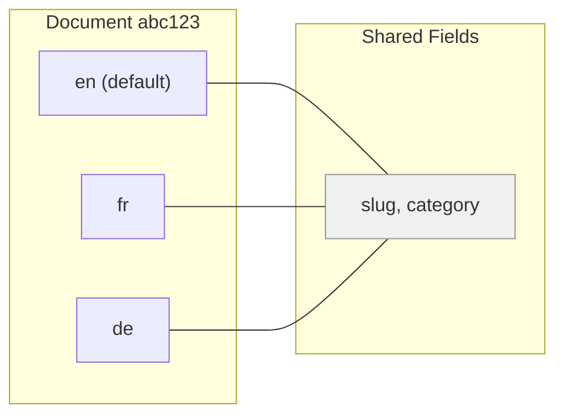

A single `documentId` can have one row per locale. When draft-and-publish is also enabled, each locale can have up to two rows (one draft, one published). Non-localized fields are automatically synchronized: updating `slug` on the English version propagates the change to French and German within the same database transaction. For more on how draft-and-publish interacts with content types, see [CONTENT_API_GUIDE.md](./CONTENT_API_GUIDE.md).

### 1.2 Configuration

Configure the plugin in `config/plugins.ts`:

```typescript
// config/plugins.ts
export default {
  i18n: {
    enabled: true,
    config: {
      defaultLocale: 'en',
      locales: ['en', 'fr', 'de', 'es', 'ja'],
    },
  },
};
```

| Option | Type | Description |
|--------|------|-------------|
| `defaultLocale` | `string` | Locale used when no `locale` parameter is specified in API requests |
| `locales` | `string[]` | Full list of enabled locale codes |

### 1.3 Enabling i18n on a Content Type

Set `pluginOptions.i18n.localized: true` in the content-type schema. For full schema design guidance, see [CONTENT_MODELING_GUIDE.md](./CONTENT_MODELING_GUIDE.md).

```typescript
// src/api/article/content-types/article/schema.ts
export default {
  kind: 'collectionType',
  collectionName: 'articles',
  info: {
    singularName: 'article',
    pluralName: 'articles',
    displayName: 'Article',
  },
  options: {
    draftAndPublish: true,
  },
  pluginOptions: {
    i18n: {
      localized: true,
    },
  },
  attributes: {
    title: {
      type: 'string',
      required: true,
      pluginOptions: { i18n: { localized: true } },   // independent per locale
    },
    slug: {
      type: 'uid',
      targetField: 'title',
      pluginOptions: { i18n: { localized: false } },   // shared across locales
    },
    body: {
      type: 'richtext',
      pluginOptions: { i18n: { localized: true } },
    },
    category: {
      type: 'relation',
      relation: 'manyToOne',
      target: 'api::category.category',
      pluginOptions: { i18n: { localized: false } },   // shared across locales
    },
  },
};
```

#### Per-Field Localization Control

| `pluginOptions.i18n.localized` | Behavior |
|-------------------------------|----------|
| `true` | Field has independent values per locale |
| `false` | Field value is shared; updates sync to all locales |

When a content type has `i18n.localized: true` at the top level, the default for each attribute is `localized: true` unless explicitly overridden.

### 1.4 REST API Reference

#### API Endpoints

| Method | Endpoint | Query Params | Description |
|--------|----------|-------------|-------------|
| `GET` | `/api/:pluralName` | `locale=fr` | List entries in a specific locale |
| `GET` | `/api/:pluralName/:documentId` | `locale=de` | Get single entry in a locale |
| `GET` | `/api/:pluralName/:documentId` | `locale=*` | Get all locale versions of an entry |
| `POST` | `/api/:pluralName` | -- | Create entry (locale in body `data.locale`) |
| `PUT` | `/api/:pluralName/:documentId` | `locale=fr` | Update entry in a specific locale |

#### curl Examples

**Fetch articles in French:**

```bash
curl -X GET "http://localhost:1337/api/articles?locale=fr" \
  -H "Authorization: Bearer <token>"
```

**Fetch all locale versions of a document:**

```bash
curl -X GET "http://localhost:1337/api/articles/abc123?locale=*" \
  -H "Authorization: Bearer <token>"
```

**Create an article in French:**

```bash
curl -X POST "http://localhost:1337/api/articles" \
  -H "Content-Type: application/json" \
  -H "Authorization: Bearer <token>" \
  -d '{
    "data": {
      "title": "Mon Article",
      "body": "Contenu en francais...",
      "locale": "fr"
    }
  }'
```

**Update an article in French:**

```bash
curl -X PUT "http://localhost:1337/api/articles/abc123?locale=fr" \
  -H "Content-Type: application/json" \
  -H "Authorization: Bearer <token>" \
  -d '{
    "data": {
      "title": "Mon Article Modifie"
    }
  }'
```

When `locale` is omitted, the `defaultLocale` is used.

### 1.5 Integration with Draft and Publish

When both i18n and draft-and-publish are enabled, each locale maintains its own independent publish state. A document can be published in English but still in draft in French.

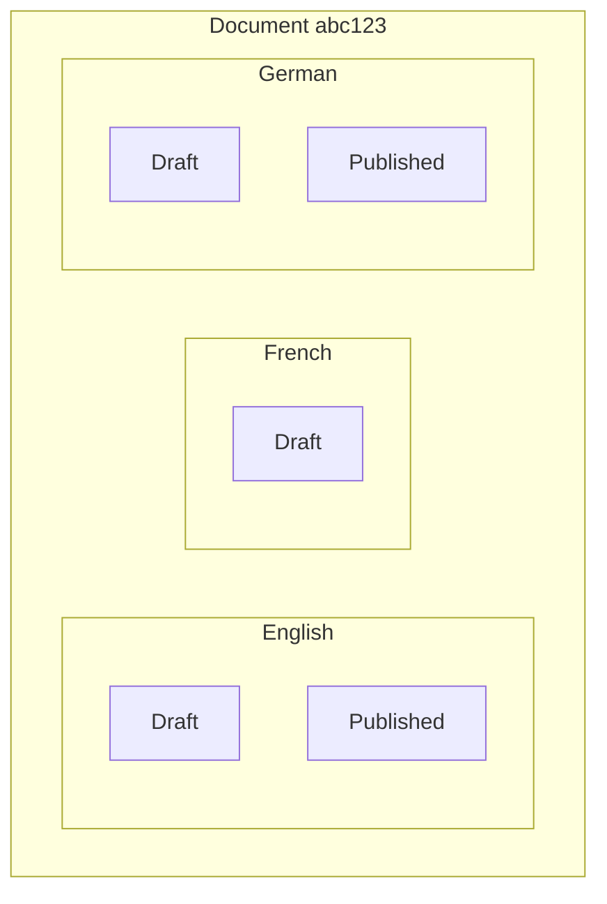

**Publish only the English version:**

```bash
curl -X POST "http://localhost:1337/api/articles/abc123/publish?locale=en" \
  -H "Authorization: Bearer <token>"
```

### 1.6 Developer API: Locale Service

The i18n plugin exposes a locale service for programmatic locale management:

```typescript
const localeService = apick.plugin('i18n').service('locales');
```

| Method | Description |
|--------|-------------|
| `find()` | List all configured locales |
| `findByCode(code)` | Get a single locale by its code |
| `create({ code, name })` | Add a new locale at runtime |
| `delete(id)` | Remove a locale and cascade-delete all content in it |

**Document Service locale parameter:**

```typescript
// Find all documents in French
const articles = await apick.documents('api::article.article').findMany({
  locale: 'fr',
});

// Find a document across all locales
const allLocales = await apick.documents('api::article.article').findOne({
  documentId: 'abc123',
  locale: '*',
});

// Delete a specific locale version
await apick.documents('api::article.article').delete({
  documentId: 'abc123',
  locale: 'de',
});
```

> **Warning:** Deleting a locale via `localeService.delete(id)` cascades and removes all content rows for that locale across every localized content type. This is irreversible.

---

## 2. Content Releases

Content Releases group multiple publish and unpublish actions into a single atomic batch. A release collects actions across content types and locales, then executes them all at once -- either manually or on a schedule.

### 2.1 Release Lifecycle

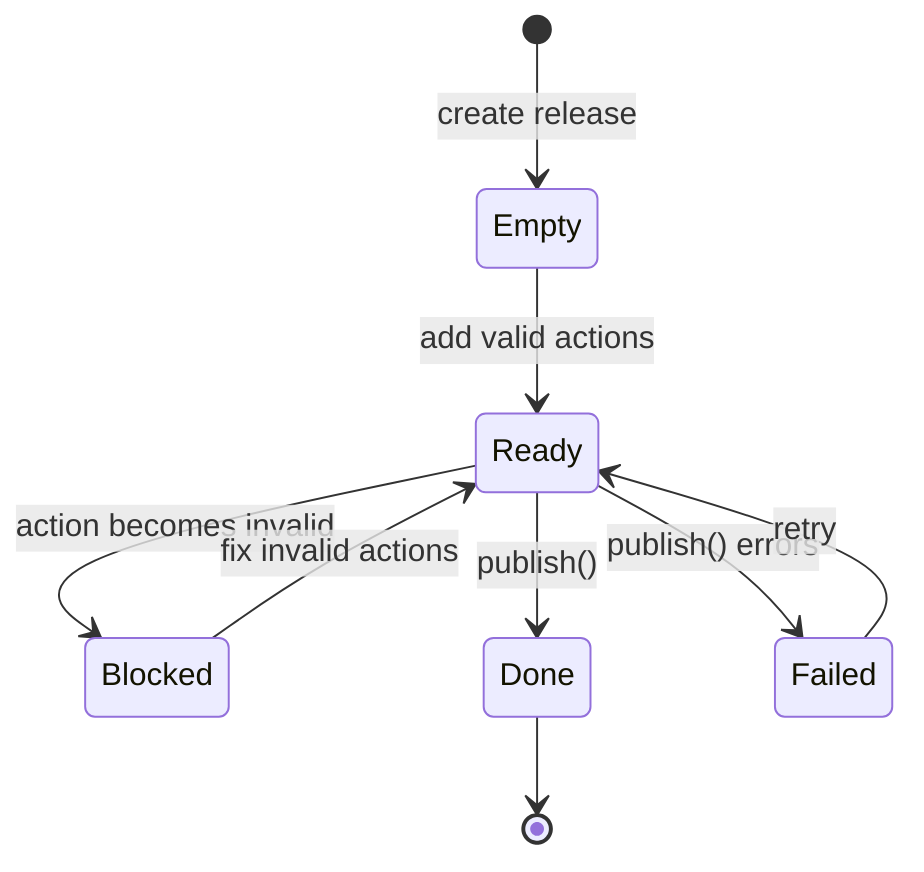

| State | Description |
|-------|-------------|
| `empty` | Release exists but has no actions |
| `ready` | All actions are valid; release can be published |
| `blocked` | One or more actions are invalid (e.g., referenced entry was deleted) |
| `done` | Release was successfully published |
| `failed` | Release publish was attempted but one or more actions failed |

### 2.2 Release Actions

Each action within a release targets a specific document, locale, and operation:

| Property | Type | Description |
|----------|------|-------------|
| `type` | `string` | `'publish'` or `'unpublish'` |
| `contentType` | `string` | Content type UID (e.g., `'api::article.article'`) |
| `documentId` | `string` | Target document identifier |
| `locale` | `string` | Target locale (or `'*'` for all locales) |

A release can mix publish and unpublish actions across different content types. For example, you might publish 5 articles and unpublish 2 old landing pages in a single release.

### 2.3 Publishing Process

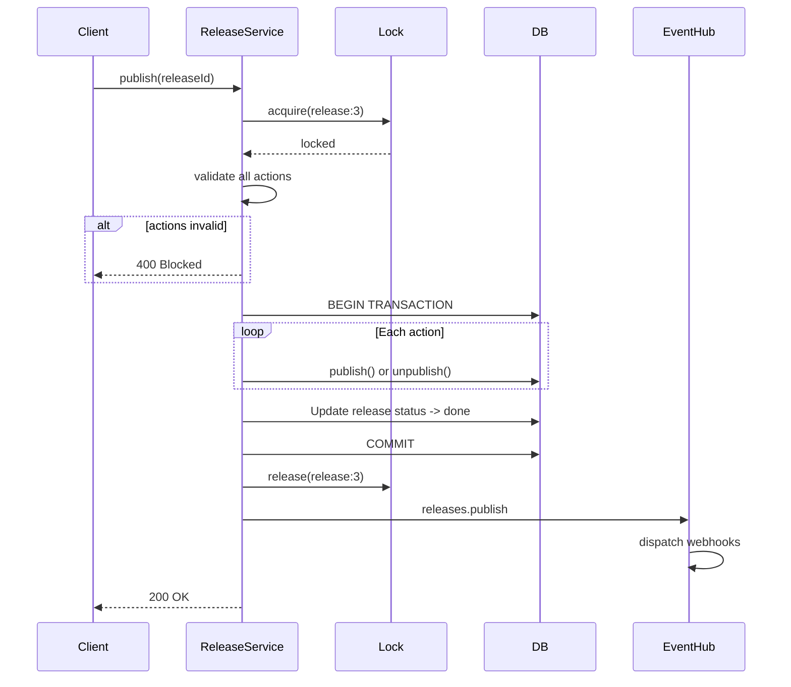

Steps in order:

1. **Acquire lock** -- prevents concurrent publish of the same release.
2. **Validate** -- verify all actions reference existing documents and content types.
3. **Execute in transaction** -- each action calls `publish()` or `unpublish()` via the Document Service. If any action fails, the entire transaction rolls back.
4. **Update status** -- set release status to `done` (or `failed` on error).
5. **Dispatch webhook** -- fire the `releases.publish` event on the Event Hub. For more on how the Event Hub works, see [ARCHITECTURE.md](./ARCHITECTURE.md).

### 2.4 Scheduling

Releases can be scheduled for future execution using an internal cron job:

```bash
curl -X POST "http://localhost:1337/admin/content-releases/3/publish" \
  -H "Content-Type: application/json" \
  -H "Authorization: Bearer <admin-jwt>" \
  -d '{
    "scheduledAt": "2026-03-15T09:00:00.000Z"
  }'
```

When `scheduledAt` is provided, the release is not executed immediately. Instead, APICK registers an internal cron job that fires at the specified time and triggers the publish process.

### 2.5 REST API Reference

#### Release Management

| Method | Endpoint | Description |
|--------|----------|-------------|
| `GET` | `/admin/content-releases` | List all releases |
| `POST` | `/admin/content-releases` | Create a new release |
| `GET` | `/admin/content-releases/:id` | Get release by ID |
| `PUT` | `/admin/content-releases/:id` | Update release metadata |
| `DELETE` | `/admin/content-releases/:id` | Delete a release |
| `POST` | `/admin/content-releases/:id/publish` | Publish a release |

#### Release Actions

| Method | Endpoint | Description |
|--------|----------|-------------|
| `POST` | `/admin/content-releases/:id/actions` | Add action(s) to a release |
| `DELETE` | `/admin/content-releases/:id/actions/:actionId` | Remove an action from a release |
| `GET` | `/admin/content-releases/:id/actions` | List actions in a release |

#### curl Examples

**Create a release:**

```bash
curl -X POST "http://localhost:1337/admin/content-releases" \
  -H "Content-Type: application/json" \
  -H "Authorization: Bearer <admin-jwt>" \
  -d '{
    "name": "Spring Launch",
    "scheduledAt": null
  }'
```

Response:

```json
{
  "data": {
    "id": 3,
    "name": "Spring Launch",
    "status": "empty",
    "scheduledAt": null,
    "createdAt": "2026-03-01T12:00:00.000Z",
    "updatedAt": "2026-03-01T12:00:00.000Z"
  }
}
```

**Add actions to a release:**

```bash
curl -X POST "http://localhost:1337/admin/content-releases/3/actions" \
  -H "Content-Type: application/json" \
  -H "Authorization: Bearer <admin-jwt>" \
  -d '{
    "actions": [
      {
        "type": "publish",
        "contentType": "api::article.article",
        "documentId": "abc123",
        "locale": "en"
      },
      {
        "type": "unpublish",
        "contentType": "api::page.page",
        "documentId": "def456",
        "locale": "*"
      }
    ]
  }'
```

**Publish a release:**

```bash
curl -X POST "http://localhost:1337/admin/content-releases/3/publish" \
  -H "Authorization: Bearer <admin-jwt>"
```

If the release is in `ready` state, all actions execute within a single transaction.

### 2.6 Developer API

```typescript
const releaseService = apick.plugin('content-releases').service('release');

// Create
const release = await releaseService.create({ name: 'Q2 Content' });

// Add actions
await releaseService.createAction(release.id, {
  type: 'publish',
  contentType: 'api::article.article',
  documentId: 'abc123',
  locale: 'en',
});

// Publish
await releaseService.publish(release.id);
```

---

## 3. Review Workflows

APICK includes multi-stage content approval workflows. Review workflows gate content through defined stages before publication, ensuring editorial review and sign-off. This feature interacts with the role-based permission system described in [AUTH_GUIDE.md](./AUTH_GUIDE.md).

### 3.1 Concepts

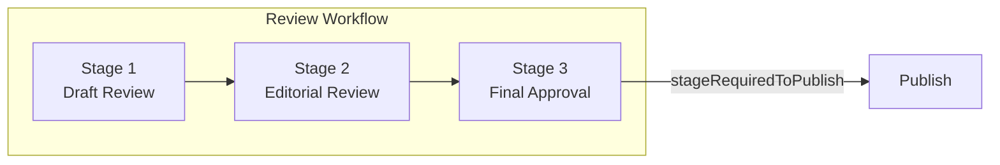

| Concept | Description |
|---------|-------------|
| **Workflow** | A named sequence of stages assigned to one or more content types |
| **Stage** | A step in the review process with assigned reviewer roles |
| **Stage Transition** | Moving content from one stage to the next (or previous) |
| **Publish Gate** | The `stageRequiredToPublish` setting that prevents publishing until content reaches a specific stage |

#### Constraints

- Each content type can be assigned to **at most one** workflow.
- A workflow must have **at least one** stage.
- Stages are ordered; content moves sequentially through them.
- Only admin users with roles assigned to a stage can move content into that stage.

### 3.2 Stage Transition Flow

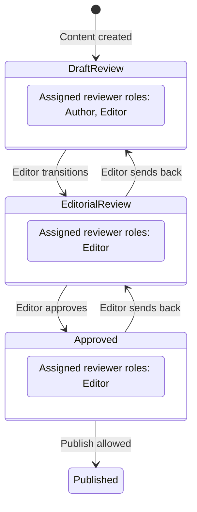

Stage transitions are **bidirectional** -- content can be moved forward or backward. The only restriction is role permissions: a user can only transition content into stages where their role has the `stage.transition` permission.

### 3.3 Publish Gate

The `stageRequiredToPublish` field references a stage ID. When set, content in this workflow **cannot be published** unless its current stage matches (or has passed) the required stage. Set to `null` to allow publishing from any stage.

### 3.4 REST API Reference

#### Workflow Endpoints

| Method | Endpoint | Description |
|--------|----------|-------------|
| `GET` | `/admin/review-workflows` | List all workflows |
| `POST` | `/admin/review-workflows` | Create a workflow |
| `GET` | `/admin/review-workflows/:id` | Get workflow with stages |
| `PUT` | `/admin/review-workflows/:id` | Update workflow metadata and content type assignments |
| `DELETE` | `/admin/review-workflows/:id` | Delete workflow |

#### Stage Endpoints

| Method | Endpoint | Description |
|--------|----------|-------------|
| `PUT` | `/admin/review-workflows/:id/stages` | Replace all stages for a workflow |

#### Content Stage Assignment

| Method | Endpoint | Description |
|--------|----------|-------------|
| `PUT` | `/admin/content-manager/:contentType/:documentId/stage` | Move document to a specific stage |

#### curl Examples

**Create a workflow:**

```bash
curl -X POST "http://localhost:1337/admin/review-workflows" \
  -H "Content-Type: application/json" \
  -H "Authorization: Bearer <admin-jwt>" \
  -d '{
    "data": {
      "name": "Article Review",
      "contentTypes": ["api::article.article"],
      "stages": [
        {
          "name": "Draft Review",
          "color": "#4945FF",
          "permissions": [
            { "role": 2, "action": "plugin::review-workflows.stage.transition" }
          ]
        },
        {
          "name": "Editorial Review",
          "color": "#F29D49",
          "permissions": [
            { "role": 2, "action": "plugin::review-workflows.stage.transition" },
            { "role": 3, "action": "plugin::review-workflows.stage.transition" }
          ]
        },
        {
          "name": "Approved",
          "color": "#328048",
          "permissions": [
            { "role": 2, "action": "plugin::review-workflows.stage.transition" }
          ]
        }
      ],
      "stageRequiredToPublish": null
    }
  }'
```

**Set a publish gate (require "Approved" stage before publishing):**

```bash
curl -X PUT "http://localhost:1337/admin/review-workflows/1" \
  -H "Content-Type: application/json" \
  -H "Authorization: Bearer <admin-jwt>" \
  -d '{
    "data": {
      "stageRequiredToPublish": 3
    }
  }'
```

**Move content to a review stage:**

```bash
curl -X PUT "http://localhost:1337/admin/content-manager/api::article.article/clx7abc123/stage" \
  -H "Content-Type: application/json" \
  -H "Authorization: Bearer <admin-jwt>" \
  -d '{
    "data": {
      "id": 2
    }
  }'
```

The `id` in the body refers to the target stage ID. The server validates:

1. The stage belongs to the workflow assigned to this content type.
2. The requesting user's role has permission to transition into this stage.
3. The content type is assigned to a workflow.

Response:

```json
{
  "data": {
    "documentId": "clx7abc123",
    "stage": {
      "id": 2,
      "name": "Editorial Review",
      "color": "#F29D49"
    }
  }
}
```

**Update stages (replace all stages for a workflow):**

```bash
curl -X PUT "http://localhost:1337/admin/review-workflows/1/stages" \
  -H "Content-Type: application/json" \
  -H "Authorization: Bearer <admin-jwt>" \
  -d '{
    "data": [
      { "id": 1, "name": "Draft Review", "color": "#4945FF" },
      { "id": 2, "name": "Legal Review", "color": "#DC3545" },
      { "id": 3, "name": "Editorial Review", "color": "#F29D49" },
      { "name": "Final Sign-off", "color": "#328048" }
    ]
  }'
```

Stages with an `id` are updated; stages without an `id` are created. Stages from the previous list that are missing from the new list are deleted, and any content in those stages is moved to the first stage.

### 3.5 Integration with Content Releases

When both review workflows and content releases are active, they interact as follows:

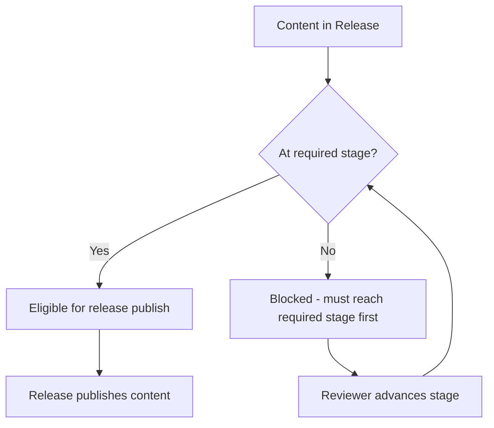

| Scenario | Behavior |
|----------|----------|
| Content in release but not at required stage | Release publish blocked for that entry |
| Content reaches required stage | Entry becomes eligible for release publishing |
| Content moved backward after release scheduling | Entry blocked again; release shows warning |

### 3.6 Permissions

| Action | Description |
|--------|-------------|
| `plugin::review-workflows.read` | View workflows and stages |
| `plugin::review-workflows.create` | Create workflows |
| `plugin::review-workflows.update` | Update workflows and stages |
| `plugin::review-workflows.delete` | Delete workflows |
| `plugin::review-workflows.stage.transition` | Move content between stages |

By default, the **Super Admin** role has all permissions. The **Editor** role has `read` and `stage.transition`. The **Author** role has `read` only. For more on roles and permissions, see [AUTH_GUIDE.md](./AUTH_GUIDE.md).

### 3.7 Developer API

```typescript
const workflowService = apick.plugin('review-workflows').service('workflows');

// List all workflows
const workflows = await workflowService.find({ populate: ['stages'] });

// Get the workflow assigned to a content type
const workflow = await workflowService.getAssignedWorkflow('api::article.article', {
  populate: ['stages', 'stages.permissions'],
});

// Create a workflow
const newWorkflow = await workflowService.create({
  data: {
    name: 'Product Review',
    contentTypes: ['api::product.product'],
    stages: [
      { name: 'Technical Review', color: '#4945FF' },
      { name: 'Marketing Review', color: '#F29D49' },
      { name: 'Ready', color: '#328048' },
    ],
  },
});

// Validate a stage belongs to a workflow
await workflowService.assertStageBelongsToWorkflow(stageId, workflowId);
// Throws if the stage is not part of the workflow
```

---

## 4. Content History and Versioning

APICK tracks versions of content documents, enabling point-in-time snapshots and schema-aware restore. Every save operation creates a version record containing the full document data, the schema at the time of save, and metadata about locale and publish status.

### 4.1 Version Data Model

Each version record stores:

| Field | Type | Description |
|-------|------|-------------|
| `id` | `number` | Auto-incremented primary key |
| `contentType` | `string` | Content type UID (e.g., `api::article.article`) |
| `relatedDocumentId` | `string` | The `documentId` of the content entry |
| `locale` | `string \| null` | Locale code if i18n is enabled |
| `status` | `string` | Document status at time of save (`draft`, `published`) |
| `data` | `object` | Full snapshot of all field values |
| `schema` | `object` | Content type schema definition at time of save |
| `componentsSchemas` | `object` | Schemas of all components used in the document |
| `createdBy` | `object` | Admin user who triggered the save |
| `createdAt` | `string` | ISO 8601 timestamp |

### 4.2 Automatic Version Creation

Versions are created automatically during these operations:

| Operation | Trigger |
|-----------|---------|
| `create` | New document saved |
| `update` | Existing document modified |
| `publish` | Document published |
| `unpublish` | Document unpublished |

Versions are **not** created for:

- Bulk operations (for performance)
- Relation reordering (no data change on the document itself)
- Locale creation (handled as separate version streams per locale)

### 4.3 Restore Process

Restoring a version is not a simple data overwrite. APICK performs schema-aware diffing to handle schema evolution between the version's snapshot and the current schema. For background on how content-type schemas evolve, see [CONTENT_MODELING_GUIDE.md](./CONTENT_MODELING_GUIDE.md).

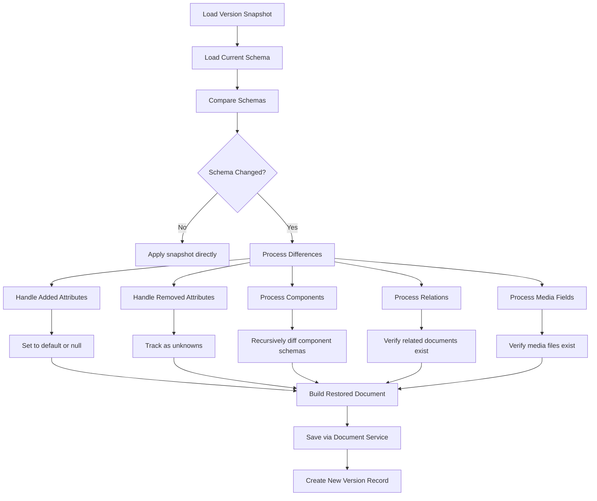

#### Schema Difference Handling

| Scenario | Behavior |
|----------|----------|
| Attribute added to current schema | Set to default value or `null`. Tracked in `unknowns.added`. |
| Attribute removed from current schema | Value from snapshot is dropped. Tracked in `unknowns.removed`. |
| Attribute type changed | Value is dropped if incompatible. Tracked in `unknowns.changed`. |
| Component schema changed | Recursively diffed. Same rules applied at component level. |
| Related document no longer exists | Relation cleared. Tracked in `unknowns.removed`. |
| Media file no longer exists | Media field cleared. Tracked in `unknowns.removed`. |

#### Unknowns Object

The `unknowns` object in the restore response tells the caller what could not be cleanly restored:

```typescript
interface RestoreUnknowns {
  added: string[];    // Fields in current schema but not in snapshot
  removed: string[];  // Fields in snapshot but not in current schema
  changed: string[];  // Fields with incompatible type changes
}
```

### 4.4 REST API Reference

#### Endpoints

| Method | Endpoint | Description |
|--------|----------|-------------|
| `GET` | `/admin/content-history/:contentType/:documentId` | List version history for a document |
| `POST` | `/admin/content-history/:versionId/restore` | Restore a document to a previous version |

#### Query Parameters (List Versions)

| Parameter | Default | Description |
|-----------|---------|-------------|
| `locale` | default locale | Filter versions by locale |
| `page` | `1` | Page number |
| `pageSize` | `20` | Results per page |

#### curl Examples

**List version history for a document:**

```bash
curl -X GET "http://localhost:1337/admin/content-history/api::article.article/clx7abc123?locale=en&page=1&pageSize=10" \
  -H "Authorization: Bearer <admin-jwt>"
```

Response:

```json
{
  "data": [
    {
      "id": 42,
      "contentType": "api::article.article",
      "relatedDocumentId": "clx7abc123",
      "locale": "en",
      "status": "draft",
      "createdBy": {
        "id": 1,
        "firstname": "Root",
        "lastname": "Admin"
      },
      "createdAt": "2026-02-15T14:30:00.000Z"
    },
    {
      "id": 38,
      "contentType": "api::article.article",
      "relatedDocumentId": "clx7abc123",
      "locale": "en",
      "status": "published",
      "createdBy": {
        "id": 1,
        "firstname": "Root",
        "lastname": "Admin"
      },
      "createdAt": "2026-02-14T09:00:00.000Z"
    }
  ],
  "meta": {
    "pagination": {
      "page": 1,
      "pageSize": 10,
      "pageCount": 2,
      "total": 15
    }
  }
}
```

> The `data` field (full document snapshot) in each list item is omitted for performance. Fetch a specific version to see the full snapshot.

**Restore a version:**

```bash
curl -X POST "http://localhost:1337/admin/content-history/38/restore" \
  -H "Authorization: Bearer <admin-jwt>"
```

Response:

```json
{
  "data": {
    "documentId": "clx7abc123",
    "contentType": "api::article.article",
    "restoredFrom": 38,
    "unknowns": {
      "added": [],
      "removed": ["legacyField"],
      "changed": []
    }
  }
}
```

### 4.5 Storage Considerations

Version records accumulate over time. Each version stores a full snapshot (not a diff), so storage grows linearly with edit frequency.

| Factor | Impact |
|--------|--------|
| Rich text fields | Large `data` payloads per version |
| Component-heavy types | Larger `componentsSchemas` objects |
| Many locales | Separate version streams per locale |
| Frequent saves | More records per document |

Consider implementing a retention policy via a cron job if storage is a concern:

```typescript
// config/server.ts
export default {
  cron: {
    enabled: true,
    tasks: {
      // Delete versions older than 90 days, daily at 3 AM
      '0 3 * * *': async ({ apick }) => {
        const cutoff = new Date(Date.now() - 90 * 24 * 60 * 60 * 1000);
        await apick.db.query('plugin::content-manager.history-version').deleteMany({
          where: { createdAt: { $lt: cutoff } },
        });
      },
    },
  },
};
```

For database configuration details, see [DATABASE_GUIDE.md](./DATABASE_GUIDE.md).

### 4.6 Developer API

```typescript
const historyService = apick.plugin('content-manager').service('history');

// Create a version snapshot
await historyService.createVersion({
  contentType: 'api::article.article',
  relatedDocumentId: 'clx7abc123',
  locale: 'en',
  status: 'draft',
  data: documentData,
  schema: contentTypeSchema,
  componentsSchemas: relatedComponentSchemas,
});

// List versions with pagination
const { results, pagination } = await historyService.findVersionsPage({
  contentType: 'api::article.article',
  relatedDocumentId: 'clx7abc123',
  locale: 'en',
  page: 1,
  pageSize: 20,
});

// Restore a version
const result = await historyService.restoreVersion(versionId);
// => { documentId, contentType, restoredFrom, unknowns }
```

---

## 5. Data Transfer (Import / Export)

APICK supports importing and exporting content, configuration, and media between instances. Three transfer methods are available: export (to file), import (from file), and direct transfer (instance to instance over the network).

### 5.1 Transfer Methods

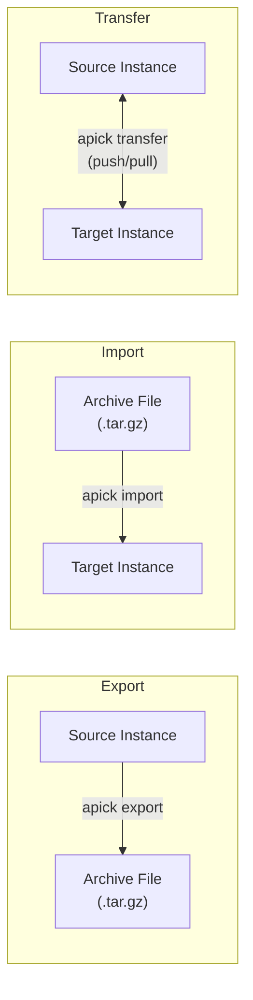

| Method | Direction | Medium | Use Case |
|--------|-----------|--------|----------|
| **Export** | Instance to file | `.tar.gz` archive | Backups, offline migration, version control |
| **Import** | File to instance | `.tar.gz` archive | Restore, seed data, offline migration |
| **Transfer** | Instance to instance | HTTP stream | Live migration, staging-to-production sync |

### 5.2 What Gets Transferred

| Data Category | Included | Notes |
|---------------|----------|-------|
| Content entries | Yes | All locales, all statuses (draft + published) |
| Media files | Yes | Binary files + upload metadata |
| Content type schemas | Yes | Schema definitions for all content types |
| Components | Yes | Component schema definitions |
| Admin users | Configurable | Opt-in; passwords are excluded |
| Admin roles | Yes | Role definitions + permission assignments |
| Admin permissions | Yes | Full permission records |
| API tokens | No | Security-sensitive; must be recreated |
| Core store settings | Yes | Plugin settings, project settings |
| Webhook configurations | Yes | Webhook URLs and event subscriptions |

### 5.3 Transfer Architecture

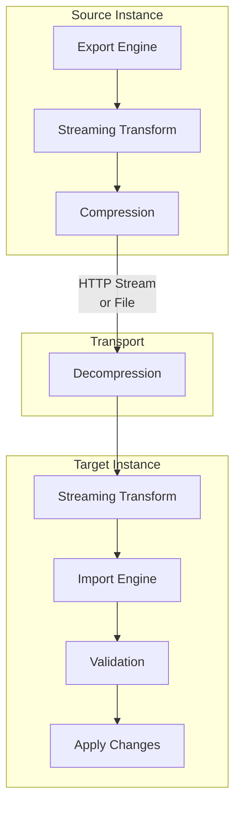

Transfers use Node.js streams for memory efficiency. Even multi-gigabyte datasets are processed without loading the full payload into memory.

**Transfer Pipeline Stages:**

1. **Extract** -- Read entities from source database
2. **Transform** -- Remap IDs, resolve relations, process media references
3. **Stream** -- Compress and transmit via HTTP or write to file
4. **Validate** -- Verify schema compatibility on the target
5. **Apply** -- Insert/update records in the target database

### 5.4 Transfer Tokens

Direct instance-to-instance transfers require authentication via transfer tokens. These are managed through the admin API.

**Security:**

- Tokens are 256-bit cryptographically random values.
- Stored as SHA-512 hashes salted with `TRANSFER_TOKEN_SALT`.
- The plaintext token is only returned at creation time -- store it immediately.

#### Token Permissions

| Permission | Description |
|------------|-------------|
| `push` | Allows pushing data TO this instance |
| `pull` | Allows pulling data FROM this instance |

#### Token API Endpoints

| Method | Endpoint | Description |
|--------|----------|-------------|
| `GET` | `/admin/transfer/tokens` | List all transfer tokens |
| `GET` | `/admin/transfer/tokens/:id` | Get token details |
| `POST` | `/admin/transfer/tokens` | Create transfer token |
| `PUT` | `/admin/transfer/tokens/:id` | Update token (name, permissions) |
| `DELETE` | `/admin/transfer/tokens/:id` | Revoke and delete token |
| `POST` | `/admin/transfer/tokens/:id/regenerate` | Regenerate token value |

#### curl Example: Create a Transfer Token

```bash
curl -X POST "http://localhost:1337/admin/transfer/tokens" \
  -H "Content-Type: application/json" \
  -H "Authorization: Bearer <admin-jwt>" \
  -d '{
    "name": "Staging Sync",
    "description": "Used for staging-to-production data sync",
    "permissions": ["push", "pull"],
    "lifespan": null
  }'
```

Response:

```json
{
  "data": {
    "id": 1,
    "name": "Staging Sync",
    "description": "Used for staging-to-production data sync",
    "permissions": ["push", "pull"],
    "accessKey": "a1b2c3d4e5f6a1b2c3d4e5f6a1b2c3d4e5f6a1b2c3d4e5f6a1b2c3d4e5f6a1b2",
    "lastUsedAt": null,
    "expiresAt": null,
    "lifespan": null,
    "createdAt": "2026-02-01T10:00:00.000Z"
  }
}
```

### 5.5 CLI Usage

#### Export

```bash
# Export everything to a tar.gz archive
apick export --file backup.tar.gz

# Export with filters
apick export --file content-only.tar.gz \
  --no-encrypt \
  --only content

# Export specific content types
apick export --file articles.tar.gz \
  --only content \
  --include api::article.article \
  --include api::category.category

# Export with encryption
apick export --file backup.tar.gz \
  --encrypt \
  --key "$(openssl rand -hex 32)"
```

**Export Options:**

| Flag | Description | Default |
|------|-------------|---------|
| `--file`, `-f` | Output file path | `export_{timestamp}.tar.gz` |
| `--encrypt` | Encrypt the archive | `false` |
| `--no-encrypt` | Explicitly disable encryption | -- |
| `--key` | Encryption key (required if `--encrypt`) | -- |
| `--only` | Transfer only specific data types: `content`, `files`, `config` | all |
| `--exclude` | Exclude specific data types | none |
| `--include` | Include specific content type UIDs | all |

#### Import

```bash
# Import from archive
apick import --file backup.tar.gz

# Import with decryption
apick import --file backup.tar.gz \
  --decrypt \
  --key "your-encryption-key"

# Dry run (validate without applying)
apick import --file backup.tar.gz --dry-run

# Import only content (skip config/schemas)
apick import --file backup.tar.gz --only content

# Force import (overwrite existing data)
apick import --file backup.tar.gz --force
```

**Import Options:**

| Flag | Description | Default |
|------|-------------|---------|
| `--file`, `-f` | Input file path | required |
| `--decrypt` | Decrypt the archive | `false` |
| `--key` | Decryption key | -- |
| `--dry-run` | Validate without applying changes | `false` |
| `--force` | Overwrite existing entries | `false` |
| `--only` | Import only specific data types | all |
| `--exclude` | Exclude specific data types | none |

#### Transfer (Instance to Instance)

```bash
# Pull data from remote to local
apick transfer --from https://staging.example.com/admin \
  --from-token "transfer-token-from-staging"

# Push data from local to remote
apick transfer --to https://production.example.com/admin \
  --to-token "transfer-token-for-production"

# Transfer only content
apick transfer --from https://staging.example.com/admin \
  --from-token "token" \
  --only content

# Dry run
apick transfer --from https://staging.example.com/admin \
  --from-token "token" \
  --dry-run
```

**Transfer Options:**

| Flag | Description |
|------|-------------|
| `--from` | Source instance admin URL (pull mode) |
| `--from-token` | Transfer token for the source instance |
| `--to` | Target instance admin URL (push mode) |
| `--to-token` | Transfer token for the target instance |
| `--only` | Transfer only specific data types |
| `--exclude` | Exclude specific data types |
| `--dry-run` | Validate without applying |
| `--force` | Overwrite existing data |

### 5.6 Conflict Resolution

| Scenario | Default Behavior | With `--force` |
|----------|-----------------|----------------|
| Same `documentId` exists | Skip | Overwrite |
| Schema mismatch | Error | Apply with best-effort mapping |
| Missing relation target | Skip relation field | Skip relation field |
| Duplicate unique field | Error | Overwrite |

### 5.7 Configuration

```typescript
// config/admin.ts
export default ({ env }) => ({
  transfer: {
    token: {
      salt: env('TRANSFER_TOKEN_SALT'),
    },
  },
});
```

| Env Variable | Description |
|-------------|-------------|
| `TRANSFER_TOKEN_SALT` | Salt for hashing transfer tokens. Required for instance-to-instance transfer. |

### 5.8 Developer API

```typescript
const transferService = apick.service('admin::transfer');

// Create a transfer token
const token = await transferService.token.create({
  name: 'CI Pipeline',
  permissions: ['push'],
  lifespan: 30 * 24 * 60 * 60 * 1000, // 30 days
});

// Export programmatically
const { engine } = await apick.plugin('data-transfer').service('export').createExportEngine({
  exclude: ['files'],
});
const stream = await engine.export();

// Import programmatically
const { engine: importEngine } = await apick.plugin('data-transfer').service('import').createImportEngine({
  source: readableStream,
  force: true,
});
await importEngine.import();
```

---

## 6. Audit Logs

APICK records admin user actions for compliance tracking, debugging, and operational visibility. Every significant admin operation emits an event that is captured, sanitized, and persisted. This is built on top of the Event Hub described in [ARCHITECTURE.md](./ARCHITECTURE.md).

### 6.1 Architecture

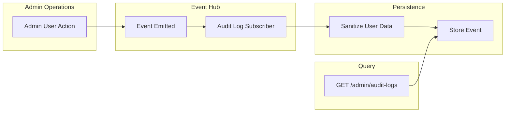

The audit log system is built on APICK's Event Hub. A subscriber listens for all admin-relevant events and persists them. No explicit instrumentation is needed in route handlers -- the Event Hub captures actions automatically.

### 6.2 Event Structure

Each audit log entry contains:

| Field | Type | Description |
|-------|------|-------------|
| `id` | `number` | Auto-incremented primary key |
| `action` | `string` | Event action identifier |
| `date` | `string` | ISO 8601 timestamp of when the action occurred |
| `userId` | `number` | ID of the admin user who performed the action |
| `user` | `object` | Sanitized user snapshot (id, displayName, email) |
| `payload` | `object` | Action-specific data (entity ID, changes, metadata) |

### 6.3 Tracked Actions

| Action | Description |
|--------|-------------|
| `content-manager.entry.create` | Content entry created |
| `content-manager.entry.update` | Content entry updated |
| `content-manager.entry.delete` | Content entry deleted |
| `content-manager.entry.publish` | Content entry published |
| `content-manager.entry.unpublish` | Content entry unpublished |
| `content-type-builder.contentType.create` | Content type schema created |
| `content-type-builder.contentType.update` | Content type schema modified |
| `content-type-builder.contentType.delete` | Content type schema deleted |
| `content-type-builder.component.create` | Component schema created |
| `content-type-builder.component.update` | Component schema modified |
| `content-type-builder.component.delete` | Component schema deleted |
| `admin.user.create` | Admin user created |
| `admin.user.update` | Admin user updated |
| `admin.user.delete` | Admin user deleted |
| `admin.role.create` | Admin role created |
| `admin.role.update` | Admin role updated (including permissions) |
| `admin.role.delete` | Admin role deleted |
| `admin.api-token.create` | API token created |
| `admin.api-token.update` | API token updated |
| `admin.api-token.delete` | API token deleted |
| `admin.api-token.regenerate` | API token regenerated |
| `admin.auth.success` | Successful admin login |
| `admin.media.create` | Media file uploaded |
| `admin.media.update` | Media file metadata updated |
| `admin.media.delete` | Media file deleted |
| `review-workflows.stage.transition` | Content moved to a different review stage |

### 6.4 User Sanitization

The `user` field on each event stores a sanitized snapshot of the acting user at the time of the action. This ensures audit logs remain useful even after users are modified or deleted. Sensitive fields (password hashes, tokens, secrets) are never stored.

**Display Name Resolution (fallback chain):**

| User Data | Resolved `displayName` |
|-----------|----------------------|
| `{ username: "jsmith", email: "j@ex.com" }` | `jsmith` |
| `{ username: null, email: "jane@ex.com" }` | `jane` |
| `{ username: null, email: null, firstname: "Jane", lastname: "Doe" }` | `Jane Doe` |
| `{ username: null, email: null, firstname: null }` | `Unknown` |

### 6.5 REST API Reference

#### Endpoints

| Method | Endpoint | Description |
|--------|----------|-------------|
| `GET` | `/admin/audit-logs` | List audit log events (paginated, filterable) |
| `GET` | `/admin/audit-logs/:id` | Get single audit log event with full payload |

#### Query Parameters

| Parameter | Type | Description |
|-----------|------|-------------|
| `filters[action][$eq]` | `string` | Filter by action type |
| `filters[userId][$eq]` | `number` | Filter by user ID |
| `filters[date][$gte]` | `string` | Events on or after date (ISO 8601) |
| `filters[date][$lte]` | `string` | Events on or before date |
| `sort` | `string` | Sort field and direction (e.g., `date:desc`) |
| `pagination[page]` | `number` | Page number (default: `1`) |
| `pagination[pageSize]` | `number` | Results per page (default: `25`) |

#### curl Examples

**Get all content update events from the last 7 days:**

```bash
curl -G "http://localhost:1337/admin/audit-logs" \
  -d "filters[action][\$eq]=content-manager.entry.update" \
  -d "filters[date][\$gte]=2026-02-24T00:00:00.000Z" \
  -d "sort=date:desc" \
  -d "pagination[page]=1" \
  -d "pagination[pageSize]=50" \
  -H "Authorization: Bearer <admin-jwt>"
```

Response:

```json
{
  "data": [
    {
      "id": 1042,
      "action": "content-manager.entry.update",
      "date": "2026-02-28T14:32:15.000Z",
      "userId": 3,
      "user": {
        "id": 3,
        "displayName": "jane.editor",
        "email": "jane@example.com"
      },
      "payload": {
        "contentType": "api::article.article",
        "documentId": "clx7abc123"
      }
    }
  ],
  "meta": {
    "pagination": {
      "page": 1,
      "pageSize": 50,
      "pageCount": 1,
      "total": 12
    }
  }
}
```

**Get a single audit event (includes full payload):**

```bash
curl -X GET "http://localhost:1337/admin/audit-logs/1042" \
  -H "Authorization: Bearer <admin-jwt>"
```

Response:

```json
{
  "data": {
    "id": 1042,
    "action": "content-manager.entry.update",
    "date": "2026-02-28T14:32:15.000Z",
    "userId": 3,
    "user": {
      "id": 3,
      "displayName": "jane.editor",
      "email": "jane@example.com"
    },
    "payload": {
      "contentType": "api::article.article",
      "documentId": "clx7abc123",
      "data": {
        "title": "Updated Title",
        "content": "Updated content body..."
      }
    }
  }
}
```

### 6.6 Retention Configuration

Audit logs accumulate over time. Configure automatic cleanup to manage storage:

```typescript
// config/plugins.ts
export default {
  'audit-logs': {
    enabled: true,
    config: {
      // Automatically delete events older than this duration (in days)
      retentionDays: 90,
    },
  },
};
```

When `retentionDays` is set, APICK runs `deleteExpiredEvents()` as part of its internal cron cycle, removing events older than the configured threshold.

### 6.7 Permissions

| Action | Description |
|--------|-------------|
| `admin::audit-logs.read` | View audit log events |

By default, only the **Super Admin** role has access to audit logs.

### 6.8 Developer API

```typescript
const auditService = apick.service('admin::audit-logs');

// Query events with filters
const { results, pagination } = await auditService.findMany({
  filters: {
    action: 'content-manager.entry.update',
    userId: 3,
    date: { $gte: '2026-02-01T00:00:00.000Z' },
  },
  sort: { date: 'desc' },
  page: 1,
  pageSize: 25,
});

// Get a single event by ID
const event = await auditService.findOne(1042);

// Delete expired events manually
await auditService.deleteExpiredEvents(new Date('2025-12-01'));
```

#### Emitting Custom Audit Events

To emit custom events that appear in audit logs, use the Event Hub:

```typescript
// In a custom service or controller
apick.eventHub.emit('custom.action', {
  user: ctx.state.user,
  payload: {
    description: 'Custom action performed',
    metadata: { key: 'value' },
  },
});
```

> Custom events are only captured if you register them as auditable actions in the audit log subscriber configuration.

---

## 7. Admin Management

APICK is a pure headless CMS -- there is no admin panel UI. All administrative operations are performed via REST API calls under the `/admin` prefix. The admin API is entirely separate from the Content API (`/api`) -- different auth tokens, different middleware stack, different permission model. For the Content API, see [CONTENT_API_GUIDE.md](./CONTENT_API_GUIDE.md). For the role-based permission model, see [AUTH_GUIDE.md](./AUTH_GUIDE.md).

### 7.1 Architecture Overview

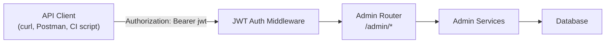

### 7.2 Configuration

Admin settings live in `config/admin.ts`:

```typescript
// config/admin.ts
export default ({ env }) => ({
  url: env('ADMIN_URL', '/admin'),

  auth: {
    secret: env('ADMIN_JWT_SECRET'),
    options: {
      expiresIn: '7d',
    },
  },

  apiToken: {
    salt: env('API_TOKEN_SALT'),
  },

  transfer: {
    token: {
      salt: env('TRANSFER_TOKEN_SALT'),
    },
  },

  autoOpen: false,
});
```

| Key | Env Variable | Description |
|-----|-------------|-------------|
| `auth.secret` | `ADMIN_JWT_SECRET` | Signs admin JWTs. Must be at least 32 characters in production. |
| `auth.options.expiresIn` | -- | Token lifetime. Default `7d`. Accepts ms-compatible strings. |
| `apiToken.salt` | `API_TOKEN_SALT` | Salt for hashing API tokens at rest. 256-bit random recommended. |
| `transfer.token.salt` | `TRANSFER_TOKEN_SALT` | Salt for hashing transfer tokens. |
| `url` | `ADMIN_URL` | Base path for admin API routes. Default `/admin`. |

### 7.3 Admin User Lifecycle

#### First Admin Registration

On a fresh APICK installation, no admin users exist. The first admin is created via a special open registration endpoint. Use the init check to determine if registration is needed:

```bash
curl -X GET "http://localhost:1337/admin/init"
```

```json
{
  "data": {
    "uuid": "f47ac10b-58cc-4372-a567-0e02b2c3d479",
    "hasAdmin": false
  }
}
```

When `hasAdmin` is `false`, register the first admin:

```bash
curl -X POST "http://localhost:1337/admin/register-admin" \
  -H "Content-Type: application/json" \
  -d '{
    "email": "admin@example.com",
    "firstname": "Root",
    "lastname": "Admin",
    "password": "S3cur3P@ssw0rd!"
  }'
```

Response:

```json
{
  "data": {
    "token": "eyJhbGciOiJIUzI1NiIs...",
    "user": {
      "id": 1,
      "documentId": "admin_abc123",
      "email": "admin@example.com",
      "firstname": "Root",
      "lastname": "Admin",
      "isActive": true,
      "roles": [
        {
          "id": 1,
          "name": "Super Admin",
          "code": "apick-super-admin"
        }
      ]
    }
  }
}
```

> This endpoint is only available when zero admin users exist in the database. Once the first admin is registered, subsequent calls return `403 Forbidden`.

#### Subsequent Admin Creation

After the first admin exists, new admin users are created by authenticated admins with the appropriate permissions:

```bash
curl -X POST "http://localhost:1337/admin/users" \
  -H "Content-Type: application/json" \
  -H "Authorization: Bearer <admin-jwt>" \
  -d '{
    "email": "editor@example.com",
    "firstname": "Jane",
    "lastname": "Editor",
    "password": "An0th3rP@ss!",
    "roles": [2]
  }'
```

### 7.4 Authentication

Admin authentication uses JWT tokens signed with `ADMIN_JWT_SECRET`. This is completely separate from the users-permissions plugin used for public API auth. See [AUTH_GUIDE.md](./AUTH_GUIDE.md) for a full comparison.

#### Login

```bash
curl -X POST "http://localhost:1337/admin/login" \
  -H "Content-Type: application/json" \
  -d '{
    "email": "admin@example.com",
    "password": "S3cur3P@ssw0rd!"
  }'
```

Response:

```json
{
  "data": {
    "token": "eyJhbGciOiJIUzI1NiIs...",
    "user": {
      "id": 1,
      "documentId": "admin_abc123",
      "email": "admin@example.com",
      "firstname": "Root",
      "lastname": "Admin",
      "isActive": true,
      "roles": [
        {
          "id": 1,
          "name": "Super Admin",
          "code": "apick-super-admin"
        }
      ]
    }
  }
}
```

#### Token Renewal

```bash
curl -X POST "http://localhost:1337/admin/renew-token" \
  -H "Authorization: Bearer <admin-jwt>"
```

Returns a fresh JWT with a reset expiration timer.

#### Password Management

```bash
# Forgot password (sends reset email)
curl -X POST "http://localhost:1337/admin/forgot-password" \
  -H "Content-Type: application/json" \
  -d '{ "email": "admin@example.com" }'

# Reset password (with token from email)
curl -X POST "http://localhost:1337/admin/reset-password" \
  -H "Content-Type: application/json" \
  -d '{
    "resetPasswordToken": "abc123...",
    "password": "NewP@ssw0rd!"
  }'
```

### 7.5 Admin Session Management

Admin sessions are stateless JWT-based. There is no server-side session store.

| Aspect | Behavior |
|--------|----------|
| Token storage | Client responsibility (no cookies set by server) |
| Expiration | Configured via `auth.options.expiresIn` |
| Revocation | Not supported per-token; change `ADMIN_JWT_SECRET` to invalidate all |
| Concurrent sessions | Unlimited; each login produces an independent token |
| Token payload | `{ id, isAdmin: true, iat, exp }` |

### 7.6 API Tokens

API tokens provide long-lived, non-user-bound authentication for the Content API. Managed entirely through the admin API.

#### Token Types

| Type | Scope |
|------|-------|
| `read-only` | Can only call `find` and `findOne` actions |
| `full-access` | Can call all Content API actions |
| `custom` | Fine-grained per-content-type, per-action permissions |

#### Token Endpoints

| Method | Endpoint | Description |
|--------|----------|-------------|
| `GET` | `/admin/api-tokens` | List all API tokens |
| `GET` | `/admin/api-tokens/:id` | Get token details |
| `POST` | `/admin/api-tokens` | Create new token |
| `PUT` | `/admin/api-tokens/:id` | Update token (name, description, permissions) |
| `DELETE` | `/admin/api-tokens/:id` | Revoke and delete token |
| `POST` | `/admin/api-tokens/:id/regenerate` | Regenerate token value |

#### curl Example: Create an API Token

```bash
curl -X POST "http://localhost:1337/admin/api-tokens" \
  -H "Content-Type: application/json" \
  -H "Authorization: Bearer <admin-jwt>" \
  -d '{
    "name": "Frontend Readonly",
    "description": "Used by Next.js frontend for content fetching",
    "type": "read-only",
    "lifespan": null
  }'
```

Response:

```json
{
  "data": {
    "id": 1,
    "name": "Frontend Readonly",
    "description": "Used by Next.js frontend for content fetching",
    "type": "read-only",
    "accessKey": "a1b2c3d4e5f6...",
    "lastUsedAt": null,
    "expiresAt": null,
    "lifespan": null,
    "createdAt": "2026-02-01T10:00:00.000Z"
  }
}
```

> The `accessKey` is only returned in full on creation and regeneration. Store it immediately -- it cannot be retrieved later. Tokens are stored as SHA-512 hashes salted with `API_TOKEN_SALT`.

### 7.7 Admin Route Map (Complete Reference)

| Category | Method | Endpoint | Auth Required |
|----------|--------|----------|---------------|
| Bootstrap | `GET` | `/admin/init` | No |
| Bootstrap | `POST` | `/admin/register-admin` | No (first admin only) |
| Auth | `POST` | `/admin/login` | No |
| Auth | `POST` | `/admin/renew-token` | Yes |
| Auth | `POST` | `/admin/forgot-password` | No |
| Auth | `POST` | `/admin/reset-password` | No |
| Users | `GET` | `/admin/users` | Yes |
| Users | `GET` | `/admin/users/me` | Yes |
| Users | `GET` | `/admin/users/:id` | Yes |
| Users | `POST` | `/admin/users` | Yes |
| Users | `PUT` | `/admin/users/:id` | Yes |
| Users | `PUT` | `/admin/users/me` | Yes |
| Users | `DELETE` | `/admin/users/:id` | Yes |
| Roles | `GET` | `/admin/roles` | Yes |
| Roles | `GET` | `/admin/roles/:id` | Yes |
| Roles | `POST` | `/admin/roles` | Yes |
| Roles | `PUT` | `/admin/roles/:id` | Yes |
| Roles | `DELETE` | `/admin/roles/:id` | Yes |
| API Tokens | `GET` | `/admin/api-tokens` | Yes |
| API Tokens | `GET` | `/admin/api-tokens/:id` | Yes |
| API Tokens | `POST` | `/admin/api-tokens` | Yes |
| API Tokens | `PUT` | `/admin/api-tokens/:id` | Yes |
| API Tokens | `DELETE` | `/admin/api-tokens/:id` | Yes |
| API Tokens | `POST` | `/admin/api-tokens/:id/regenerate` | Yes |
| Transfer Tokens | `GET` | `/admin/transfer/tokens` | Yes |
| Transfer Tokens | `GET` | `/admin/transfer/tokens/:id` | Yes |
| Transfer Tokens | `POST` | `/admin/transfer/tokens` | Yes |
| Transfer Tokens | `PUT` | `/admin/transfer/tokens/:id` | Yes |
| Transfer Tokens | `DELETE` | `/admin/transfer/tokens/:id` | Yes |
| Transfer Tokens | `POST` | `/admin/transfer/tokens/:id/regenerate` | Yes |
| Settings | `GET` | `/admin/project-settings` | Yes |
| Settings | `POST` | `/admin/project-settings` | Yes |
| Settings | `GET` | `/admin/information` | Yes |
| Content Releases | `GET` | `/admin/content-releases` | Yes |
| Content Releases | `POST` | `/admin/content-releases` | Yes |
| Content Releases | `GET` | `/admin/content-releases/:id` | Yes |
| Content Releases | `PUT` | `/admin/content-releases/:id` | Yes |
| Content Releases | `DELETE` | `/admin/content-releases/:id` | Yes |
| Content Releases | `POST` | `/admin/content-releases/:id/publish` | Yes |
| Review Workflows | `GET` | `/admin/review-workflows` | Yes |
| Review Workflows | `POST` | `/admin/review-workflows` | Yes |
| Review Workflows | `GET` | `/admin/review-workflows/:id` | Yes |
| Review Workflows | `PUT` | `/admin/review-workflows/:id` | Yes |
| Review Workflows | `DELETE` | `/admin/review-workflows/:id` | Yes |
| Content History | `GET` | `/admin/content-history/:contentType/:documentId` | Yes |
| Content History | `POST` | `/admin/content-history/:versionId/restore` | Yes |
| Audit Logs | `GET` | `/admin/audit-logs` | Yes |
| Audit Logs | `GET` | `/admin/audit-logs/:id` | Yes |

### 7.8 Settings Management

APICK stores runtime settings in the `core_store` table, accessible via the admin API. For database details, see [DATABASE_GUIDE.md](./DATABASE_GUIDE.md).

#### Settings Endpoints

| Method | Endpoint | Description |
|--------|----------|-------------|
| `GET` | `/admin/project-settings` | Get project name, description, logo |
| `POST` | `/admin/project-settings` | Update project settings |
| `GET` | `/admin/init` | Server initialization info (hasAdmin, uuid) |
| `GET` | `/admin/information` | Server version, node version, database info |

### 7.9 Developer API

```typescript
// Admin user service
const user = await apick.service('admin::user').findOne(userId);
const users = await apick.service('admin::user').findPage({ page: 1, pageSize: 10 });
await apick.service('admin::user').create({ email, firstname, lastname, password, roles });
await apick.service('admin::user').updateById(userId, { isActive: false });
await apick.service('admin::user').deleteById(userId);

// API token service
const token = await apick.service('admin::api-token').create({ name, type, permissions });
await apick.service('admin::api-token').regenerate(tokenId);

// Auth service
const jwt = apick.service('admin::auth').issue({ id: user.id, isAdmin: true });
const decoded = apick.service('admin::auth').verify(token);

// Core store (key-value settings)
const value = await apick.store.get({ type: 'core', key: 'application' });
await apick.store.set({
  type: 'core',
  key: 'application',
  value: { name: 'My Project', description: 'A headless CMS' },
});
```

---

## Cross-Reference Index

| Topic | Guide |
|-------|-------|
| System architecture, Event Hub, lifecycle | [ARCHITECTURE.md](./ARCHITECTURE.md) |
| Content CRUD, filtering, pagination, population | [CONTENT_API_GUIDE.md](./CONTENT_API_GUIDE.md) |
| Content type schemas, components, dynamic zones | [CONTENT_MODELING_GUIDE.md](./CONTENT_MODELING_GUIDE.md) |
| Database configuration, migrations, query engine | [DATABASE_GUIDE.md](./DATABASE_GUIDE.md) |
| Authentication, roles, permissions, RBAC | [AUTH_GUIDE.md](./AUTH_GUIDE.md) |
| Plugin system and extension points | [PLUGINS_GUIDE.md](./PLUGINS_GUIDE.md) |
| Deployment and production configuration | [DEPLOYMENT_GUIDE.md](./DEPLOYMENT_GUIDE.md) |
